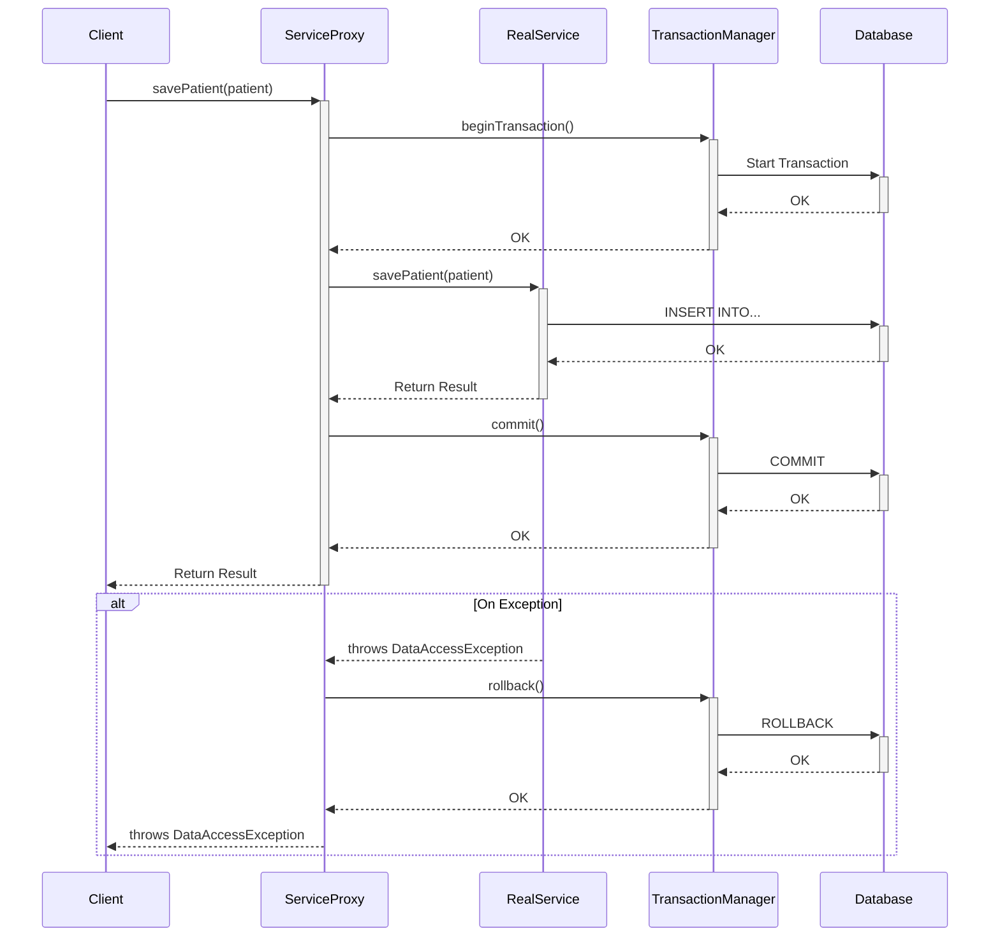

# Spring Boot Internals

## How Auto-Configuration Works

Auto-configuration is Spring Boot's mechanism for automatically configuring the application based on the dependencies present on the classpath. It's driven by the **`@EnableAutoConfiguration`** annotation.

**The Process:**

1.  **Trigger**: The process begins with `@EnableAutoConfiguration`, which is included in `@SpringBootApplication`.
2.  **Candidate Loading**: Spring looks for a specific file on the classpath of all included JARs: `META-INF/spring/org.springframework.boot.autoconfigure.AutoConfiguration.imports`. This file contains a list of all potential auto-configuration classes.
    * *Legacy Note:* In older versions, this was done via a `spring.factories` file. The new `.imports` file is more efficient.
3.  **Conditional Evaluation**: Each auto-configuration class is evaluated. These classes are heavily annotated with **`@Conditional`** annotations. Spring checks these conditions to decide whether to activate the configuration and create the associated beans.
4.  **Bean Creation**: If all conditions for an auto-configuration class are met, the beans defined within it are registered in the `ApplicationContext`.

```mermaid
graph TD
    A[@SpringBootApplication] -- includes --> B[@EnableAutoConfiguration];
    B -- 1. Triggers Scan --> C[Classpath JARs];
    C -- 2. Loads Candidates from --> D["META-INF/.../AutoConfiguration.imports"];
    D -- 3. Provides List of --> E{AutoConfiguration Classes};
    subgraph "Conditional Evaluation"
        E -- "Are conditions met?" --> F{Evaluate @Conditional Annotations};
        F -- Yes --> G[✅ Activate & Create Beans];
        F -- No --> H[❌ Deactivate & Skip];
    end
    G --> I[ApplicationContext];
    H --> I[ApplicationContext];
````

-----

#### @Conditional Annotations

`@Conditional` annotations are the "brains" of auto-configuration. They allow a configuration to be included only if certain conditions are true. Interviewers love these because they demonstrate a deep understanding of Spring's inner workings.

| Annotation | Purpose | Example Use Case |
| --- | --- | --- |
| **`@ConditionalOnClass`** | The configuration is applied only if the specified class is present on the classpath. | `DataSourceAutoConfiguration` only runs if `javax.sql.DataSource` is present. |
| **`@ConditionalOnMissingBean`** | A bean is created only if no other bean of the same type is already defined in the context. | Creates a default `ObjectMapper` bean only if the user hasn't defined their own. |
| **`@ConditionalOnProperty`** | The configuration is applied only if a specific property in the environment has a certain value. | `ServerPropertiesAutoConfiguration` can be disabled with `spring.main.web-application-type=none`. |
| **`@ConditionalOnBean`** | The configuration is applied only if a bean of the specified type already exists in the context. | Auto-configuring a component that depends on an already-configured `DataSource`. |
| **`@ConditionalOnWebApplication`** | The configuration is applied only if the application is a web application. | `WebMvcAutoConfiguration` only runs if it detects a web context. |

-----

#### Boot Startup Flow (Detailed)

The `SpringApplication.run()` method orchestrates a complex sequence of events to get the application running.

```mermaid
graph TD
    A[Start: SpringApplication.run()] --> B[1. Prepare Environment];
    subgraph B
        B1[Load Properties & Profiles]
        B2[Configure ClassLoaders]
    end
    
    B --> C[2. Create ApplicationContext];
    C --> D[3. Prepare Context];
    subgraph D
        D1[Apply Initializers]
        D2[Set Environment]
        D3[Run BeanFactoryPostProcessors]
    end

    D --> E[4. Refresh Context];
    subgraph E
        direction LR
        E1[Register BeanPostProcessors] --> E2[Instantiate & Wire Beans] --> E3[Finish Initialization]
    end

    E --> F[5. Call Runners];
    subgraph F
        F1[ApplicationRunner]
        F2[CommandLineRunner]
    end
    
    F --> G([✅ Application Ready]);
```

**Breakdown:**

1.  **Prepare Environment**: An `Environment` object is created. This involves loading properties from all sources (`application.properties`, system properties, command-line arguments) and resolving active profiles.
2.  **Create `ApplicationContext`**: Based on the classpath, an appropriate `ApplicationContext` is instantiated (e.g., `AnnotationConfigServletWebServerApplicationContext` for a web app).
3.  **Prepare Context**: The context is prepared *before* it's refreshed. The environment is attached, and special `ApplicationContextInitializer` beans are run. `BeanFactoryPostProcessor`s are executed here to modify bean definitions before they are created.
4.  **Refresh Context**: This is the heart of the IoC container startup. This single `refresh()` call triggers the entire bean lifecycle process:
    * It registers all `BeanPostProcessor`s.
    * It finds all bean definitions (from component scanning and auto-configuration).
    * It instantiates, configures, and wires all singleton beans (as detailed in the bean lifecycle).
    * It starts the embedded web server (Tomcat).
5.  **Call Runners**: After the context is fully refreshed and ready, the `run()` methods of all `ApplicationRunner` and `CommandLineRunner` beans are executed for any final startup tasks.

-----

-----

## Spring MVC Advanced Topics

#### Filter vs. Interceptor vs. ControllerAdvice

These are three distinct mechanisms for intercepting requests, each operating at a different level and with a different purpose.

| Feature | Servlet Filter | Spring Interceptor | `@ControllerAdvice` AOP |
| --- | --- | --- | --- |
| **Scope** | Servlet Container Level (e.g., Tomcat) | Spring MVC / `DispatcherServlet` Level | Spring AOP / Controller Level |
| **Awareness** | Not Spring-aware. Works with `HttpServletRequest/Response`. | Spring-aware. Can access the `ApplicationContext` and the target `HandlerMethod`. | Spring-aware. AOP proxy around controllers. |
| **Purpose** | Cross-cutting concerns before Spring is involved: authentication, logging, compression, CORS. | Pre/post-processing of requests within Spring MVC: modifying the model, detailed logging, permissions checks. | Global concerns for controllers: exception handling, model attribute binding, request/response body modification. |
| **Configuration** | Implement `Filter`, register as `@Component` or `FilterRegistrationBean`. | Implement `HandlerInterceptor`, register with a `WebMvcConfigurer`. | Annotate a class with `@ControllerAdvice`. |

```mermaid
graph TD
    A[Client Request] --> B{Servlet Container (Tomcat)};
    B -- "Enters Container" --> C[Filter Chain];
    subgraph "Spring Context"
        C -- "Forwards to Spring" --> D(DispatcherServlet);
        D -- "preHandle" --> E[Interceptor Chain];
        E -- "Invokes Handler" --> F[Controller Method];
        F -- "Throws Exception" --> G[@ControllerAdvice<br/>@ExceptionHandler];
        F -- "Returns Response" --> E;
        E -- "postHandle / afterCompletion" --> D;
    end
    D -- "Sends Response" --> C;
    C -- "Response processing" --> B;
    B --> A;

    style C fill:#f9f,stroke:#333,stroke-width:2px
    style E fill:#ccf,stroke:#333,stroke-width:2px
    style G fill:#cfc,stroke:#333,stroke-width:2px
```

-----

#### Asynchronous Requests

By default, a Spring MVC application uses one thread per request from the servlet container's (Tomcat's) thread pool. If a request involves a slow I/O operation (like calling a remote API), that thread is blocked, limiting the server's ability to handle new requests.

**Async processing solves this by freeing up the container thread.**

1.  A request arrives, and the Tomcat thread invokes the controller.
2.  The controller returns a `Callable` or `DeferredResult`. **This immediately frees the Tomcat thread** to handle other requests.
3.  The long-running task is executed in a separate thread pool managed by Spring (`TaskExecutor`).
4.  Once the task is complete, the result is sent back to the client.

<!-- end list -->

* **`Callable<T>`**: The simplest approach. You return a `Callable` that computes a value in another thread. Spring manages the entire process.
* **`DeferredResult<T>`**: More advanced. It allows the result to be produced by any thread, even one not managed by Spring (e.g., a response from a message queue listener).

-----

-----

## Spring AOP & Proxies

#### Why Proxies are created at `postProcessAfterInitialization`

The `BeanPostProcessor`'s `postProcessAfterInitialization` method is the **last step** in the bean's initialization lifecycle before it's considered ready for use. Creating the proxy here is critical for two reasons:

1.  **Wrapping a Complete Object**: The proxy's purpose is to intercept calls to a fully functional target object. By waiting until after initialization (`@PostConstruct`, `afterPropertiesSet`), we guarantee that the underlying bean has all its dependencies injected and its custom init logic has run. Proxying a partially initialized object would lead to unpredictable behavior.
2.  **Preserving Bean Identity**: The object returned from `postProcessAfterInitialization` is the final object that gets stored in the singleton cache and injected into other beans. By creating the proxy here, we ensure that all other components in the application receive a reference to the proxy, not the raw target object, thus ensuring that AOP advice (like `@Transactional`) is always applied.

-----

#### JDK Dynamic Proxy vs. CGLIB

Spring AOP uses one of two proxying strategies to create proxies at runtime.

| Feature | JDK Dynamic Proxy | CGLIB (Code Generation Library) |
| --- | --- | --- |
| **Mechanism** | Uses Java's built-in `java.lang.reflect.Proxy`. | Uses bytecode generation to create a subclass of the target. |
| **Requirement** | The target class **must implement at least one interface**. | The target class **does not need to implement an interface**. |
| **Limitation** | Can only proxy method calls defined in the interface. | Cannot proxy `final` classes or `final` methods. |
| **Spring's Choice** | Used if the target bean implements an interface. | Used if the target bean does not implement an interface. |

In modern Spring Boot, **CGLIB is often the default**, even if interfaces are present, as it allows for more flexibility (e.g., proxying calls to methods not on the interface). This can be controlled with the `proxy-target-class` property.

-----

#### Example: How `@Transactional` Works

This is a classic use case of AOP proxies.



**Step-by-Step Flow:**

1.  **Proxy Creation**: At startup, Spring sees the `@Transactional` annotation on `MyService`. A `BeanPostProcessor` wraps the `MyService` bean in a proxy.
2.  **Client Call**: The client (e.g., a controller) gets a reference to the **proxy**, not the real `MyService` object.
3.  **Method Interception**: When `savePatient()` is called on the proxy, the AOP **interceptor** (specifically, the `TransactionInterceptor`) intercepts the call *before* it reaches the real method.
4.  **Transaction Start**: The `TransactionInterceptor` asks the `TransactionManager` to begin a new transaction. A database connection is obtained and set to `auto-commit=false`.
5.  **Method Execution**: The interceptor invokes the original `savePatient()` method on the real `MyService` object. The method executes its database operations.
6.  **Transaction Commit/Rollback**:
    * **Success**: If the method completes without an exception, the interceptor tells the `TransactionManager` to **commit** the transaction.
    * **Failure**: If a runtime exception is thrown, the interceptor catches it and tells the `TransactionManager` to **rollback** the transaction. The exception is then re-thrown.

<!-- end list -->

