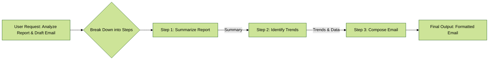
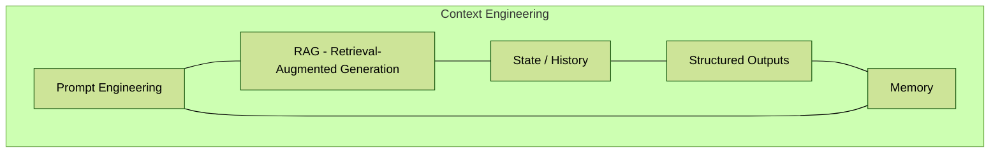

***


## Table of Contents
1.  [Introduction: The Power of Thinking in Steps](#1-introduction-the-power-of-thinking-in-steps)
2.  [The Core Problem: Limitations of a Single Prompt](#2-the-core-problem-limitations-of-a-single-prompt)
3.  [The Solution: Prompt Chaining (The Pipeline Pattern)](#3-the-solution-prompt-chaining-the-pipeline-pattern)
    - [How It Works: A Mental Model](#how-it-works-a-mental-model)
    - [The Importance of Structured Output](#the-importance-of-structured-output)
4.  [Practical Applications & Use Cases](#4-practical-applications--use-cases)
    - [1. Information Processing Workflows](#1-information-processing-workflows)
    - [2. Complex Query Answering](#2-complex-query-answering)
    - [3. Data Extraction and Transformation](#3-data-extraction-and-transformation)
    - [4. Content Generation Workflows](#4-content-generation-workflows)
    - [5. Conversational Agents with State](#5-conversational-agents-with-state)
    - [6. Code Generation and Refinement](#6-code-generation-and-refinement)
    - [7. Multimodal and Multi-step Reasoning](#7-multimodal-and-multi-step-reasoning)
5.  [Hands-On Example: Building a Prompt Chain with LangChain](#5-hands-on-example-building-a-prompt-chain-with-langchain)
    - [Step 1: The Goal](#step-1-the-goal)
    - [Step 2: The Code, Explained](#step-2-the-code-explained)
6.  [The Bigger Picture: Context Engineering](#6-the-bigger-picture-context-engineering)
7.  [Final Summary & Key Takeaways](#7-final-summary--key-takeaways)
    - [At a Glance](#at-a-glance)
    - [Key Takeaways Checklist](#key-takeaways-checklist)

---

### 1. Introduction: The Power of Thinking in Steps

Welcome! In this guide, we'll master a foundational technique for building sophisticated AI systems: **Prompt Chaining**.

Imagine you were asked to write a detailed research report on climate change, including a summary, key data points, and a concluding email to your team—all in one go. You'd likely break it down: first, research and gather data; second, write the summary; third, extract the key data; and finally, draft the email. You tackle it in steps.

**Prompt Chaining** applies this same "divide-and-conquer" logic to Large Language Models (LLMs). Instead of giving an LLM one giant, complex task, we break it into a sequence of smaller, manageable sub-tasks. The output of one task becomes the input for the next, creating a powerful and reliable workflow.

**Why it matters**: This technique is the key to moving beyond simple chatbots and building robust, multi-step AI agents that can reason, plan, and execute complex workflows.

### 2. The Core Problem: Limitations of a Single Prompt

Asking an LLM to do too much in a single prompt is inefficient and often leads to failure. This is because a monolithic prompt places a high **cognitive load** on the model.

Common failure points include:
*   **Instruction Neglect**: The model simply ignores or overlooks parts of your complex instructions.
*   **Contextual Drift**: The model starts strong but loses track of the original goal halfway through the task.
*   **Error Propagation**: A small mistake made early on gets amplified in later parts of the response, ruining the final output.
*   **Hallucination**: The model gets overwhelmed and starts making up incorrect information to fill the gaps.

For example, if you ask an LLM to "Analyze this market report, summarize the findings, identify the top three trends with specific data points, and draft a formal email to the marketing team," it might provide a good summary but fail to extract the correct data or draft the email properly.

### 3. The Solution: Prompt Chaining (The Pipeline Pattern)

**Prompt Chaining**, also known as the **Pipeline Pattern**, solves these problems by creating a focused, sequential workflow. Each step in the chain is a simple, distinct prompt that performs a single operation before passing its result to the next.

This makes the overall process:
*   **More Robust & Reliable**: Simpler tasks are less prone to error.
*   **Easier to Debug**: If something goes wrong, you can easily pinpoint which specific step in the chain failed.
*   **More Interpretable**: You can understand and inspect the process at every stage.

#### How It Works: A Mental Model

Think of it as an assembly line. Let's revisit our market report example:

1.  **Station 1 (Summarizer)**:
    *   **Input**: The full market research report.
    *   **Prompt**: `"Summarize the key findings of the following market research report: [text]."`
    *   **Output**: A concise summary.

2.  **Station 2 (Trend Analyst)**:
    *   **Input**: The summary from Station 1.
    *   **Prompt**: `"Using the summary, identify the top three emerging trends and extract the specific data points that support each trend: [output from step 1]."`
    *   **Output**: The top three trends and their supporting data.

3.  **Station 3 (Email Writer)**:
    *   **Input**: The trends and data from Station 2.
    *   **Prompt**: `"Draft a concise email to the marketing team that outlines the following trends and their supporting data: [output from step 2]."`
    *   **Output**: A well-formatted, accurate email.

This modular workflow is visualized in the diagram below.



#### The Importance of Structured Output

The reliability of a prompt chain depends entirely on the quality of the information passed between steps. If one step produces ambiguous, natural-language text, the next step might misinterpret it.

To prevent this, it's crucial to specify a **structured output format**, like **JSON** or **XML**.

For our example, the output from the "Trend Analyst" step should be formatted like this:

```json
{
  "trends": [
    {
      "trend_name": "AI-Powered Personalization",
      "supporting_data": "73% of consumers prefer to do business with brands that use personal information..."
    },
    {
      "trend_name": "Sustainable and Ethical Brands",
      "supporting_data": "Sales of products with ESG-related claims grew 28% over the last five years..."
    }
  ]
}
```
This ensures the data is machine-readable and can be precisely inserted into the next prompt without any confusion.

### 4. Practical Applications & Use Cases

Prompt chaining is incredibly versatile. Here are some real-world applications.

#### 1. Information Processing Workflows
Used for automated content analysis and research.
*   **Step 1**: Extract text content from a URL or document.
*   **Step 2**: Summarize the extracted text.
*   **Step 3**: Extract specific entities (names, dates, locations).
*   **Step 4**: Use the entities to query an internal knowledge base.
*   **Step 5**: Generate a final report with all the gathered information.

#### 2. Complex Query Answering
For questions that require multiple steps of reasoning, like *"What were the main causes of the 1929 stock market crash, and how did the government respond?"*
*   **Step 1**: Identify the sub-questions (causes, government response).
*   **Step 2**: Retrieve information about the causes.
*   **Step 3**: Retrieve information about the government's response.
*   **Step 4**: Synthesize the information into a single, coherent answer.

#### 3. Data Extraction and Transformation
Perfect for converting unstructured data (like invoices or forms) into structured formats.
*   **Step 1**: Extract all text from an invoice document (using OCR if needed).
*   **Step 2**: Attempt to extract specific fields (name, address, amount).
*   **Step 3 (Conditional)**: If a field is missing, use a new prompt to specifically find the missing information.
*   **Step 4**: Output the validated, structured data as JSON.

#### 4. Content Generation Workflows
Breaks down the creative process for writing articles, stories, or technical documentation.
*   **Step 1**: Generate 5 topic ideas based on a user's interest.
*   **Step 2**: Generate a detailed outline for the selected topic.
*   **Step 3**: Write a draft for the first section of the outline.
*   **Step 4**: Write the next section, using the previous section for context.
*   **Step 5**: Review the complete draft for coherence and grammar.

#### 5. Conversational Agents with State
Maintains conversational continuity (i.e., "memory") in a chatbot.
*   **Step 1**: Process the user's message, identifying intent and key entities.
*   **Step 2**: Update the conversation state (history) with this new information.
*   **Step 3**: Generate a response based on the *current state* and conversation history.
*   **Step 4**: Repeat for each new message, continuously enriching the state.

#### 6. Code Generation and Refinement
Decomposes complex coding tasks into logical steps.
*   **Step 1**: Understand the user's request and generate pseudocode or an outline.
*   **Step 2**: Write the initial code draft based on the outline.
*   **Step 3**: Identify potential errors or areas for improvement (e.g., using a static analysis tool).
*   **Step 4**: Refine the code based on the identified issues.
*   **Step 5**: Add documentation and test cases.

#### 7. Multimodal and Multi-step Reasoning
For tasks involving different types of data, like an image containing text and tables.
*   **Step 1**: Extract and understand the text from the image.
*   **Step 2**: Link the extracted text to its corresponding labels or parts of the image.
*   **Step 3**: Interpret this gathered information using a provided table to determine the final output.

### 5. Hands-On Example: Building a Prompt Chain with LangChain

Frameworks like **LangChain**, **LangGraph**, and the **Google Agent Development Kit (ADK)** provide structured tools to build, execute, and manage these chains.

Let's walk through the LangChain code example from the document.

#### Step 1: The Goal
The goal is to create a two-step pipeline that:
1.  Extracts technical specifications (CPU, RAM, storage) from a sentence.
2.  Formats these specifications into a clean JSON object.

**Input Text**: `"The new laptop model features a 3.5 GHz octa-core processor, 16GB of RAM, and a 1TB NVMe SSD."`

**Desired Final Output**:
```json
{
  "cpu": "3.5 GHz octa-core processor",
  "memory": "16GB of RAM",
  "storage": "1TB NVMe SSD"
}
```

#### Step 2: The Code, Explained

```python
# First, ensure you have the necessary libraries installed
# pip install langchain langchain-community langchain-openai

import os
from langchain_openai import ChatOpenAI
from langchain_core.prompts import ChatPromptTemplate
from langchain_core.output_parsers import StrOutputParser

# --- Configuration ---
# This initializes the Language Model we'll be using.
# temperature=0 makes the output deterministic (less random).
llm = ChatOpenAI(temperature=0)

# --- Prompt 1: Extract Information ---
# This template defines the first step of our chain.
# It's a simple instruction to pull out the technical specs.
prompt_extract = ChatPromptTemplate.from_template(
    "Extract the technical specifications from the following text:\n\n{text_input}"
)

# --- Prompt 2: Transform to JSON ---
# This template defines the second step.
# It takes the extracted specs and formats them as JSON.
prompt_transform = ChatPromptTemplate.from_template(
    "Transform the following specifications into a JSON object with 'cpu', 'memory', and 'storage' as keys:\n\n{specifications}"
)

# --- Building the Chains using LCEL (LangChain Expression Language) ---

# This is the first, smaller chain. It pipes the prompt to the model,
# and then pipes the model's output to a simple string parser.
# (prompt -> model -> output)
extraction_chain = prompt_extract | llm | StrOutputParser()

# This is the full, two-step chain. It's more complex:
# 1. It runs the `extraction_chain` first.
# 2. It takes the output of that chain and passes it as the `specifications` variable
#    into the `prompt_transform`.
# 3. It then sends that second prompt to the model and parses the output.
full_chain = (
    {"specifications": extraction_chain} # Run first chain, map output to "specifications"
    | prompt_transform
    | llm
    | StrOutputParser()
)

# --- Running the Chain ---
input_text = "The new laptop model features a 3.5 GHz octa-core processor, 16GB of RAM, and a 1TB NVMe SSD."

# We execute the chain by "invoking" it with our input text.
final_result = full_chain.invoke({"text_input": input_text})

# Print the final, clean JSON output
print("--- Final JSON Output ---")
print(final_result)
```

### 6. The Bigger Picture: Context Engineering

Prompt Chaining is a key technique within a broader, more powerful discipline called **Context Engineering**.

**Context Engineering** is the practice of designing and delivering a *complete informational environment* to an AI model to get the best possible output. It recognizes that a model's performance depends less on its architecture and more on the richness of the context it's given.

This goes far beyond just the immediate prompt. It includes:



*   **Prompt Engineering**: Crafting the immediate user query and system instructions (e.g., "You are a technical writer").
*   **RAG (Retrieval-Augmented Generation)**: Actively fetching information from external knowledge bases or documents.
*   **State/History**: Remembering past interactions and user identity.
*   **Tool Outputs**: Using external tools (like APIs) to get real-time data (e.g., querying a calendar for availability).
*   **Memory**: Retaining key information across sessions.

Context Engineering reframes the task from simply answering a question to building a comprehensive operational picture for an AI agent, enabling it to be truly situationally-aware.

### 7. Final Summary & Key Takeaways

#### At a Glance

> **What**: Prompt Chaining is a divide-and-conquer strategy that breaks down complex tasks into a sequence of smaller, interconnected sub-tasks for an LLM.
>
> **Why**: It significantly improves reliability, control, and debugging by avoiding the common failures of single, monolithic prompts. It's foundational for building sophisticated, multi-step AI agents.
>
> **Rule of Thumb**: Use this pattern when a task is too complex for a single prompt, involves multiple distinct processing stages, requires interaction with external tools, or needs to maintain state.

#### Key Takeaways Checklist

- [ ] **Prompt Chaining breaks down complex tasks** into smaller, focused steps. This is also called the **Pipeline Pattern**.
- [ ] Each step in a chain uses the **output of the previous step as its input**, creating a dependency.
- [ ] This pattern **improves the reliability and manageability** of complex interactions with LLMs.
- [ ] Using **structured output formats (like JSON)** between steps is crucial for preventing errors.
- [ ] Frameworks like **LangChain, LangGraph, and Google ADK** provide robust tools to define, manage, and execute these multi-step sequences.
- [ ] Prompt Chaining is a core component of the broader field of **Context Engineering**.