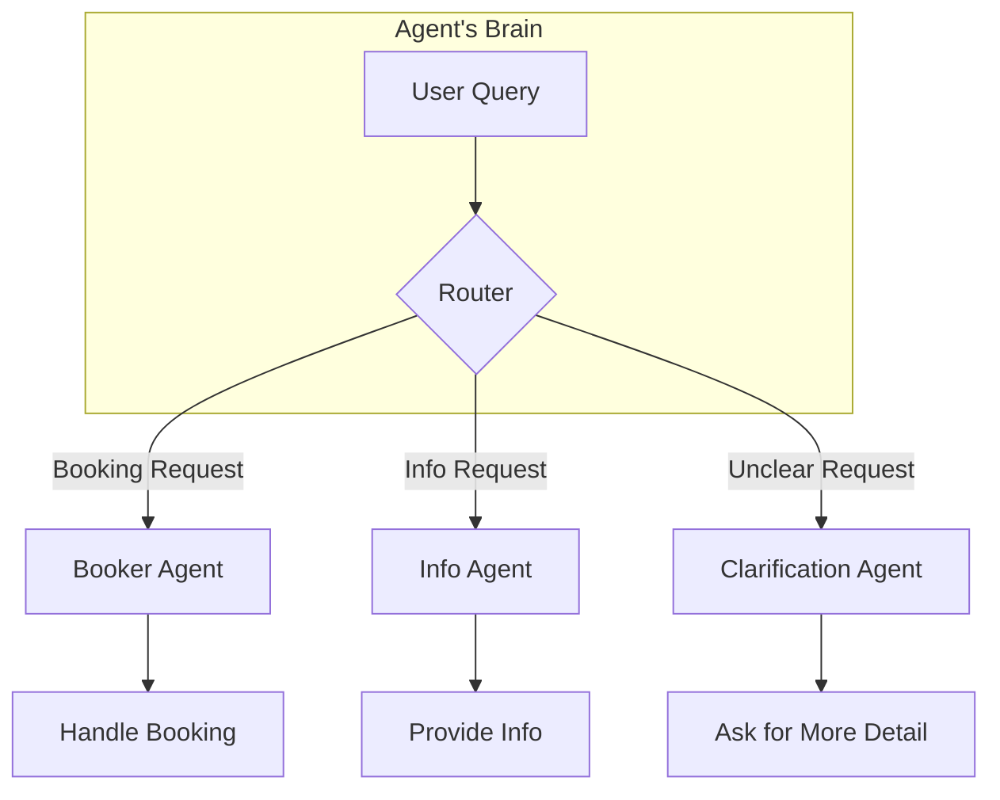

## Table of Contents
1.  [Introduction: Beyond the Straight Line](#1-introduction-beyond-the-straight-line)
2.  [The Core Concept: What is Routing?](#2-the-core-concept-what-is-routing)
    - [An Analogy: The Smart Switchboard Operator](#an-analogy-the-smart-switchboard-operator)
3.  [How Routing Works: The Four Main Techniques](#3-how-routing-works-the-four-main-techniques)
    - [1. LLM-based Routing](#1-llm-based-routing)
    - [2. Embedding-based Routing](#2-embedding-based-routing)
    - [3. Rule-based Routing](#3-rule-based-routing)
    - [4. Machine Learning Model-Based Routing](#4-machine-learning-model-based-routing)
4.  [Practical Applications: Where to Use Routing](#4-practical-applications-where-to-use-routing)
5.  [Hands-On Example 1: LangChain (Explicit Routing)](#5-hands-on-example-1-langchain-explicit-routing)
    - [The Goal](#the-goal)
    - [The Workflow Explained](#the-workflow-explained)
    - [The Code, Explained Step-by-Step](#the-code-explained-step-by-step)
6.  [Hands-On Example 2: Google ADK (Implicit Routing)](#6-hands-on-example-2-google-adk-implicit-routing)
    - [The Goal](#the-goal-1)
    - [The ADK Philosophy: Routing via Tools](#the-adk-philosophy-routing-via-tools)
    - [The Code, Explained Step-by-Step](#the-code-explained-step-by-step-1)
7.  [Final Summary & Key Takeaways](#7-final-summary--key-takeaways)
    - [At a Glance](#at-a-glance)
    - [Key Takeaways Checklist](#key-takeaways-checklist)

---

### 1. Introduction: Beyond the Straight Line

In the previous chapter, we mastered **Prompt Chaining**, which is perfect for linear, step-by-step tasks. But the real world is rarely so predictable. An AI agent often needs to make decisions and adapt its actions based on user input, the environment, or the results of a previous step.

This is where the **Routing Pattern** comes in. Routing moves us from a fixed assembly line to an intelligent, dynamic workflow. It introduces **conditional logic** (`if this, then that`) into our agent, allowing it to decide the best path forward from multiple options.

**Why it matters**: Routing is the skill that transforms a simple bot into an adaptive, context-aware agent that can handle the complexity and variability of real-world tasks.

### 2. The Core Concept: What is Routing?

**Routing** is the mechanism that allows an AI agent to dynamically decide which tool, function, or sub-process to use next. Instead of following a single, predetermined path, the agent first analyzes the situation and then directs the workflow to the most appropriate destination.

A sophisticated customer service agent using routing would:
1.  **Analyze** the user's query: *"I want to know where my package is."*
2.  **Determine the intent**: The user wants to "check order status."
3.  **Route** the query to the correct tool: It directs the request to a sub-agent that can interact with the order database, instead of a sub-agent that handles product information or technical support.

#### An Analogy: The Smart Switchboard Operator

Think of a basic prompt chain as a direct phone line—it only goes to one place. A **Router** is like a smart switchboard operator. It listens to the caller's request, understands what they need, and then connects them to the right department (Sales, Support, Billing, etc.).



### 3. How Routing Works: The Four Main Techniques

The "Router" in our diagram can be implemented in several ways. Here are the four most common methods:

#### 1. LLM-based Routing
This is the most flexible approach. We use the language model itself as the router.
*   **How**: You give the LLM the user's query and a special prompt that asks it to classify the request.
*   **Prompt Example**: `"Analyze the user query and output ONLY one of the following categories: 'Order Status', 'Product Info', 'Technical Support', or 'Other'."`
*   **Pro**: Excellent at understanding nuanced and novel user inputs.
*   **Con**: Can be slower and more expensive due to the extra LLM call.

#### 2. Embedding-based Routing
This method routes based on semantic meaning rather than just keywords.
*   **How**: You convert the user's query into a vector **embedding** (a numerical representation of its meaning). You then compare this embedding to pre-calculated embeddings for each possible route (e.g., an embedding for the phrase "checking order status and tracking"). The query is sent to the route with the most similar embedding.
*   **Pro**: Fast and effective for routing based on conceptual similarity.
*   **Con**: Requires setting up and managing a vector database.

#### 3. Rule-based Routing
This is the most traditional and deterministic method.
*   **How**: You use predefined rules, like `if-else` statements or `switch` cases, based on keywords or patterns.
*   **Logic Example**: `if "track" in user_query or "order status" in user_query: route_to_order_status()`
*   **Pro**: Very fast, predictable, and cheap to run.
*   **Con**: Brittle. It can't handle synonyms, typos, or new ways of phrasing a request.

#### 4. Machine Learning Model-Based Routing
This is a more advanced, specialized approach.
*   **How**: You train a smaller, dedicated classification model (not a massive generative LLM) on a dataset of labeled examples. This fine-tuned model's sole job is to perform the routing task.
*   **Pro**: Extremely fast and accurate for its specific task.
*   **Con**: Requires labeled data and the expertise to train and maintain a separate ML model.

### 4. Practical Applications: Where to Use Routing

Routing is a critical control mechanism in almost any sophisticated agent.

*   **Virtual Assistants & Tutors**: To interpret a user's intent and decide whether to retrieve information, escalate to a human, or present the next learning module.
*   **Automated Data Pipelines**: To classify and distribute incoming data. For example, routing support tickets based on urgency, or processing different API payload formats (JSON vs. CSV) with different workflows.
*   **Multi-Agent Systems**: To act as a high-level dispatcher. A research agent might use a router to assign a task to the best sub-agent for searching, summarizing, or analyzing data.
*   **AI Coding Assistants**: To identify the programming language and the user's intent (e.g., debug, explain, or translate) before passing the code to the correct specialized tool.

### 5. Hands-On Example 1: LangChain (Explicit Routing)

This example builds a "coordinator" agent that explicitly routes requests to different "handlers" using an LLM-based router.

#### The Goal
To create a system that takes a user request and routes it to one of three functions:
1.  `booking_handler` (for flights, hotels)
2.  `info_handler` (for general questions)
3.  `unclear_handler` (as a fallback)

#### The Workflow Explained

```mermaid
graph TD
    A[User Request: "Book me a flight"] --> B{coordinator_router_chain};
    B -- LLM decides: "booker" --> C{delegation_branch};
    C -- Matches "booker" --> D[booking_handler];
    D --> E[Final Output: "Booking action simulated."];
```

#### The Code, Explained Step-by-Step

```python
# --- 1. Setup & Handlers ---
# (Imports and API key setup omitted for brevity)

# These are our "specialist departments." They are simple Python functions
# that will handle the request once it's routed to them.
def booking_handler(request: str) -> str:
    print("\n--- DELEGATING TO BOOKING HANDLER ---")
    return f"Booking Handler processed request: '{request}'."

def info_handler(request: str) -> str:
    print("\n--- DELEGATING TO INFO HANDLER ---")
    return f"Info Handler processed request: '{request}'."

def unclear_handler(request: str) -> str:
    print("\n--- HANDLING UNCLEAR REQUEST ---")
    return f"Coordinator could not delegate request: '{request}'."

# --- 2. The Router (The Switchboard Operator) ---
# This is our LLM-based router. We create a prompt template that
# instructs the LLM to act as a classifier.
coordinator_router_prompt = ChatPromptTemplate.from_messages([
    ("system", """Analyze the user's request and determine which specialist handler should process it.
    - If related to booking flights or hotels, output 'booker'.
    - For general information, output 'info'.
    - If unclear, output 'unclear'.
    ONLY output one word: 'booker', 'info', or 'unclear'."""),
    ("user", "{request}")
])

# We create the router chain by piping the prompt to the LLM and parsing the output.
# This chain's only job is to output one of the three words.
coordinator_router_chain = coordinator_router_prompt | llm | StrOutputParser()

# --- 3. The Delegation Logic (The Traffic Cop) ---
# `RunnableBranch` is LangChain's tool for conditional logic.
# It acts like an if/elif/else block.
delegation_branch = RunnableBranch(
    # If the router's output is 'booker', run the booking_handler.
    (lambda x: x['decision'].strip() == 'booker', booking_handler),
    # If the router's output is 'info', run the info_handler.
    (lambda x: x['decision'].strip() == 'info', info_handler),
    # Otherwise (the default case), run the unclear_handler.
    unclear_handler
)

# --- 4. The Full Agent (Putting It All Together) ---
# We combine the router and the branch into a single agent.
# This chain first runs the router to get a 'decision', then
# passes both the 'decision' and the original 'request' to the delegation branch.
coordinator_agent = (
    {
        "decision": coordinator_router_chain, # Run router first
        "request": lambda x: x["request"]    # Pass original request through
    }
    | delegation_branch
)

# --- 5. Running the System ---
request_a = "Book me a flight to London."
result_a = coordinator_agent.invoke({"request": request_a})
print(f"Final Result A: {result_a}")

request_b = "What is the capital of Italy?"
result_b = coordinator_agent.invoke({"request": request_b})
print(f"\nFinal Result B: {result_b}")
```

### 6. Hands-On Example 2: Google ADK (Implicit Routing)

The Google Agent Development Kit (ADK) handles routing differently. Instead of you explicitly building a router, it uses a more **implicit, tool-based** approach.

#### The Goal
Same as before: create a system that delegates booking and info requests to the correct specialists.

#### The ADK Philosophy: Routing via Tools
In ADK, you don't build a separate router. Instead, you:
1.  Define a "Coordinator" agent.
2.  Define specialized "sub-agents" (like "Booker" and "Info").
3.  Give each sub-agent specific **tools** (Python functions) and a clear `description` of what they do.
4.  Tell the Coordinator that these sub-agents exist.

ADK's underlying LLM then uses the sub-agents' descriptions to **automatically route** the user's request to the best one. This is called **Auto-Flow**.

#### The Code, Explained Step-by-Step

```python
# --- 1. Setup & Tool Functions ---
# (Imports and setup omitted)
# These are the same as our handlers before, but now they are "tools".
def booking_handler(request: str) -> str:
    # ...
def info_handler(request: str) -> str:
    # ...

# We wrap our functions in `FunctionTool` objects.
booking_tool = FunctionTool(booking_handler)
info_tool = FunctionTool(info_handler)

# --- 2. Define Specialized Sub-Agents ---
# We create an agent for each specialty. The `description` is CRITICAL
# as this is what the router uses to make its decision.
booking_agent = Agent(
    name="Booker",
    description="A specialized agent that handles all flight and hotel booking requests by calling the booking tool.",
    tools=[booking_tool]
)

info_agent = Agent(
    name="Info",
    description="A specialized agent that provides general information and answers user questions by calling the info tool.",
    tools=[info_tool]
)

# --- 3. Define the Coordinator Agent ---
# This is our main agent. Its instructions tell it to delegate, not to answer.
# The key part is listing the `sub_agents`. This enables ADK's auto-routing.
coordinator = Agent(
    name="Coordinator",
    instruction=(
        "You are the main coordinator. Your only task is to analyze incoming user requests "
        "and delegate them to the appropriate specialist agent. Do not try to answer the user directly.\n"
        "- For any requests related to booking flights or hotels, delegate to the 'Booker' agent.\n"
        "- For all other general information questions, delegate to the 'Info' agent."
    ),
    # This is where the magic happens!
    sub_agents=[booking_agent, info_agent]
)

# --- 4. Running the System ---
# The ADK runner handles the execution and the underlying routing logic automatically.
# (The `run_coordinator` function from the PDF manages this part).

async def main():
    runner = InMemoryRunner(coordinator)
    # The runner will now automatically delegate this to the Booker agent.
    result_a = await run_coordinator(runner, "Book me a hotel in Paris.")
    print(f"Final Output A: {result_a}")
    
    # This will be routed to the Info agent.
    result_b = await run_coordinator(runner, "What is the highest mountain in the world?")
    print(f"Final Output B: {result_b}")

# ... (rest of the execution logic)
```

### 7. Final Summary & Key Takeaways

#### At a Glance

> **What**: The Routing pattern introduces conditional logic into an AI system, allowing it to dynamically choose the best tool, function, or sub-agent for a given task. It's the mechanism for making decisions.
>
> **Why**: Real-world tasks are variable and complex. A static, linear workflow (like a simple prompt chain) is too rigid. Routing enables the creation of flexible, context-aware agents that can handle diverse user requests effectively.
>
> **Rule of Thumb**: Use the Routing pattern whenever an agent must decide between multiple distinct workflows, tools, or actions based on user input or the current state. It's essential for any task that involves triaging, classifying, or delegating requests.

#### Key Takeaways Checklist

- [ ] **Routing enables dynamic decisions**, moving beyond the linear execution of prompt chains.
- [ ] It allows agents to **handle diverse inputs** and adapt their behavior accordingly.
- [ ] Routing logic can be implemented in several ways: **LLM-based**, **embedding-based**, **rule-based**, or with a dedicated **ML model**.
- [ ] Frameworks like **LangChain** and **LangGraph** provide tools (like `RunnableBranch`) for building **explicit** routing logic.
- [ ] Frameworks like **Google ADK** provide systems (like `sub_agents` and `Auto-Flow`) for **implicit**, tool-based routing.