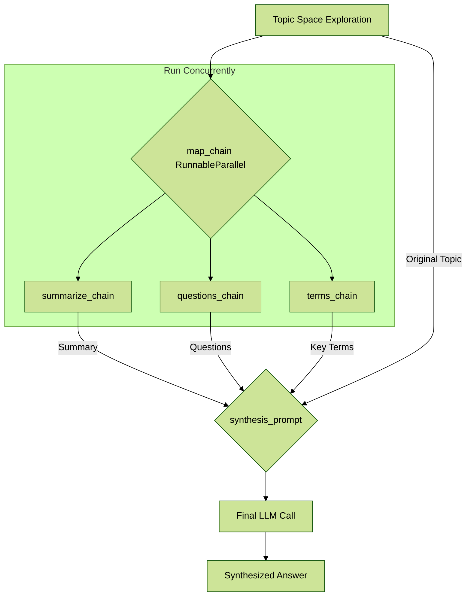
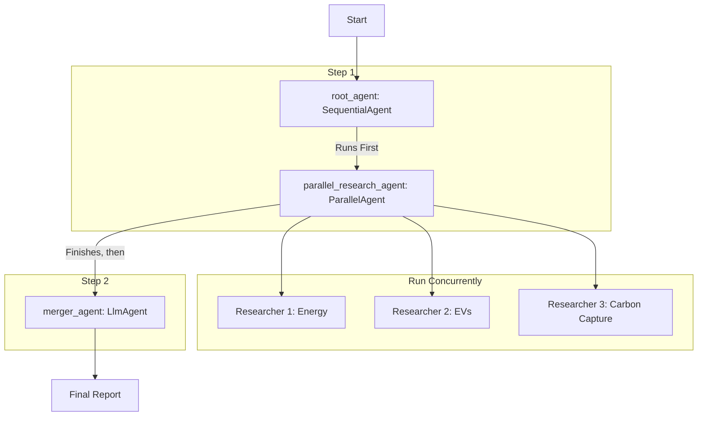

# AI Engineering Masterclass: The Parallelization Pattern

## Table of Contents
1.  [Introduction: The Need for Speed](#1-introduction-the-need-for-speed)
2.  [The Core Concept: What is Parallelization?](#2-the-core-concept-what-is-parallelization)
    - [An Analogy: The Efficient Kitchen Crew](#an-analogy-the-efficient-kitchen-crew)
3.  [When to Use Parallelization: Key Applications](#3-when-to-use-parallelization-key-applications)
4.  [Hands-On Example 1: LangChain (Concurrent Operations)](#4-hands-on-example-1-langchain-concurrent-operations)
    - [The Goal](#the-goal)
    - [The LangChain Philosophy: `RunnableParallel`](#the-langchain-philosophy-runnableparallel)
    - [The Workflow Explained](#the-workflow-explained)
    - [The Code, Explained Step-by-Step](#the-code-explained-step-by-step)
5.  [Hands-On Example 2: Google ADK (True Parallel Agents)](#5-hands-on-example-2-google-adk-true-parallel-agents)
    - [The Goal](#the-goal-1)
    - [The ADK Philosophy: Orchestrator Agents](#the-adk-philosophy-orchestrator-agents)
    - [The Workflow Explained](#the-workflow-explained-1)
    - [The Code, Explained Step-by-Step](#the-code-explained-step-by-step-1)
6.  [Final Summary & Key Takeaways](#6-final-summary--key-takeaways)
    - [At a Glance](#at-a-glance)
    - [Key Takeaways Checklist](#key-takeaways-checklist)

---

### 1. Introduction: The Need for Speed

So far, we've learned how to execute tasks in a sequence (**Prompt Chaining**) and how to make decisions about which path to take (**Routing**). But what if our agent needs to perform multiple tasks that don't depend on each other? Waiting for each one to finish before starting the next is a huge waste of time.

This is where the **Parallelization Pattern** becomes essential. Parallelization is all about executing multiple operations **concurrently** (at the same time). This dramatically reduces the total execution time and makes our agents faster and more responsive, especially when dealing with slow external services like APIs.

**Why it matters**: In the real world, speed is a critical feature. Parallelization is the key optimization technique for building high-performance agents that can handle complex, multi-part tasks efficiently.

### 2. The Core Concept: What is Parallelization?

**Parallelization** is the practice of identifying parts of a workflow that are **independent** of each other and running them simultaneously. The results are then gathered and combined in a subsequent step.

Let's consider an agent designed to research a topic.

**A Sequential Approach (Slow):**
1.  Search for Source A.
2.  *Wait...*
3.  Summarize Source A.
4.  *Wait...*
5.  Search for Source B.
6.  *Wait...*
7.  Summarize Source B.
8.  *Wait...*
9.  Synthesize the final answer from both summaries.
    *Total Time = Time(A) + Time(B) + Time(Synthesize)*

**A Parallel Approach (Fast):**
1.  **Simultaneously**:
    *   Search for and Summarize Source A.
    *   Search for and Summarize Source B.
2.  *Wait for both to finish...*
3.  Synthesize the final answer from both summaries.
    *Total Time = Time(Longest Task) + Time(Synthesize)*

The core idea is simple: **don't wait if you don't have to**.

#### An Analogy: The Efficient Kitchen Crew

Imagine a single chef in a kitchen preparing a three-course meal. A sequential chef would:
1.  Prepare, cook, and plate the appetizer.
2.  *Then*, prepare, cook, and plate the main course.
3.  *Finally*, prepare and serve the dessert.

An efficient kitchen with a **parallel** workflow would have three chefs working at the same time: one for the appetizer, one for the main, and one for the dessert. They all work concurrently, and the meal is ready in the time it takes the slowest chef to finish their dish.

### 3. When to Use Parallelization: Key Applications

This pattern is a powerful optimizer for a wide range of tasks.

*   **Information Gathering & Research**:
    *   **Use Case**: Researching a company.
    *   **Parallel Tasks**: Simultaneously search news articles, pull stock data from an API, check social media mentions, and query a company database.
*   **Data Processing & Analysis**:
    *   **Use Case**: Analyzing a batch of customer feedback.
    *   **Parallel Tasks**: For each piece of feedback, concurrently run sentiment analysis, extract keywords, and categorize the issue.
*   **Multi-API or Tool Interaction**:
    *   **Use Case**: A travel planning agent.
    *   **Parallel Tasks**: Concurrently check flight prices, search for hotel availability, look up local events, and find restaurant recommendations.
*   **Content Generation with Multiple Components**:
    *   **Use Case**: Creating a marketing email.
    *   **Parallel Tasks**: Simultaneously generate a subject line, draft the email body, and find a relevant image.
*   **Validation and Verification**:
    *   **Use Case**: Verifying a user's sign-up form.
    *   **Parallel Tasks**: Concurrently check the email format, validate the phone number via an API, and check the username against a database.
*   **A/B Testing or Generating Multiple Options**:
    *   **Use Case**: Creating headlines for an article.
    *   **Parallel Tasks**: Generate three different headlines using three slightly different prompts at the same time, then pick the best one.

### 4. Hands-On Example 1: LangChain (Concurrent Operations)

LangChain's Expression Language (LCEL) facilitates parallel execution through a special construct called `RunnableParallel`.

#### The Goal
To create a workflow that takes a single topic (e.g., "The history of space exploration") and concurrently performs three different tasks:
1.  **Summarize** the topic.
2.  Generate interesting **questions** about it.
3.  Extract key **terms** from it.
Finally, it will synthesize these three results into a comprehensive answer.

#### The LangChain Philosophy: `RunnableParallel`
In LangChain, you define a dictionary where each key is a desired output and each value is the chain that will produce it. When the workflow runs, LangChain executes all the chains in this dictionary concurrently using Python's `asyncio` library.

> **Important Note**: `asyncio` provides **concurrency**, not true parallelism. This means it uses a single CPU core to cleverly switch between tasks while they are idle (e.g., waiting for an API response). This is highly effective for I/O-bound tasks like LLM calls but is not the same as multi-core processing.

#### The Workflow Explained



#### The Code, Explained Step-by-Step

```python
# --- 1. Setup & Independent Chains ---
# (Imports, API key setup omitted)

# We define three separate, independent chains. Each is a runnable
# that can perform one task.
summarize_chain = ChatPromptTemplate.from_template("Summarize: {topic}") | llm | StrOutputParser()
questions_chain = ChatPromptTemplate.from_template("Generate questions about: {topic}") | llm | StrOutputParser()
terms_chain = ChatPromptTemplate.from_template("Extract key terms from: {topic}") | llm | StrOutputParser()

# --- 2. Build the Parallel Block ---
# `RunnableParallel` is the key. It's a dictionary of runnables.
# When this block is executed, LangChain will run all three chains concurrently.
map_chain = RunnableParallel(
    summary=summarize_chain,
    questions=questions_chain,
    key_terms=terms_chain,
    # We also pass the original topic through for the final step.
    topic=RunnablePassthrough() 
)

# --- 3. Build the Final Synthesis Step ---
# This prompt is designed to receive the dictionary of results
# from our `map_chain`.
synthesis_prompt = ChatPromptTemplate.from_messages([
    ("system", """Based on the following information:
    Summary: {summary}
    Related Questions: {questions}
    Key Terms: {key_terms}
    Synthesize a comprehensive answer."""),
    ("user", "Original topic: {topic}")
])

# --- 4. Construct the Full End-to-End Chain ---
# The final workflow is sequential at the highest level:
# 1. First, run the parallel `map_chain`.
# 2. Then, pipe its entire output dictionary into the `synthesis_prompt`.
# 3. Finally, send the formatted prompt to the LLM.
full_parallel_chain = map_chain | synthesis_prompt | llm | StrOutputParser()

# --- 5. Run the Asynchronous Chain ---
async def run_example():
    topic = "The history of space exploration"
    # We use `ainvoke` for asynchronous execution.
    response = await full_parallel_chain.ainvoke({"topic": topic})
    print(response)

# asyncio.run(run_example())
```

### 5. Hands-On Example 2: Google ADK (True Parallel Agents)

Google ADK provides a more structured, agent-based approach to parallelism using dedicated `ParallelAgent` and `SequentialAgent` primitives.

#### The Goal
To build a multi-agent system that:
1.  **In Parallel**: Has three specialist agents research renewable energy, electric vehicles, and carbon capture.
2.  **In Sequence**: Has a final "merger" agent take the results from the three researchers and synthesize them into a single, structured report.

#### The ADK Philosophy: Orchestrator Agents
In ADK, you build complex workflows by composing agents.
*   **`LlmAgent`**: A single agent that performs a task.
*   **`ParallelAgent`**: An orchestrator that runs multiple sub-agents concurrently and finishes when they are all done.
*   **`SequentialAgent`**: An orchestrator that runs multiple sub-agents one after another.

You combine these building blocks to define the entire workflow.

#### The Workflow Explained



#### The Code, Explained Step-by-Step

```python
# --- 1. Define the Specialist Researcher Agents ---
# These are three independent LlmAgents. Each has a specific research task.
# The `output_key` is important: it tells the agent where to save its result
# in the shared session state so the merger agent can find it later.

researcher_agent_1 = LlmAgent(
    name="RenewableEnergyResearcher",
    instruction="Research... renewable energy sources... Output *only* the summary.",
    tools=[google_search],
    output_key="renewable_energy_result"
)
researcher_agent_2 = LlmAgent(
    name="EVResearcher",
    instruction="Research... electric vehicle technology... Output *only* the summary.",
    tools=[google_search],
    output_key="ev_technology_result"
)
researcher_agent_3 = LlmAgent(
    name="CarbonCaptureResearcher",
    instruction="Research... carbon capture methods... Output *only* the summary.",
    tools=[google_search],
    output_key="carbon_capture_result"
)

# --- 2. Create the Parallel Orchestrator ---
# The `ParallelAgent` takes a list of sub-agents and runs them all concurrently.
# It finishes when all three researchers have completed and written to the state.
parallel_research_agent = ParallelAgent(
    name="ParallelWebResearchAgent",
    sub_agents=[researcher_agent_1, researcher_agent_2, researcher_agent_3]
)

# --- 3. Define the Merger Agent ---
# This is a standard LlmAgent. Its prompt is designed to read the results
# from the session state using the `output_key` names we defined earlier.
merger_agent = LlmAgent(
    name="SynthesisAgent",
    instruction="""Synthesize the following research summaries...
    **Input Summaries:**
    * **Renewable Energy:** {renewable_energy_result}
    * **Electric Vehicles:** {ev_technology_result}
    * **Carbon Capture:** {carbon_capture_result}
    ...
    """
)

# --- 4. Create the Sequential Orchestrator (The Main Controller) ---
# This is the root agent that defines the entire workflow.
# It runs its sub_agents in sequence:
# 1. First, run the `parallel_research_agent`.
# 2. After it's done, run the `merger_agent`.
root_agent = SequentialAgent(
    name="ResearchAndSynthesisPipeline",
    sub_agents=[parallel_research_agent, merger_agent]
)

# When you run the `root_agent`, it will execute this entire parallel-then-sequential flow.
```

### 6. Final Summary & Key Takeaways

#### At a Glance

> **What**: The Parallelization pattern involves executing multiple independent sub-tasks concurrently to reduce overall execution time.
>
> **Why**: Sequential execution is slow and inefficient, creating a bottleneck, especially when waiting for external APIs. Parallelization makes agents faster and more responsive.
>
> **Rule of Thumb**: Use this pattern whenever a workflow contains multiple operations that do not depend on each other's immediate output. It is the primary method for performance optimization in agentic design.

#### Key Takeaways Checklist

- [ ] **Parallelization executes independent tasks concurrently** to improve speed and efficiency.
- [ ] It is most effective for tasks that involve **waiting for external resources** (I/O-bound), like multiple API calls.
- [ ] While powerful, parallel architectures add complexity to design, debugging, and logging.
- [ ] In **LangChain**, concurrency is achieved using `RunnableParallel` within the LCEL framework.
- [ ] In **Google ADK**, parallelism is achieved by composing orchestrator agents like `ParallelAgent` and `SequentialAgent`.