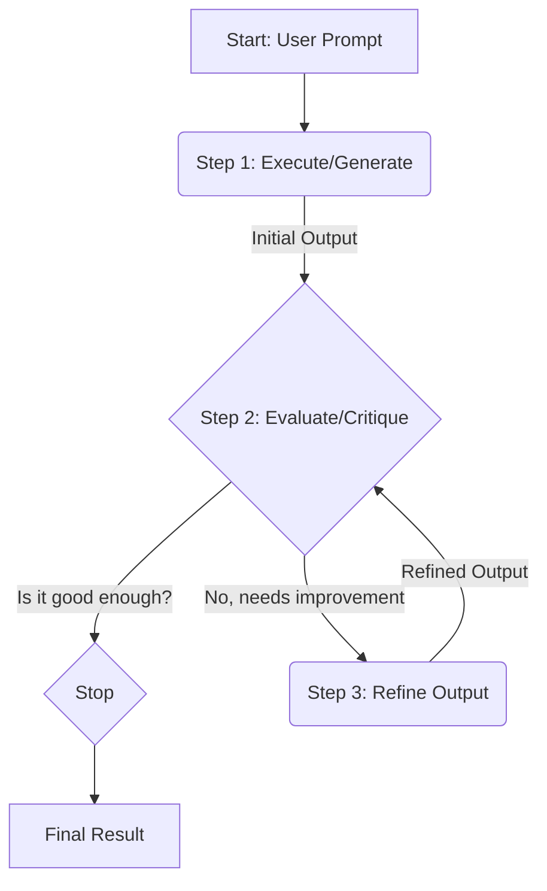
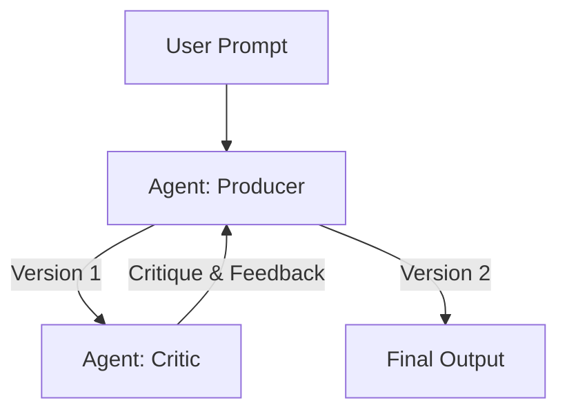

# AI Engineering Masterclass: The Reflection Pattern

## Table of Contents
1.  [Introduction: The Pursuit of Quality](#1-introduction-the-pursuit-of-quality)
2.  [The Core Concept: What is Reflection?](#2-the-core-concept-what-is-reflection)
    - [An Analogy: The Writer and the Editor](#an-analogy-the-writer-and-the-editor)
3.  [The Reflection Process: A Four-Step Cycle](#3-the-reflection-process-a-four-step-cycle)
4.  [The "Producer-Critic" Model: The Gold Standard](#4-the-producer-critic-model-the-gold-standard)
5.  [Practical Applications: Where Quality is King](#5-practical-applications-where-quality-is-king)
6.  [The Catch: The Price of Perfection](#6-the-catch-the-price-of-perfection)
7.  [Hands-On Example 1: LangChain (Iterative Code Refinement)](#7-hands-on-example-1-langchain-iterative-code-refinement)
    - [The Goal](#the-goal)
    - [The Workflow Explained](#the-workflow-explained)
    - [The Code, Explained Step-by-Step](#the-code-explained-step-by-step)
8.  [Hands-On Example 2: Google ADK (A Single Review Cycle)](#8-hands-on-example-2-google-adk-a-single-review-cycle)
    - [The Goal](#the-goal-1)
    - [The Workflow Explained](#the-workflow-explained-1)
    - [The Code, Explained Step-by-Step](#the-code-explained-step-by-step-1)
9.  [Final Summary & Key Takeaways](#9-final-summary--key-takeaways)
    - [At a Glance](#at-a-glance)
    - [Key Takeaways Checklist](#key-takeaways-checklist)

---

### 1. Introduction: The Pursuit of Quality

We've built a powerful toolkit so far. **Chaining** gives us structure, **Routing** gives us decision-making, and **Parallelization** gives us speed. But even with the best tools, an agent's first attempt at a complex task—its "first draft"—might have flaws. It could be inaccurate, incomplete, or poorly structured.

How do we take an agent's work from "good enough" to "great"? This is where the **Reflection Pattern** comes in. Reflection is a mechanism for **self-correction and iterative improvement**. It gives an agent the ability to step back, evaluate its own work, and intelligently refine it.

**Why it matters**: This pattern is the difference between an agent that just follows instructions and one that can produce high-quality, reliable, and polished results. It introduces a layer of "meta-cognition," or the ability to "think about its own thinking."

### 2. The Core Concept: What is Reflection?

**Reflection** is the process of an agent evaluating its own output or plan against a set of criteria and using that evaluation to generate a better version. It transforms a simple, one-way workflow into a **feedback loop**, where the agent's output is fed back into the system for critique and refinement.

This isn't just about passing data to the next step (like in Chaining). It's about critically examining the output for quality, accuracy, and completeness before moving forward.

#### An Analogy: The Writer and the Editor

This is the most intuitive way to understand Reflection:

*   A simple agent is like a writer who finishes a draft and immediately publishes it, typos and all.
*   An agent using **Reflection** is like a writer who finishes a draft and then gives it to a meticulous **editor**. The editor reads the draft, adds comments ("This paragraph is unclear," "Fact-check this claim," "Strengthen the conclusion"), and hands it back. The writer then uses this feedback to produce a much-improved second draft.

This process can even repeat multiple times until the work is polished and ready.

### 3. The Reflection Process: A Four-Step Cycle

Reflection typically follows an iterative loop. Understanding these four steps is key to implementing it effectively.

1.  **Execution (The First Draft)**: The agent performs the initial task and generates an output. This could be writing a piece of code, summarizing a document, or creating a plan.
2.  **Evaluation (The Critique)**: The agent (or a separate "critic" agent) analyzes the output against specific criteria. Is it factually correct? Does it follow instructions? Is the code efficient? Is the tone appropriate?
3.  **Refinement (The Second Draft)**: Based on the critique, the agent determines how to improve the output. It then generates a new, refined version, addressing the issues that were raised.
4.  **Iteration (Repeat if Necessary)**: The cycle can repeat. The refined output can be evaluated again, leading to further improvements, until a stopping condition is met (e.g., the output is deemed "perfect" or a maximum number of loops is reached).



### 4. The "Producer-Critic" Model: The Gold Standard

While an agent can critique its own work ("self-reflection"), a far more robust and powerful approach is the **Producer-Critic** model. This involves separating the workflow into two distinct roles:

1.  **The Producer Agent (The Creator)**: Its only job is to generate the content. It focuses purely on the creative or constructive task at hand, turning the initial prompt into the first draft.
2.  **The Critic Agent (The Reviewer)**: Its only job is to evaluate the Producer's output. It is given a different persona and a specific set of instructions (e.g., "You are a senior software engineer reviewing code for bugs" or "You are a meticulous fact-checker").

**Why is this so effective?** It avoids the "cognitive bias" of reviewing one's own work. The Critic comes in with a fresh, dedicated perspective, focused solely on finding flaws and suggesting improvements. This leads to more objective and higher-quality feedback.



### 5. Practical Applications: Where Quality is King

Use the Reflection pattern in any scenario where the final quality, accuracy, and detail of the output are more important than raw speed and cost.

*   **Creative Writing & Content Generation**: To refine a blog post for flow and clarity, ensuring it meets specific quality standards before publishing.
*   **Code Generation and Debugging**: To write initial code, have a "senior engineer" critic review it for bugs and inefficiencies, and then fix the code based on the feedback.
*   **Complex Problem Solving**: To evaluate each step in a logical puzzle. If a proposed step leads to a contradiction, the agent can "reflect" and backtrack to try a different path.
*   **Summarization & Information Synthesis**: To generate an initial summary and then compare it against the source document to ensure no key points were missed.
*   **Planning & Strategy**: To generate a multi-step plan and then have a critic evaluate its feasibility, identify potential flaws, and suggest improvements.

### 6. The Catch: The Price of Perfection

While Reflection is incredibly powerful, it's not free. You must be aware of the trade-offs:

*   **Increased Latency**: Each loop of critique and refinement takes time, making the overall process slower. This is not ideal for real-time applications.
*   **Higher Cost**: Each step (generation, critique, refinement) often involves an additional LLM call, which increases API costs.
*   **Memory & Context Limits**: The conversation history (initial prompt, first draft, critique, refined draft, etc.) grows with each iteration. This consumes more memory and can risk exceeding the model's context window.

### 7. Hands-On Example 1: LangChain (Iterative Code Refinement)

This code demonstrates a full iterative reflection loop to write and improve a Python function. It perfectly illustrates the Producer-Critic model within a single script.

#### The Goal
To create a Python function that calculates a factorial, ensuring it has a docstring, handles edge cases (0!), and raises an error for negative numbers. The process will iterate up to 3 times to perfect the code.

#### The Workflow Explained
The code creates a loop that alternates between two stages:
1.  **Generate/Refine Stage (Producer)**: The LLM's primary persona writes or refines the Python code based on the history.
2.  **Reflect Stage (Critic)**: The LLM is given a *different persona*—a senior software engineer—to critique the code it just generated.
The loop stops if the Critic deems the code "PERFECT" or after 3 iterations.

#### The Code, Explained Step-by-Step

```python
# --- 1. Setup ---
# (Imports, API key setup, and LLM initialization omitted)

def run_reflection_loop():
    # --- 2. The Core Task (The Producer's Goal) ---
    task_prompt = """
    Your task is to create a Python function named `calculate_factorial`.
    This function should... [handle edge cases, raise errors, etc.]
    """

    # --- 3. The Iterative Loop ---
    max_iterations = 3
    # We maintain a `message_history` to give the LLM context for each step.
    message_history = [HumanMessage(content=task_prompt)]

    for i in range(max_iterations):
        print(f"\n--- REFLECTION LOOP: ITERATION {i + 1} ---")

        # --- STAGE 1: GENERATE or REFINE (Producer Role) ---
        if i == 0:
            print(">>> STAGE 1: GENERATING initial code...")
        else:
            print(">>> STAGE 1: REFINING code based on previous critique...")
            # We explicitly ask it to refine the code.
            message_history.append(HumanMessage(content="Please refine the code using the critiques provided."))
        
        # The LLM generates the code based on the conversation history.
        response = llm.invoke(message_history)
        current_code = response.content
        message_history.append(response) # Add the new code to the history.

        # --- STAGE 2: REFLECT (Critic Role) ---
        print(">>> STAGE 2: REFLECTING on the generated code...")
        
        # This is the key! We create a NEW, temporary prompt to give the LLM
        # the persona of a senior code reviewer.
        reflector_prompt = [
            SystemMessage(content="You are a senior software engineer... Your role is to perform a meticulous code review... If the code is perfect, respond with 'CODE_IS_PERFECT'. Otherwise, provide a bulleted list of your critiques."),
            HumanMessage(content=f"Original Task:\n{task_prompt}\n\nCode to Review:\n{current_code}")
        ]
        
        critique_response = llm.invoke(reflector_prompt)
        critique = critique_response.content

        # --- STAGE 3: STOPPING CONDITION ---
        if "CODE_IS_PERFECT" in critique:
            print("\n--- Critique ---\nNo further critiques found. The code is satisfactory.")
            break # Exit the loop
        
        print(f"\n--- Critique ---\n{critique}")
        # Add the critique to the main history for the next refinement loop.
        message_history.append(HumanMessage(content=f"Critique of the previous code:\n{critique}"))

    print("\n--- FINAL REFINED CODE ---\n")
    print(current_code)```

### 8. Hands-On Example 2: Google ADK (A Single Review Cycle)

This ADK example showcases a single pass of the Producer-Critic model using two distinct agents orchestrated by a `SequentialAgent`.

#### The Goal
To have one agent (`generator`) write a short paragraph and a second agent (`reviewer`) fact-check its work, producing a structured critique.

#### The Workflow Explained
This is a non-iterative, single-loop reflection.
1.  The `SequentialAgent` first runs the `generator` agent.
2.  The `generator` writes a paragraph and saves it to the shared state (`draft_text`).
3.  The `SequentialAgent` then runs the `reviewer` agent.
4.  The `reviewer` reads `draft_text` from the state, performs its critique, and saves its structured feedback to the state (`review_output`).

#### The Code, Explained Step-by-Step

```python
# --- 1. Define the Producer Agent ---
# Its only job is to generate the initial draft.
generator = LlmAgent(
    name="DraftWriter",
    instruction="Write a short, informative paragraph about the user's subject.",
    # It saves its output to the 'draft_text' key in the shared state.
    output_key="draft_text" 
)

# --- 2. Define the Critic Agent ---
# Its only job is to review the draft.
reviewer = LlmAgent(
    name="FactChecker",
    instruction="""
    You are a meticulous fact-checker.
    1. Read the text provided in the state key 'draft_text'.
    2. Carefully verify the factual accuracy of all claims.
    3. Your final output must be a dictionary with "status" and "reasoning" keys.
    """,
    # It saves its dictionary output to the 'review_output' key.
    output_key="review_output"
)

# --- 3. Define the Orchestrator ---
# The `SequentialAgent` ensures the Producer runs before the Critic.
# This structure perfectly models a single pass of the reflection pattern.
review_pipeline = SequentialAgent(
    name="WriteAndReview_Pipeline",
    sub_agents=[generator, reviewer]
)

# --- Execution Flow ---
# 1. generator runs -> saves its paragraph to state['draft_text'].
# 2. reviewer runs -> reads state['draft_text'] and saves its
#    dictionary output to state['review_output'].
```

### 9. Final Summary & Key Takeaways

#### At a Glance

> **What**: The Reflection pattern is a mechanism for self-correction where an agent establishes a feedback loop to iteratively evaluate and refine its own work, leading to higher-quality outputs.
>
> **Why**: An agent's first output is often suboptimal. Reflection provides a structured way to identify and fix errors, moving beyond simple instruction-following to a more robust form of problem-solving.
>
> **Rule of Thumb**: Use the Reflection pattern when the **quality, accuracy, and detail** of the final output are more important than speed and cost. It is essential for generating polished content, debugging code, and creating reliable plans. The **Producer-Critic** model is the most effective implementation.

#### Key Takeaways Checklist

- [ ] **Reflection is an iterative feedback loop**: Execute -> Evaluate -> Refine.
- [ ] Its primary goal is to **improve the quality, accuracy, and reliability** of an agent's output.
- [ ] The **Producer-Critic model** is a powerful implementation that uses a separate agent (or role) for critique to enhance objectivity.
- [ ] This pattern is crucial for complex tasks like polished writing, robust code generation, and strategic planning.
- [ ] Be mindful of the trade-offs: Reflection **increases latency (time) and cost** due to the extra processing and LLM calls.