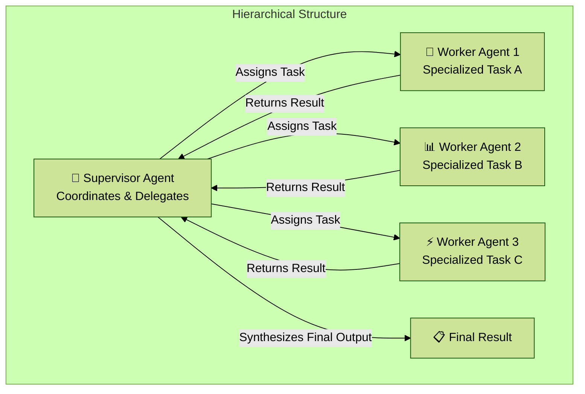

## Table of Contents
1.  [Introduction: Beyond the Lone Genius](#1-introduction-beyond-the-lone-genius)
2.  [The Core Concept: What is Multi-Agent Collaboration?](#2-the-core-concept-what-is-multi-agent-collaboration)
    - [An Analogy: The Expert Software Development Team](#an-analogy-the-expert-software-development-team)
3.  [Collaboration Models: How Agents Work Together](#3-collaboration-models-how-agents-work-together)
4.  [Communication Architectures: The Social Network of Agents](#4-communication-architectures-the-social-network-of-agents)
5.  [Practical Applications: Assembling Your Digital A-Team](#5-practical-applications-assembling-your-digital-a-team)
6.  [Hands-On Example 1: CrewAI (A Sequential Handoff)](#6-hands-on-example-1-crewai-a-sequential-handoff)
    - [The Goal](#the-goal)
    - [The CrewAI Philosophy](#the-crewai-philosophy)
    - [The Code, Explained Step-by-Step](#the-code-explained-step-by-step)
7.  [Hands-On Example 2: Google ADK (Hierarchical Delegation)](#7-hands-on-example-2-google-adk-hierarchical-delegation)
    - [The Goal](#the-goal-1)
    - [The ADK Philosophy](#the-adk-philosophy)
    - [The Code, Explained Step-by-Step](#the-code-explained-step-by-step-1)
8.  [Final Summary & Key Takeaways](#8-final-summary--key-takeaways)
    - [At a Glance](#at-a-glance)
    - [Key Takeaways Checklist](#key-takeaways-checklist)

---

### 1. Introduction: Beyond the Lone Genius

A single, monolithic agent, no matter how powerful, has limitations. It's like a brilliant individual trying to build an entire skyscraper alone. For complex, multi-domain problems, a much more effective approach is to assemble a team of specialists. This is the essence of the **Multi-Agent Collaboration** pattern.

This pattern addresses the limitations of a single agent by structuring a system as a **cooperative ensemble of distinct, specialized agents**. The high-level objective is broken down into discrete sub-problems, and each is assigned to an agent with the specific tools, knowledge, or skills best suited for that task.

**Why it matters**: This is how we build truly sophisticated and robust systems. By dividing labor, we create solutions that are more modular, scalable, and resilient. The collective performance of the team surpasses what any single agent could ever achieve.

### 2. The Core Concept: What is Multi-Agent Collaboration?

Multi-Agent Collaboration is a design pattern where multiple independent or semi-independent agents work together to achieve a common goal. The power of this pattern lies not just in the division of labor, but in the **synergy and interaction** between these agents.

This requires two fundamental components:
1.  **Task Decomposition**: A complex problem (e.g., "produce a market research report") is broken down into smaller, specialized tasks.
2.  **Inter-Agent Communication**: A standardized protocol that allows agents to exchange data, delegate tasks, and coordinate their actions to ensure the final output is coherent.

For example, a research report task could be assigned to:
*   A **Research Agent** to find and retrieve information.
*   A **Data Analysis Agent** to process statistics.
*   A **Synthesis Agent** to write the final report.

The success of the system depends entirely on these agents' ability to communicate and work together effectively.

#### An Analogy: The Expert Software Development Team

*   **A Monolithic Agent**: This is like a single developer trying to do everything: gather user requirements, write the code, design the UI, test for bugs, and write the documentation. They might be a genius, but they'll be slow, and the quality will be inconsistent across different domains.
*   **A Multi-Agent System**: This is like a modern software team:
    *   A **Product Manager Agent** analyzes user needs.
    *   A **Developer Agent** writes the code.
    *   A **QA Agent** tests the code for bugs.
    *   A **UI/UX Designer Agent** creates the user interface.
    *   A **Technical Writer Agent** produces the documentation.

Each agent is a specialist. They communicate, hand off work, and collaborate to build a high-quality product far more efficiently than any single person could.

### 3. Collaboration Models: How Agents Work Together

Collaboration isn't a single concept; it can take many forms. Here are the most common models:

*   **Sequential Handoffs**: A digital assembly line. Agent A completes its task and passes its output to Agent B, who performs the next step. This is similar to the Chaining pattern but explicitly involves different, specialized agents.
*   **Parallel Processing**: A divide-and-conquer approach. Multiple agents work on different, independent parts of a problem simultaneously. Their results are combined later by another agent.
*   **Hierarchical Structures (Manager/Worker)**: A "supervisor" or "manager" agent breaks down a task and delegates the sub-tasks to a team of "worker" agents. The manager then synthesizes their results. This is a very common and powerful structure.
*   **Expert Teams**: A group of agents with different specializations (e.g., a researcher, a writer, an editor) collaborate to produce a complex output, much like our software team analogy.
*   **Critic-Reviewer**: A multi-agent implementation of the **Reflection** pattern. A "Producer" agent creates a draft, and a "Critic" agent reviews it, providing feedback for refinement. This separation of roles enhances objectivity and quality.
*   **Debate and Consensus**: Multiple agents with different perspectives or information sources can discuss a problem, evaluate options, and vote to reach a more informed and robust decision.



### 4. Communication Architectures: The Social Network of Agents

The way agents are interconnected defines the overall structure and capability of the system.

1.  **Single Agent**: The baseline. A solo agent with its own tools, operating without communication.
2.  **Network (Peer-to-Peer)**: A decentralized model where all agents can talk directly to each other. This is resilient but can become chaotic and hard to manage as the number of agents grows.
3.  **Supervisor (Hub-and-Spoke)**: A dedicated supervisor agent acts as a central hub for communication and task allocation. This is organized and efficient but creates a single point of failure.
4.  **Supervisor as a Tool**: A variation where the supervisor is less of a direct commander and more of a resource provider. Other agents can "call" the supervisor to access its powerful tools or data.
5.  **Hierarchical**: A multi-layered organizational chart. High-level supervisors manage teams of lower-level supervisors, who in turn manage teams of worker agents. This is excellent for managing highly complex problems at scale.
6.  **Custom**: A hybrid model tailored to a specific problem, combining elements from the other architectures.

### 5. Practical Applications: Assembling Your Digital A-Team

Multi-agent collaboration is a powerful pattern for nearly any complex domain.

*   **Complex Research and Analysis**: A team of agents specializes in searching databases, summarizing findings, identifying trends, and synthesizing a final report.
*   **Software Development**: A team of agents collaborates to act as a requirements analyst, code generator, tester, and documentation writer.
*   **Creative Content Generation**: A market research agent, a copywriter agent, a graphic design agent (using image generation tools), and a social media scheduling agent work together to create and launch a marketing campaign.
*   **Financial Analysis**: Specialist agents fetch stock data, analyze news sentiment, perform technical analysis, and generate investment recommendations.
*   **Customer Support Escalation**: A front-line agent handles simple queries and intelligently escalates complex issues to the correct specialist agent (e.g., technical expert, billing specialist).

### 6. Hands-On Example 1: CrewAI (A Sequential Handoff)

#### The Goal
To create a two-agent crew where:
1.  A **Researcher Agent** finds the top 3 emerging trends in AI.
2.  A **Writer Agent** takes the researcher's findings and writes a 500-word blog post.

#### The CrewAI Philosophy
CrewAI excels at defining agents with specific `roles` and `goals`, then orchestrating their collaboration through `Tasks`. The key to collaboration in CrewAI is the `context` parameter in a task, which makes one task dependent on the output of another.

#### The Code, Explained Step-by-Step

```python
# --- 1. Define the Agents ---
# Each agent has a clear, specialized role.
researcher = Agent(
    role='Senior Research Analyst',
    goal='Find and summarize the latest trends in AI.',
    backstory='You are an experienced research analyst...'
)

writer = Agent(
    role='Technical Content Writer',
    goal='Write a clear and engaging blog post based on research findings.',
    backstory='You are a skilled writer...'
)

# --- 2. Define the Tasks ---
# The first task is for the researcher. It has no dependencies.
research_task = Task(
    description='Research the top 3 emerging trends in Artificial Intelligence in 2024-2025.',
    expected_output='A detailed summary of the top 3 AI trends...',
    agent=researcher
)

# The second task is for the writer. This is the key collaboration step.
# The `context=[research_task]` tells the Crew that this task depends on the
# output of the research_task. The writer agent will automatically receive
# the researcher's findings as input.
writing_task = Task(
    description='Write a 500-word blog post based on the research findings.',
    expected_output='A complete 500-word blog post...',
    agent=writer,
    context=[research_task] # This enables the handoff!
)

# --- 3. Assemble and Run the Crew ---
# We define the agents and the tasks. `Process.sequential` ensures
# the tasks are run in an order that respects their dependencies.
blog_creation_crew = Crew(
    agents=[researcher, writer],
    tasks=[research_task, writing_task],
    process=Process.sequential
)

result = blog_creation_crew.kickoff()
print(result)```

### 7. Hands-On Example 2: Google ADK (Hierarchical Delegation)

#### The Goal
To create a "Coordinator" agent that acts as a supervisor, delegating tasks to two specialized sub-agents: a "Greeter" and a "TaskExecutor".

#### The ADK Philosophy
Google ADK uses an object-oriented approach where agents can be composed. You create a parent "supervisor" agent and assign other agents to its `sub_agents` list. The parent agent's instructions then guide its logic for delegating tasks to the appropriate child.

#### The Code, Explained Step-by-Step

```python
# --- 1. Define the Worker (Sub-Agents) ---
# LlmAgent requires a model to be specified.
greeter = LlmAgent(
    name="Greeter",
    model="gemini-2.0-flash-exp",
    instruction="You are a friendly greeter."
)

# This is a custom agent for non-LLM tasks.
class TaskExecutor(BaseAgent):
    name: str = "TaskExecutor"
    description: str = "Executes a predefined task."
    # ... (implementation logic)
task_doer = TaskExecutor()

# --- 2. Define the Supervisor (Parent Agent) ---
# The coordinator's instructions are crucial. They explicitly tell it
# WHEN to delegate and TO WHOM.
coordinator = LlmAgent(
    name="Coordinator",
    model="gemini-2.0-flash-exp",
    description="A coordinator that can greet users and execute tasks.",
    instruction="When asked to greet, delegate to the Greeter. When asked to perform a task, delegate to the TaskExecutor.",
    # This is the key collaboration step! We establish the hierarchy here.
    sub_agents=[
        greeter,
        task_doer
    ]
)

# --- 3. The Result ---
# The ADK framework automatically establishes the parent-child relationships.
# When the coordinator receives a prompt like "Greet the user and then do the task,"
# its LLM brain, guided by its instructions, will first invoke the `greeter` agent,
# and then invoke the `task_doer` agent.
print("Agent hierarchy created successfully.")
```

### 8. Final Summary & Key Takeaways

#### At a Glance

> **What**: Complex, multi-domain problems often exceed the capabilities of a single agent. The Multi-Agent Collaboration pattern solves this by creating a system of multiple, cooperating agents where each agent is a specialist with a defined role, toolset, or skillset.
>
> **Why**: This distributed approach creates a synergistic effect, allowing the group to achieve outcomes impossible for any single agent. It leads to systems that are more modular (easier to maintain), scalable (can handle more complexity), and robust (the failure of one agent doesn't crash the entire system).
>
> **Rule of Thumb**: Use this pattern when a task is too complex for a single agent and can be decomposed into distinct sub-tasks requiring specialized skills or tools. It is ideal for problems that benefit from diverse expertise, parallel processing, or a structured workflow with multiple stages.

#### Key Takeaways Checklist

- [x] **Multi-Agent Collaboration** involves multiple specialized agents working together to achieve a common goal.
- [x] The pattern leverages **specialized roles**, distributed tasks, and **inter-agent communication**.
- [x] Collaboration can take many forms, including **sequential handoffs**, **parallel processing**, and **hierarchical structures**.
- [x] A well-defined communication architecture (e.g., Supervisor, Network) is fundamental to a successful multi-agent system.
- [x] Frameworks like **CrewAI** and **Google ADK** provide powerful, high-level abstractions for building, composing, and orchestrating multi-agent systems.