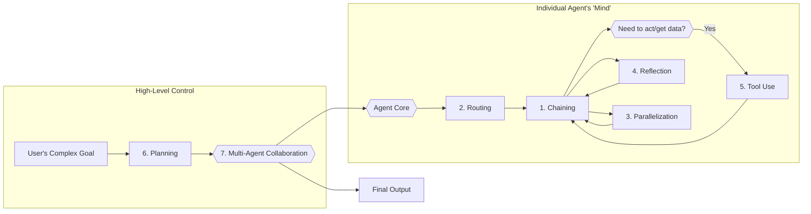

---
title: "Summary"
---

# The Agentic Design Playbook: A Synthesis of Core Patterns

## Table of Contents
1.  [**Introduction: The Blueprint of an AI Mind**](#1-introduction-the-blueprint-of-an-ai-mind)
2.  [**The Building Blocks: A Review of Each Pattern**](#2-the-building-blocks-a-review-of-each-pattern)
    *   [Chapter 1: Prompt Chaining - The Assembly Line](#chapter-1-prompt-chaining---the-assembly-line)
    *   [Chapter 2: Routing - The Smart Switchboard](#chapter-2-routing---the-smart-switchboard)
    *   [Chapter 3: Parallelization - The Efficiency Engine](#chapter-3-parallelization---the-efficiency-engine)
    *   [Chapter 4: Reflection - The Quality Control Inspector](#chapter-4-reflection---the-quality-control-inspector)
    *   [Chapter 5: Tool Use - The Bridge to the Real World](#chapter-5-tool-use---the-bridge-to-the-real-world)
    *   [Chapter 6: Planning - The Grand Strategist](#chapter-6-planning---the-grand-strategist)
    *   [Chapter 7: Multi-Agent Collaboration - The Expert Team](#chapter-7-multi-agent-collaboration---the-expert-team)
3.  [**Connecting the Patterns: How They Work Together**](#3-connecting-the-patterns-how-they-work-together)
    *   [The Foundational Workflow: Chaining and Routing](#the-foundational-workflow-chaining-and-routing)
    *   [Enhancing the Workflow: Parallelization and Reflection](#enhancing-the-workflow-parallelization-and-reflection)
    *   [Empowering the Workflow: Tool Use and Planning](#empowering-the-workflow-tool-use-and-planning)
    *   [Scaling the Workflow: Multi-Agent Collaboration](#scaling-the-workflow-multi-agent-collaboration)
4.  [**Putting It All Together: Anatomy of a Sophisticated Agent**](#4-putting-it-all-together-anatomy-of-a-sophisticated-agent)
5.  [**Final Conclusion: Your Agentic Design Toolkit**](#5-final-conclusion-your-agentic-design-toolkit)

---

### 1. Introduction: The Blueprint of an AI Mind

Welcome to your consolidated guide. Think of the seven patterns we've covered not as isolated tricks, but as a complete **blueprint for designing and building an AI agent's "mind."** Each pattern provides a specific, essential capability, and their true power is unlocked when you understand how they interconnect.

A basic agent can follow a single instruction. A sophisticated agent can **strategize, self-correct, use tools, make decisions, work efficiently, and even collaborate.** This document will show you how these patterns form a layered, synergistic system to achieve that goal.

### 2. The Building Blocks: A Review of Each Pattern

Here is a concise summary of each pattern, focusing on the problem it solves and its core importance.

#### Chapter 1: Prompt Chaining - The Assembly Line
*   **Problem It Solves**: A single, monolithic prompt for a complex task is unreliable. It places too much "cognitive load" on an LLM, leading to errors, forgotten instructions, and poor-quality output.
*   **Core Idea**: Break down a complex task into a sequence of smaller, simpler, more manageable steps. The output of one step becomes the input for the next.
*   **Importance**: This is the most fundamental pattern for creating **structure and reliability**. It transforms an unpredictable process into a dependable, step-by-step workflow. It is the **spine** of your agent's thought process.

#### Chapter 2: Routing - The Smart Switchboard
*   **Problem It Solves**: Real-world tasks are not always linear. An agent needs to make decisions and choose between different paths based on the context or user input.
*   **Core Idea**: Introduce conditional logic (`if this, then that`). A router component analyzes the current state and directs the workflow to the most appropriate next step or tool.
*   **Importance**: Routing gives your agent a **brain**. It moves beyond a rigid, fixed sequence and allows for dynamic, context-aware decision-making.

#### Chapter 3: Parallelization - The Efficiency Engine
*   **Problem It Solves**: Executing independent tasks one after another is slow and inefficient, especially when waiting for external APIs or long computations.
*   **Core Idea**: Identify tasks that don't depend on each other and execute them simultaneously.
*   **Importance**: This pattern is crucial for **performance and speed**. It dramatically reduces latency, making your agent more responsive and capable of handling more work in less time.

#### Chapter 4: Reflection - The Quality Control Inspector
*   **Problem It Solves**: An agent's "first draft" of an output (be it code, text, or a plan) may not be optimal, accurate, or complete.
*   **Core Idea**: Create a feedback loop for **self-correction and iterative improvement**. An agent (or a separate "critic" agent) evaluates an output against a set of criteria and then refines it.
*   **Importance**: Reflection is the key to producing **high-quality, polished, and reliable results**. It adds a layer of meta-cognition, ensuring the final output is robust and accurate.

#### Chapter 5: Tool Use - The Bridge to the Real World
*   **Problem It Solves**: LLMs are fundamentally disconnected from the real world. Their knowledge is static, and they cannot perform actions like accessing live data, sending emails, or running code.
*   **Core Idea**: Give the agent access to external functions, APIs, and services. The LLM decides *when* to use a tool, and an orchestration framework executes it and returns the result.
*   **Importance**: This is the pattern that makes an agent **useful and practical**. It gives the agent's brain **hands and eyes**, allowing it to perceive and act upon the world beyond its training data.

#### Chapter 6: Planning - The Grand Strategist
*   **Problem It Solves**: Complex, high-level goals cannot be solved by simply reacting to inputs. The agent needs foresight to determine the *how* when it isn't explicitly provided.
*   **Core Idea**: The agent first decomposes a high-level objective into a coherent, multi-step plan. This plan is often adaptable, changing as new information is encountered.
*   **Importance**: Planning gives your agent **autonomy and foresight**. It transforms it from a simple task-executor into a strategic thinker that can navigate complex problems from start to finish.

#### Chapter 7: Multi-Agent Collaboration - The Expert Team
*   **Problem It Solves**: A single agent, like a single person, cannot be an expert in everything. For truly complex, multi-domain problems, a lone agent becomes a bottleneck and a single point of failure.
*   **Core Idea**: Structure the system as a team of multiple, specialized agents that cooperate to achieve a common goal. They divide labor and communicate to produce a synergistic outcome.
*   **Importance**: This is the pattern for **scalability, modularity, and advanced problem-solving**. It allows you to build systems that are far more capable, robust, and efficient than any single agent could ever be.

### 3. Connecting the Patterns: How They Work Together

No pattern exists in a vacuum. They are designed to be layered and combined. Here is the logical flow of how you build a sophisticated agent by connecting these patterns.

#### The Foundational Workflow: Chaining and Routing
**Chaining** is the skeleton of any workflow. **Routing** adds the joints and nervous system, allowing the skeleton to move and react intelligently. A routed workflow is fundamentally a chain with decision points.

#### Enhancing the Workflow: Parallelization and Reflection
These two patterns act as powerful modifiers to your foundational workflow.
*   Within a chain, if you have multiple independent steps, you can wrap them in a **Parallelization** block to speed everything up.
*   After a critical step in a chain produces an output, you can insert a **Reflection** loop to ensure its quality before proceeding.

#### Empowering the Workflow: Tool Use and Planning
These patterns give the agent purpose and power.
*   **Tool Use** is what makes the steps in a chain actually *do* something. An action in a chain is often a call to a tool. A router might decide *which* tool to use.
*   **Planning** is the meta-pattern that generates the initial chain or workflow. When faced with a complex goal, the planning agent's first output is the sequence of steps (the chain) that another agent will execute.

#### Scaling the Workflow: Multi-Agent Collaboration
This is the ultimate scaling pattern. Instead of one agent with one complex plan, you have a **Supervisor Agent** whose plan involves delegating sub-goals to a team of specialist agents. Each of these specialist agents then runs its own internal workflow using all the other patterns.

### 4. Putting It All Together: Anatomy of a Sophisticated Agent

Let's imagine an **Autonomous Market Research Agent** tasked with: "Generate a detailed report on the European Electric Vehicle market, including key players, recent trends, and a 5-year forecast."

Here is how it would use all seven patterns:

1.  **Planning**: The agent's first action is to create a high-level plan:
    1.  Research key companies and sales data.
    2.  Analyze recent news for market sentiment and trends.
    3.  Find expert financial forecasts.
    4.  Synthesize all data into a structured report.
    5.  Review and refine the final report.

2.  **Multi-Agent Collaboration**: The main agent (a "Supervisor") delegates these tasks:
    *   It assigns step 1 to a **Researcher Agent**.
    *   It assigns step 2 to a **News Analyst Agent**.
    *   It assigns steps 4 and 5 to a **Writer Agent** and an **Editor Agent**.

3.  **Tool Use**:
    *   The `Researcher Agent` uses `web_search` and `database_query` tools.
    *   The `News Analyst Agent` uses a tool that scrapes financial news sites.

4.  **Parallelization**: To be efficient, the `Supervisor Agent` runs the `Researcher Agent` and the `News Analyst Agent` **simultaneously**, as their tasks are independent.

5.  **Routing**: The `News Analyst Agent`'s internal workflow uses **Routing**. After getting an article, it analyzes the content. If the sentiment is positive, it routes the data to a "Positive Trends" collector. If negative, it routes to a "Market Risks" collector.

6.  **Chaining**: The `Writer Agent` operates on a **Sequential Chain**:
    1.  Take the structured data from the other agents.
    2.  Draft the executive summary.
    3.  Draft the main body.
    4.  Generate charts and tables.

7.  **Reflection**: After the `Writer Agent` completes its first draft, it is handed to the **`Editor Agent`** (a Critic). The `Editor Agent` reviews the draft for clarity, factual accuracy, and coherence, providing feedback. The `Writer Agent` then produces a final, refined version.

### 5. Final Conclusion: Your Agentic Design Toolkit

These seven patterns are the fundamental building blocks for creating intelligent, autonomous, and useful AI systems. By understanding not only what each one does but how they connect, you move from being a prompt engineer to an **agentic architect**. You now have a complete toolkit to design workflows that are structured, intelligent, efficient, high-quality, empowered, strategic, and scalable.