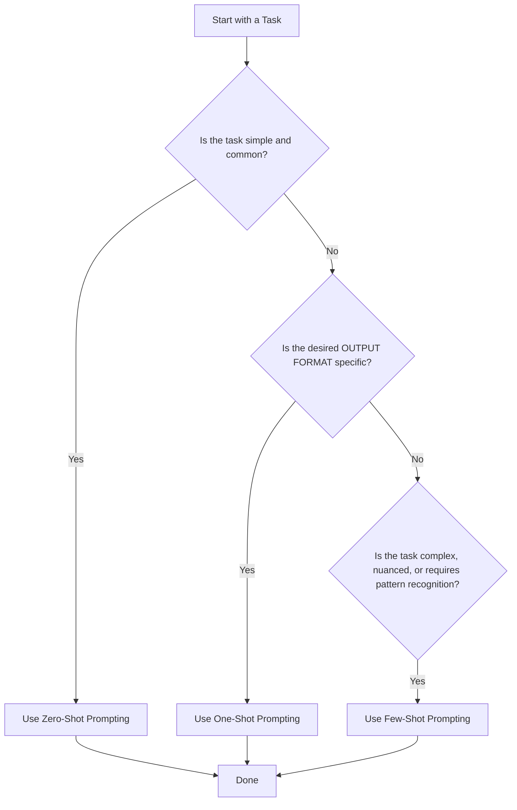

Now that we have established the core principles of communication, we will explore the fundamental *patterns* for structuring your prompts. Think of this as choosing the right teaching method for a new employee. Do you just tell them what to do, show them one example, or give them a small training packet? The method you choose depends on the complexity of the task.

### **Chapter 3: Basic Prompting Techniques**

This chapter covers the three primary methods for providing context to a language model. Mastering these techniques will allow you to tailor your prompt's level of guidance to the specific task at hand, ensuring efficient and accurate results.

#### **3.1 Zero-Shot Prompting: Instruction Without Examples**

*   **Simple Explanation:** This is the most direct form of prompting. You give the model an instruction and expect it to "just know" how to perform the task based on its vast pre-training data. You provide **zero examples** of the desired output.

*   **Analogy:** Think of asking an experienced chef to "chop an onion." You don't need to show them how to hold the knife or what a chopped onion looks like. Their prior training makes the instruction sufficient.

*   **When to Use It:**
    *   For simple, common-knowledge tasks (e.g., summarization, translation, general questions).
    *   When the task is straightforward and has very little ambiguity.
    *   **Always try this first.** It's the simplest and most efficient method. If it works, you don't need anything more complex.

*   **Concrete Example:**
    ```
    Task: Translate the following English sentence into Japanese.

    Sentence: "The weather is beautiful today."
    ```

#### **3.2 One-Shot Prompting: Providing a Single Demonstration**

*   **Simple Explanation:** In this technique, you provide the model with **one single example** of the input and the corresponding desired output. This single demonstration acts as a template, showing the model the specific pattern or format you want it to follow.

*   **Analogy:** Imagine teaching that same chef a new, specific plating style. You wouldn't just describe it; you would plate one dish yourself and say, "Do it like this." The single example communicates the style far better than words alone.

*   **When to Use It:**
    *   When the desired output format is specific, unusual, or non-obvious.
    *   For simple data extraction tasks where you need a consistent key-value structure.
    *   When Zero-Shot prompting understands the *task* but fails to produce the *format* you need.

*   **Concrete Example:**
    ```
    Task: Extract the product name from the customer feedback.

    Feedback: "I absolutely love my new UltraWidget Pro, it's fantastic!"
    Product Name: UltraWidget Pro

    Feedback: "The SuperGadget X is okay, but the battery could be better."
    Product Name:
    ```

#### **3.3 Few-Shot Prompting: Establishing Patterns with Multiple Examples**

*   **Simple Explanation:** This is the most powerful of the three basic techniques. You provide the model with **several examples (typically 3-5 or more)** of input-output pairs. This "mini training set" within the prompt allows the model to learn more complex, nuanced patterns and apply them to new inputs.

*   **Analogy:** This is like giving a new data entry clerk a small stack of completed forms before they start. By reviewing several examples, they learn how to handle variations, edge cases, and the overall "rules" of the task much more effectively than if they had only seen one.

*   **When to Use It:**
    *   For complex tasks like classification, where the model needs to understand the subtle differences between categories.
    *   When the desired output requires a high degree of stylistic consistency or adherence to a complex schema.
    *   When Zero-Shot and One-Shot prompts fail to produce consistently accurate results.

*   **Concrete Example:**
    ```
    Task: Classify the sentiment of the following movie reviews as POSITIVE, NEUTRAL, or NEGATIVE.

    Review: "A cinematic masterpiece! I was on the edge of my seat."
    Sentiment: POSITIVE

    Review: "The movie was alright, but I probably wouldn't watch it again."
    Sentiment: NEUTRAL

    Review: "A complete waste of time. The plot was confusing and boring."
    Sentiment: NEGATIVE

    Review: "The special effects were incredible, but the acting was a bit wooden."
    Sentiment:
    ```

---

##### **3.3.1 The Importance of Example Quality and Diversity**

*   **Simple Explanation:** The effectiveness of Few-Shot prompting depends entirely on the quality of your examples. The model is a pattern-matching machine; if your examples contain errors or are not diverse enough, the model will learn the wrong pattern.

*   **Analogy:** Think "Garbage In, Garbage Out." If you teach a child math using worksheets filled with incorrect answers, they will learn to solve problems incorrectly. Your examples are the model's textbook—they must be accurate and cover a range of scenarios.

*   **Concrete Example:**
    *   **Bad Example (Error):** `Review: "Loved it!", Sentiment: NEUTRAL` -> This will confuse the model.
    *   **Bad Example (Lacks Diversity):** All your POSITIVE examples are about acting, and all your NEGATIVE examples are about plot. The model might incorrectly learn that "acting" is always positive.
    *   **Good Example (Diverse):** Include examples that are short, long, use sarcasm, or are mixed in sentiment to teach the model how to handle real-world complexity.

##### **3.3.2 Best Practices for Classification: Mixing Classes**

*   **Simple Explanation:** When providing few-shot examples for a classification task, you must **randomize the order** of the different classes. If you list all your POSITIVE examples first, then all your NEUTRAL, etc., the model might incorrectly learn that the order of the examples is part of the pattern.

*   **Analogy:** Imagine studying for a multiple-choice test. If you study all the "A" answers, then all the "B" answers, you aren't really learning the material. You need to study from a mixed-up practice test to ensure you can identify the correct answer regardless of its position.

*   **Concrete Example:**
    *   **BAD (Sorted by Class):**
        1.  `Review: "Amazing!", Sentiment: POSITIVE`
        2.  `Review: "Fantastic!", Sentiment: POSITIVE`
        3.  `Review: "Boring.", Sentiment: NEGATIVE`
        4.  `Review: "Terrible.", Sentiment: NEGATIVE`
    *   **GOOD (Mixed Classes):**
        1.  `Review: "Amazing!", Sentiment: POSITIVE`
        2.  `Review: "Boring.", Sentiment: NEGATIVE`
        3.  `Review: "Fantastic!", Sentiment: POSITIVE`
        4.  `Review: "Terrible.", Sentiment: NEGATIVE`

##### **3.3.3 The Evolution to "Many-Shot" Learning in Modern LLMs**

*   **Simple Explanation:** Historically, prompts were limited in length. "Few-Shot" meant just a handful of examples. As modern LLMs (like Gemini) have developed massive "context windows" (the amount of text they can process at once), the line has blurred. "Many-Shot" learning is now possible, where you can include **hundreds of examples** directly in the prompt.

*   **Analogy:** This is the difference between giving your new employee a one-page "quick reference guide" (Few-Shot) and giving them an "open-book test" where the entire training manual is available to them at all times (Many-Shot). More context leads to better performance on highly complex tasks.

***

### **Visual Summary: Choosing Your Prompting Pattern**

Here is a simple decision-making flowchart to help you choose the right technique every time.

