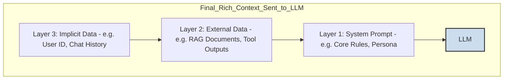

### **Chapter 5: Context Engineering: The Key to Aware Agents**

If the previous chapters were about giving clear commands, this chapter is about giving the AI a *memory* and *awareness*. A simple chatbot is like a person with amnesia—every time you talk to it, it's meeting you for the first time. Context Engineering is the cure for that amnesia. It is the discipline of dynamically building a rich, relevant "briefing package" for the AI *before every single interaction*, so it has all the information it needs to act intelligently.

#### **5.1 Defining Context Engineering vs. Static Prompts**

*   **Simple Explanation:** The key difference is one word: **dynamic**.
    *   A **Static Prompt** is a fixed template. You write it once, and it gets used over and over, regardless of what happened before.
    *   **Context Engineering** is a dynamic *process*. It's a system that actively gathers information from multiple sources in real-time and assembles it into a custom-built, just-in-time prompt for the task at hand.

*   **Analogy:**
    *   **Static Prompt:** It's like a "Frequently Asked Questions" page. The answers are pre-written and don't change, no matter who is asking or what they asked before.
    *   **Context Engineering:** It's like a briefing with a world-class human assistant. Before you ask them a question, they have already pulled up your calendar, the relevant files, your previous emails on the topic, and are ready with a holistic understanding of your situation. The "briefing" they receive is always fresh and relevant to the immediate moment.

#### **5.2 The Layers of Dynamic Context**

A well-engineered context isn't just a single piece of information; it's a carefully constructed set of layers, moving from the most general rules to the most specific, real-time data. Think of it as an onion, where each layer adds a new level of awareness.

Let's break down each layer in this diagram:

##### **5.2.1 System Prompts (Layer 1: The Foundation)**

*   **Simple Explanation:** This is the innermost, most stable layer. As we discussed in Chapter 4, this is the AI's "constitution" or core identity. It provides the foundational rules and persona that govern all its behavior.
*   **Role in Context:** It ensures that no matter what other dynamic information is added, the agent's core personality and safety constraints remain consistent.

##### **5.2.2 External Data (Layer 2: Real-Time Knowledge)**

*   **Simple Explanation:** This layer contains information that the agent actively *fetches* from the outside world to understand the current situation. It's the agent's "senses," allowing it to perceive information beyond its static training data.
*   **This layer includes two main types:**
    1.  **Retrieved Documents (RAG):** The agent searches a knowledge base (like a company's internal wiki, product manuals, or a legal database) for documents relevant to the user's query. The text from these documents is then added to the context.
    2.  **Tool Outputs:** The agent uses a tool (like calling an API) to get real-time information. The result from that tool is then added to the context.

*   **Concrete Example:**
    *   **User Query:** "Is my flight to Tokyo on time?"
    *   **Agent Action:** The agent uses a `flight_status_checker` tool (API call) with the flight number.
    *   **Tool Output:** `{ "status": "Delayed", "new_departure": "18:00" }`
    *   **Context Layer:** The raw JSON output from the tool is added to the prompt, giving the LLM the factual data it needs to answer the user.

##### **5.2.3 Implicit Data (Layer 3: The Unspoken Context)**

*   **Simple Explanation:** This is the most sophisticated layer. It includes all the relevant information that isn't explicitly stated in the user's latest message but is *implied* by the situation. It's what makes an assistant feel truly personal and aware.

*   **This layer often includes:**
    *   **User Identity:** Is this a free user or a paying customer? An admin or a guest?
    *   **Interaction History:** What did we just talk about? The last 5-10 messages of the conversation are often included here to give the agent short-term memory.
    *   **Environmental State:** What time is it? Where is the user located?

*   **Concrete Example:**
    *   **Previous Message:** User: "I'm looking for a good Italian restaurant in San Francisco."
    *   **Current Message:** User: "Okay, what about something cheaper?"
    *   **Implicit Context Added:** The agent adds the previous message ("*I'm looking for a good Italian restaurant in San Francisco*") to the context of the new prompt. Without this, the agent would have no idea what "something cheaper" refers to.

#### **5.3 The Role of Context in Agentic Behaviors**

Why do we go through the trouble of engineering these complex, multi-layered contexts? Because it is the **direct enabler** of the intelligent behaviors that define a true agent.

*   **Memory:** An agent's "memory" is not magic; it is simply the product of systematically adding the **Interaction History** (Implicit Data) into the context for every new turn of the conversation. This allows the agent to recall what was said before and maintain a coherent dialogue.

*   **Planning:** An agent cannot create a useful plan without situational awareness. Effective planning requires:
    *   Knowing the end goal (from the user's query).
    *   Knowing what it has already tried (from the Interaction History).
    *   Knowing what the current state of the world is (from Tool Outputs).
    *   Knowing what information is available to it (from Retrieved Documents).
    *   Context Engineering provides this complete operational picture, allowing the agent to reason about the best next step.

*   **Adaptation:** When an agent's action (like a tool call) produces an unexpected result or an error, that output becomes part of the next context. This allows the agent to see that its first attempt failed and adapt its plan accordingly, creating a robust, self-correcting system.