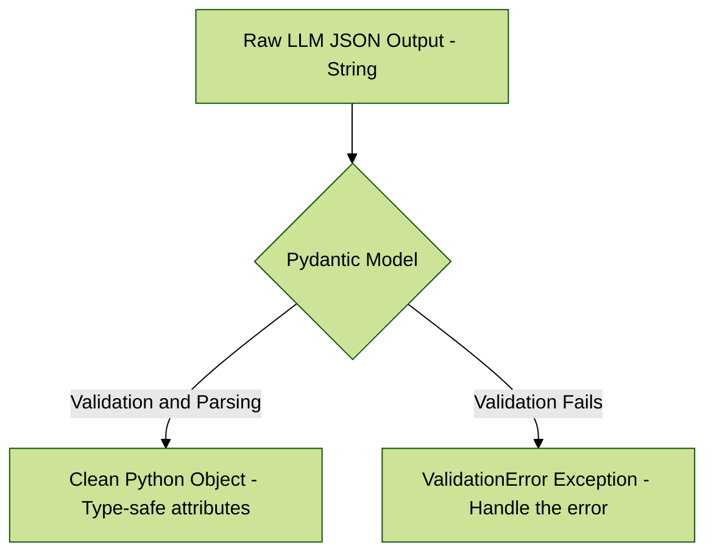
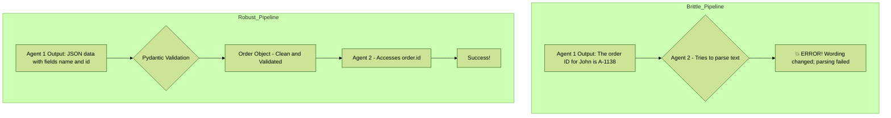

---
title: " Engineering Structured and Verifiable Outputs"
---


Welcome. In our journey to build intelligent agents, we now arrive at a critical engineering discipline: controlling the *output* of a Large Language Model (LLM).

An agent is not just a conversationalist; it's a component in a larger system. Its output often becomes the *input* for another tool, an API call, or a database entry. Free-form, unstructured text is a nightmare for automation. It's unpredictable and brittle.

**Analogy:** Think of building a car on an assembly line. You need precisely engineered parts that fit together perfectly every time. If the parts supplier just sent you a random block of metal (unstructured text), your entire production line would grind to a halt. We need our LLM to deliver perfectly machined, predictable parts (structured data).

This chapter teaches you how to be the factory manager for your LLM, ensuring every output it produces is structured, verifiable, and ready for use.

---

### 6.1 Requesting Structured Output: JSON, XML, and CSV

The simplest way to get structured data is to ask for it. By explicitly instructing the model to use a specific format, you are heavily constraining its output to something predictable and machine-readable.

#### Simple Explanation
In your prompt, you must clearly state three things:
1.  **The Task:** What information to extract or generate.
2.  **The Format:** The desired structure (e.g., "JSON", "XML", "a CSV with two columns").
3.  **The Schema:** The specific keys, tags, or columns you expect.

#### Concrete Examples

**A. Requesting JSON**
JSON (JavaScript Object Notation) is the most common and versatile format for agentic systems.

*   **Prompt:**
    ```
    Extract the user's name, email, and order number from the text below.
    Return the result as a single, clean JSON object with the keys "userName", "userEmail", and "orderID".

    Text: "Hi, my name is Jane Doe. I'm writing about order #A-1138. You can reach me at jane.d@email.com."
    ```
*   **Expected LLM Output:**
    ```json
    {
      "userName": "Jane Doe",
      "userEmail": "jane.d@email.com",
      "orderID": "A-1138"
    }
    ```

**B. Requesting XML**
XML (eXtensible Markup Language) is useful when interacting with legacy systems or certain APIs.

*   **Prompt:**
    ```
    Convert the following user data into an XML structure. The root element should be `<user>`. The user's name should be in a `<name>` tag and their age in an `<age>` tag.

    Data: Name is John Smith, Age is 42.
    ```
*   **Expected LLM Output:**
    ```xml
    <user>
      <name>John Smith</name>
      <age>42</age>
    </user>
    ```

---

### 6.2 The Benefit of Forced Structure: Limiting Hallucinations

A "hallucination" is when an LLM confidently states something that is incorrect or nonsensical. It essentially "makes things up." While this is a complex problem, requesting structured output is a powerful mitigation technique.

#### Simple Explanation
Forcing the LLM to fill in a predefined structure (like a JSON schema) acts as a set of guardrails on its thinking process. Instead of having the freedom to generate any sentence it wants, it must focus its attention on finding the specific pieces of data that fit into the slots you've provided.

**Analogy:** It's the difference between an essay question and a multiple-choice test.
*   **Essay (Unstructured Text):** The student can write anything, get off-topic, or invent facts.
*   **Multiple-Choice (Structured Output):** The student is constrained to a set of predefined answers. It's much harder to go completely off the rails.

By forcing the model to find values for `userName` and `orderID`, you make it less likely to invent a story about the user's shopping history.

---

### 6.3 Leveraging Pydantic for an Object-Oriented Facade

This is where we move from just *requesting* structure to *enforcing* it in our code. **Pydantic** is a Python library for data validation. It allows us to define a data schema as a Python class. We can then use this class to parse the LLM's output, instantly converting it into a clean, validated, and type-safe Python object.

This creates an **"Object-Oriented Facade"**—a clean, predictable Python interface that sits in front of the messy, unpredictable world of raw LLM text output.



#### 6.3.1 Parsing and Validating LLM JSON with `model_validate_json`

This is the most direct and powerful way to handle JSON output from an LLM.

**Step 1: Define Your Pydantic Model**
This class is your "schema" or "contract." It defines what the data *must* look like.

```python
from pydantic import BaseModel, EmailStr, Field, ValidationError
from typing import List, Optional

# Define the data structure you expect from the LLM.
# This acts as a verifiable contract.
class UserProfile(BaseModel):
    name: str = Field(..., description="The full name of the user.")
    email: EmailStr = Field(..., description="A valid email address for the user.")
    company: Optional[str] = Field(None, description="The user's affiliated company, if any.")
    interests: List[str] = Field(default_factory=list, description="A list of the user's interests.")
```

**Step 2: Use `model_validate_json` to Parse the LLM's Output**
The `model_validate_json` method takes a raw JSON string, parses it, and validates it against your model in a single step.

```python
# Hypothetical JSON string output from your LLM
llm_output_json = """
{
    "name": "Alice Wonderland",
    "email": "alice.w@example.com",
    "company": "Looking Glass Inc.",
    "interests": ["Logic Puzzles", "Tea Parties"]
}
"""

# The validation step. This is the core of the technique.
try:
    # This one line does all the work: parsing, validation, and type conversion.
    user = UserProfile.model_validate_json(llm_output_json)

    # Now you can work with a clean, predictable Python object.
    print("Validation Successful!")
    print(f"User Name: {user.name}")
    print(f"Interests: {user.interests[0]}")

    # The email is guaranteed to be a valid format because of EmailStr.
    # The 'interests' attribute is guaranteed to be a list.

except ValidationError as e:
    # If the LLM output is malformed or misses a required field,
    # Pydantic raises an error that you can catch and handle.
    print("LLM output failed validation!")
    print(e)
```

#### 6.3.2 Handling XML with `xmltodict` and Field Aliases

XML is trickier due to its verbose nature and attributes (e.g., `<item id="123">`). The strategy is to first convert the XML to a dictionary, then parse it with Pydantic. We use `Field(alias=...)` to map awkward XML names to clean Python attribute names.

**Step 1: Convert XML to a Dictionary**
We use the `xmltodict` library for this.

**Step 2: Define a Pydantic Model with Aliases**
Aliases allow your Python code to use `item_id` while the parser knows to look for `item['@id']` in the source dictionary.

```python
import xmltodict
from pydantic import BaseModel, Field, ValidationError

# Hypothetical XML output from your LLM
llm_output_xml = """
<product>
    <item-name>Super Widget</item-name>
    <details stock-status="in-stock">
        <price>29.99</price>
        <currency>USD</currency>
    </details>
</product>
"""

# Define a model using aliases to map from the XML structure
# to clean Python attribute names.
class Product(BaseModel):
    # 'item-name' is not a valid Python identifier, so we create an alias.
    name: str = Field(alias='item-name')
    price: float = Field(alias='price')
    currency: str = Field(alias='currency')
    # The '@' sign denotes an attribute in xmltodict.
    stock_status: str = Field(alias='@stock-status')

class ProductWrapper(BaseModel):
    product: Product

# The validation process
try:
    # 1. Convert XML string to a Python dictionary
    data_dict = xmltodict.parse(llm_output_xml)

    # 2. Extract the relevant nested dictionary
    product_details_dict = data_dict['product']['details']
    product_details_dict['item-name'] = data_dict['product']['item-name'] # Manually merge for simplicity

    # 3. Use the standard Pydantic constructor with the dictionary
    product_obj = Product.model_validate(product_details_dict)

    print("XML Validation Successful!")
    print(f"Product Name: {product_obj.name}")
    print(f"Stock Status: {product_obj.stock_status}")

except (ValidationError, KeyError) as e:
    print("Failed to parse or validate XML from LLM.")
    print(e)
```

#### 6.3.3 Ensuring Interoperability in Agentic Systems

**The "Why":** The ultimate goal of this entire chapter is to build robust, multi-step agentic systems that don't break. Interoperability is the ability of different components or agents to communicate and work together reliably.

*   **The Brittle Way (Without Structure):** Agent 1 outputs a paragraph of text. Agent 2 tries to find a number in that text using fragile string searches. If Agent 1 changes its wording slightly, the entire system fails.

*   **The Robust Way (With Pydantic):** Agent 1 is prompted to output a JSON object. The system validates this output into a `Pydantic` object. Agent 2 receives this clean object and can access the data reliably with `result.order_id`. This connection is strong and predictable.

Pydantic objects act as a **verifiable data contract** between the different parts of your agentic system.

#### Visualizing the Data Flow

