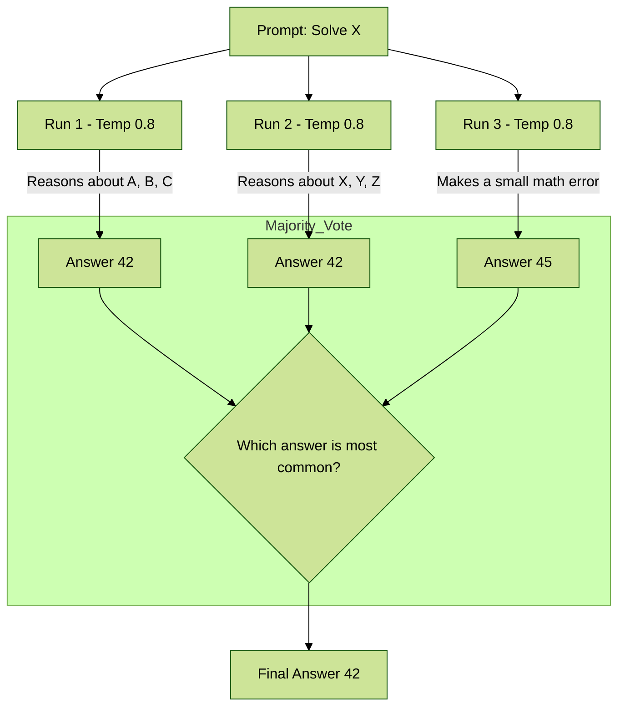

Welcome. So far, we have learned how to ask for information and how to structure the model's output. Now, we will learn how to make the model *think*.

A standard prompt is like asking a question to a brilliant but lazy student. They might just blurt out the first answer that comes to mind, which could be wrong, especially if the problem is complex. The techniques in this chapter are how we, as educators, force the student to "show their work." When the model is forced to externalize its reasoning process, its accuracy and reliability on complex tasks increase dramatically.

**Analogy:** You wouldn't solve a multi-step algebra problem in your head in one go. You'd write down each step of the calculation on paper. These prompting techniques are the equivalent of giving the AI a piece of scratch paper and telling it to write everything down.

---

### 7.1 Chain of Thought (CoT) Prompting

Chain of Thought (CoT) is the foundational technique for improving reasoning. It is the simple act of instructing the model to break down a problem into a series of intermediate, logical steps before stating the final answer.

#### 7.1.1 Zero-Shot CoT: The Magic Phrase
This is the simplest and most surprisingly effective way to enable CoT. You simply append a phrase like **"Let's think step by step"** to the end of your question. This trigger is often enough to coax the model into a more deliberate, sequential reasoning mode.

*   **Simple Explanation:** You are telling the model, "Don't just give me the answer. Show me how you got there."
*   **When to Use It:** This should be your first attempt for any task involving logic, math, or multi-step deduction. It's low-effort and high-reward.

*   **Concrete Example:**
    *   **Standard Prompt (Prone to Error):**
        ```
        A grocery store has 5 crates of apples with 30 apples each. They sell 68 apples in the morning and another 45 in the afternoon. How many apples are left?
        ```    *   **Zero-Shot CoT Prompt (More Reliable):**
        ```
        A grocery store has 5 crates of apples with 30 apples each. They sell 68 apples in the morning and another 45 in the afternoon. How many apples are left?

        Let's think step by step.
        ```
    *   **Expected LLM Output:**
        ```
        Step 1: Calculate the total number of apples initially.
        There are 5 crates with 30 apples each.
        Total apples = 5 * 30 = 150 apples.

        Step 2: Calculate the total number of apples sold.
        They sold 68 in the morning and 45 in the afternoon.
        Total sold = 68 + 45 = 113 apples.

        Step 3: Calculate the remaining apples.
        Remaining apples = Total apples - Total sold
        Remaining apples = 150 - 113 = 37 apples.

        The final answer is 37.
        ```

#### 7.1.2 Few-Shot CoT: Demonstrating the Reasoning Process
For more complex or novel problems, you need to provide examples not just of the answer, but of the entire reasoning process. You are showing the model the *pattern* of thinking you want it to emulate.

*   **Simple Explanation:** Instead of just telling the model to "show its work," you provide a few examples of solved problems with the work already shown.
*   **When to Use It:** Use this when Zero-Shot CoT is inconsistent, or when the reasoning requires a specific format or follows a less common logical path.

*   **Concrete Example:**
    ```
    Q: The sum of three consecutive odd integers is 93. What are the integers?
    A: Let the first odd integer be x. The next consecutive odd integer is x+2, and the third is x+4.
    Their sum is x + (x+2) + (x+4) = 3x + 6.
    We know the sum is 93, so 3x + 6 = 93.
    Subtract 6 from both sides: 3x = 87.
    Divide by 3: x = 29.
    The integers are 29, 31, and 33.

    Q: Sarah has 15 red marbles. She has twice as many blue marbles as red marbles. She gives away 5 of each color. How many marbles does she have left in total?
    A: Let's think step by step.
    First, calculate the number of blue marbles. Sarah has twice as many blue as red (15), so Blue marbles = 15 * 2 = 30.
    Next, calculate the total number of marbles she starts with. Total = Red + Blue = 15 + 30 = 45.
    Next, calculate how many marbles she gives away. She gives away 5 of each color, so total given away = 5 + 5 = 10.
    Finally, calculate the remaining marbles. Total marbles left = 45 - 10 = 35.
    Sarah has 35 marbles left.

    Q: A farm has chickens and pigs. There are 25 heads and 70 legs in total. How many chickens and how many pigs are on the farm?
    A:
    ```

---

### 7.2 Self-Consistency: Improving Reliability with Majority Voting

Self-Consistency is a technique that builds on CoT to make the final answer even more reliable. It works by generating several different reasoning paths and then choosing the most consistent answer among them.

*   **Analogy:** Imagine you're on "Who Wants to Be a Millionaire?" and you're unsure of an answer. You use the "Ask the Audience" lifeline. You don't trust just one person's opinion; you trust the collective majority vote of the audience. Self-Consistency is the AI's version of polling the audience.

*   **How It Works:**
    1.  **Prompt Multiple Times:** Run the same CoT prompt 3-5 times, but with a higher `temperature` setting. This encourages the model to generate diverse, creative reasoning paths.
    2.  **Generate Diverse Chains of Thought:** Each run will produce a slightly different step-by-step process.
    3.  **Extract and Vote:** Extract the final answer from each chain and choose the one that appears most frequently.

#### Visualizing the Self-Consistency Flow



*   **When to Use It:** For critical reasoning tasks where accuracy is paramount and you can afford the extra computational cost of multiple runs. Excellent for arithmetic and logical deduction problems.

---

### 7.3 Step-Back Prompting: Evoking Reasoning via Abstraction

Sometimes, a model gets stuck on the specific details of a problem and misses the bigger picture. Step-Back Prompting fixes this by forcing the model to "zoom out" and think about the general principles involved before "zooming in" on the specific question.

*   **Analogy:** A detective arrives at a complex crime scene. Before examining individual clues (the specifics), they might "step back" and ask, "What are the general principles of a crime like this? What are the common motives?" This high-level thinking helps guide their detailed investigation.

*   **How It Works:** It's a two-step process.
    1.  **Step-Back Prompt:** First, you ask the model a general, high-level question related to your core task.
    2.  **Original Prompt with Context:** You then ask your original, specific question, but you include the model's answer to the step-back question as context.

*   **Concrete Example:**
    *   **Core Task:** Write a plot summary for a new mystery novel.
    *   **Step 1: The Step-Back Prompt**
        ```
        What are the key elements and principles that make a detective story compelling and satisfying for the reader?
        ```
    *   **Model's Step-Back Answer (Abstraction):**
        ```
        A compelling detective story usually includes: a mysterious crime, a clever detective with a unique flaw, a limited set of suspects with hidden motives, a series of red herrings, logical clues that the reader can follow, and a final, surprising but logical resolution.
        ```
    *   **Step 2: The Original Prompt with Context**
        ```
        Based on these principles for a compelling detective story:
        [Insert the model's step-back answer here]

        Now, write a short plot summary for a new mystery novel set in a remote Alaskan research station during a polar winter.
        ```

*   **When to Use It:** Excellent for creative and strategic tasks that benefit from high-level thinking, such as writing, planning, or problem-solving.

---

### 7.4 Tree of Thoughts (ToT): Exploring Multiple Reasoning Paths Concurrently

Tree of Thoughts (ToT) is the most advanced and computationally intensive of these techniques. It extends Chain of Thought by allowing the model to explore multiple different reasoning paths at once, like branches on a tree.

*   **Analogy:** A chess grandmaster doesn't just think about their next move in a straight line (CoT). They consider several possible moves. For each move, they think about their opponent's possible responses, and their own responses to those, and so on. They build a "tree" of future possibilities in their mind and choose the most promising path.

*   **How It Works:**
    1.  **Decompose:** Break the problem into steps.
    2.  **Generate:** For each step, generate multiple possible "thoughts" or next steps.
    3.  **Evaluate:** A separate "evaluator" prompt or process assesses how promising each thought is.
    4.  **Explore:** The system then pursues the most promising thoughts, branching out from them in the next step. It can backtrack if a path leads to a dead end.

#### Visualizing the Tree of Thoughts

```mermaid
---
config:
  theme: forest
---
graph TD
    A[Start: The Problem] --> B[Step 1: Thought A]
    A --> C[Step 1: Thought B &#40;More Promising&#41;]
    A --> D[Step 1: Thought C &#40;Dead End&#41;]

    C --> E[Step 2: Thought B1]
    C --> F[Step 2: Thought B2 &#40;Most Promising&#41;]

    F --> G[Step 3: Thought B2a]
    F --> H[Step 3: Thought B2b]

    H --> I[Final Solution]

    style D fill:#ffcccc,stroke:#333,stroke-width:2px
    style C fill:#ccffcc,stroke:#333,stroke-width:2px
    style F fill:#ccffcc,stroke:#333,stroke-width:2px


```



*   **When to Use It:** Only for very complex problems that require exploration, strategic planning, or where the optimal path is not known in advance (e.g., planning a complex trip, solving a scientific puzzle, or creative writing with multiple possible plot twists). This technique often requires a more complex agentic framework to manage the tree search.