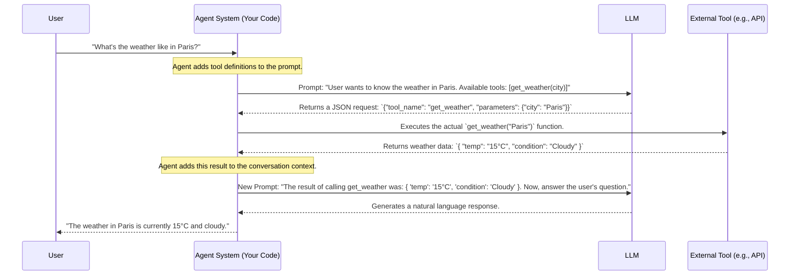
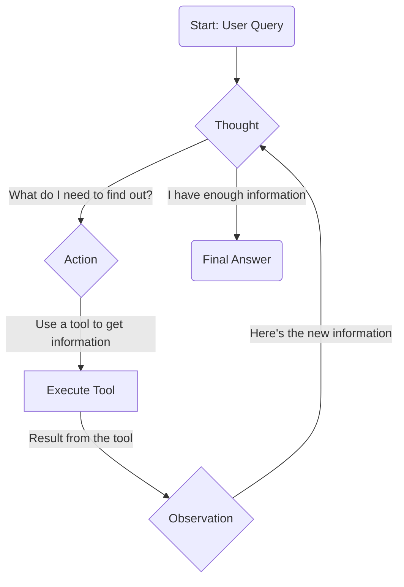

## Chapter 8: Bridging Prompts to the Real World

Welcome. A Large Language Model, by itself, is like a brilliant brain trapped in a glass box. It has vast knowledge and powerful reasoning abilities, but it cannot interact with the outside world. It cannot check today's stock prices, search for recent news, book a calendar appointment, or query your company's database.

To build a truly useful agent, we must give this brain "hands" and "senses." We must provide it with a mechanism to perform actions and observe the results. This chapter details the fundamental techniques that allow an LLM to break out of the box and interact with its environment through tools, APIs, and other external systems.

**Analogy:** Imagine a brilliant CEO (the LLM) who is an expert strategist. To execute their strategy, they don't perform every task themselves. They delegate by giving clear instructions to their team (the agentic system). This chapter is about how to build that team and establish the communication protocol between the CEO and their assistants.

---

### 8.1 Tool Use / Function Calling: The Mechanism of Action

Function Calling (or Tool Use) is the core mechanism that allows an LLM to request that an action be performed in the outside world.

**A critical point to understand:** The LLM does *not* execute the code itself. It cannot directly make an API call or run a Python function. Instead, its job is to generate a structured piece of data—typically JSON—that precisely describes the function it *wants* to be called and the parameters to use. Your agentic system then reads this JSON, executes the function, and returns the result to the LLM.

#### Simple Explanation
The process works in three distinct steps:

1.  **Declaration:** Your code defines a set of available "tools" and provides their descriptions to the LLM in the initial prompt (often a system prompt). This includes the function name, its purpose, and the parameters it accepts.
2.  **Generation:** Based on the user's request, the LLM determines that it needs to use a tool. It then generates a JSON object specifying the name of the tool to use and the arguments to pass to it.
3.  **Execution & Observation:** Your application parses this JSON, calls the corresponding function in your codebase with the provided arguments, and then passes the return value from that function back to the LLM as new context.

#### Visualizing the Function Calling Flow

---

### 8.2 The ReAct Framework: Synergizing Reason and Action

**ReAct** stands for **Reason + Act**. It is a powerful and elegant framework that combines the reasoning capabilities of Chain of Thought (Chapter 7) with the action capabilities of Function Calling (Section 8.1).

Instead of performing a single action, a ReAct agent operates in an **iterative loop**. It can reason about a problem, decide to take an action to gather more information, observe the result of that action, and then use that new information to inform its next step of reasoning.

**Analogy:** This process perfectly mimics how a human detective solves a case.
1.  **Reason (Thought):** "The suspect's alibi is that they were at the library. This seems plausible, but I need to verify it."
2.  **Act (Action):** The detective drives to the library and requests the security footage (uses a "tool").
3.  **Observe (Observation):** The footage shows the suspect was not there. This new fact is now part of the investigation.
4.  **Repeat:** The detective's next thought is now informed by this observation: "The alibi is false. I need to re-interrogate the suspect."

#### 8.2.1 The Thought -> Action -> Observation Loop

The ReAct framework is defined by this simple, powerful cycle. At each turn, the agent generates a response that includes one or more of these components.

1.  **Thought:** The LLM's internal monologue. It verbalizes its current understanding of the problem, what information it's missing, and what its plan is for the next step. This is a private thought process that is not shown to the end user.
2.  **Action:** Based on its thought, the LLM decides to use one of its available tools. It generates the function-calling JSON, specifying the tool and its parameters.
3.  **Observation:** The agentic system executes the action and feeds the result back into the loop. This becomes the "Observation" that the LLM uses to start the next cycle with a new "Thought."

The loop continues until the Thought process concludes that it has enough information to provide a final answer to the user.

#### Visualizing the ReAct Loop

#### 8.2.2 A Practical Trace of a ReAct Agent

Let's trace a ReAct agent as it solves a multi-step query.

**User Query:** "Who is the lead singer of the band that wrote 'Stairway to Heaven', and what year was he born?"

**Available Tools:** `Search(query: str)`

---
**Turn 1**

*   **Thought:** The user is asking a two-part question. First, I need to identify the band that wrote 'Stairway to Heaven'. I will use the search tool for this.
*   **Action:** `Search(query="band that wrote Stairway to Heaven")`

*(System executes the search and returns the result.)*

*   **Observation:** "Led Zeppelin"

---
**Turn 2**

*   **Thought:** Okay, the band is Led Zeppelin. Now I need to find the lead singer of Led Zeppelin. I will use the search tool again.
*   **Action:** `Search(query="lead singer of Led Zeppelin")`

*(System executes the search and returns the result.)*

*   **Observation:** "Robert Plant"

---
**Turn 3**

*   **Thought:** Great, the lead singer is Robert Plant. The final part of the question is his birth year. I need to search for that information.
*   **Action:** `Search(query="Robert Plant birth year")`

*(System executes the search and returns the result.)*

*   **Observation:** "August 20, 1948"

---
**Turn 4**

*   **Thought:** I have now found all the necessary pieces of information: the band is Led Zeppelin, the lead singer is Robert Plant, and he was born in 1948. I can now formulate the final answer for the user.
*   **Final Answer:** The lead singer of Led Zeppelin, the band that wrote 'Stairway to Heaven', is Robert Plant. He was born in 1948.