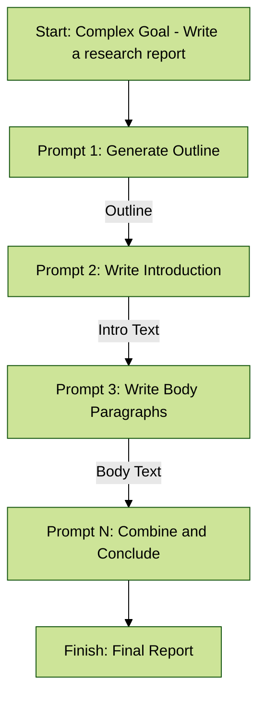
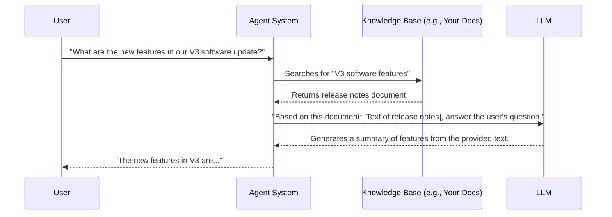

Welcome to our final chapter on prompting techniques. Think of the core methods we've discussed—like Chain of Thought and ReAct—as the primary tools in your workshop: the hammer, the saw, the drill. They are essential for the main construction.

This chapter is about the specialized tools: the calipers, the level, the wood file. These supplementary techniques provide precision, handle specific edge cases, and add a layer of polish to your work. Mastering them will elevate your agentic systems from functional to exceptional.

---

### 10.1 Iterative Prompting and Manual Refinement

This is less of a formal technique and more of a fundamental workflow. It is the human-driven, scientific method of prompt engineering. No prompt is perfect on the first try. The best results come from a disciplined cycle of testing and refinement.

*   **Simple Explanation:**
    1.  **Start Simple:** Write a basic, clear prompt for your task.
    2.  **Test:** Run the prompt and observe the output.
    3.  **Analyze:** Identify the flaws. Is it too vague? Wrong format? Missing key information?
    4.  **Refine:** Modify the prompt to specifically address the flaws you identified. Add an example, clarify an instruction, or request a different structure.
    5.  **Repeat:** Continue this loop until the output is consistently reliable.

*   **Analogy:** This is like tuning a musical instrument. You play a note (test), listen to see if it's sharp or flat (analyze), adjust the tension on the string (refine), and play it again, repeating until it's perfectly in tune.

*   **Concrete Example:** Creating a product description.
    *   **Attempt 1 Prompt:** `"Write about a new coffee maker."`
        *   *Result:* Too generic. Talks about coffee makers in general.
    *   **Attempt 2 Prompt:** `"Write a product description for the 'AeroPress XL'. Highlight that it's fast and easy to clean."`
        *   *Result:* Better, but lacks a target audience and engaging tone.
    *   **Attempt 3 Prompt:** `"Act as a marketing copywriter. Write a 100-word product description for the 'AeroPress XL'. Emphasize its 1-minute brew time and single-rinse cleanup. The target audience is busy professionals who value quality and convenience. Use an energetic and persuasive tone."`
        *   *Result:* Much closer to the desired, high-quality output.

---

### 10.2 Providing Negative Examples

While the core principle is to use positive instructions ("do this"), sometimes it's highly effective to provide a clear negative constraint ("don't do that"). This is best used to prevent a specific, common error.

*   **Simple Explanation:** You show the model an example of what you explicitly want to avoid. This helps to create sharp boundaries for the model's behavior.

*   **Analogy:** A GPS tells you the route to take (positive instruction). A "Road Closed" sign tells you a specific route *not* to take (negative constraint). Both are useful for successful navigation.

*   **Concrete Example:**
    ```
    Generate a list of three popular tourist attractions in Paris.
    You MUST NOT include the Eiffel Tower in your list.

    Example of what to avoid:
    - The Eiffel Tower
    - The Louvre Museum
    - Notre-Dame Cathedral
    ```

---

### 10.3 Using Analogies to Frame Tasks

Analogies can be a powerful way to tap into the model's conceptual understanding. By framing a complex task in terms of a familiar, real-world concept, you can guide its approach in a more intuitive way than a list of literal instructions.

*   **Simple Explanation:** You give the model a metaphor for its job. This helps it understand the *spirit* of the task, not just the letter of the instructions.

*   **Concrete Example:**
    ```
    Act as a "Data Chef" for a business executive.

    Your ingredients are the raw sales data provided below. Your task is to prepare a "summary dish". This means you should not just present the raw numbers. You must clean them, highlight the most important "flavors" (trends and key insights), and present them in a clean, digestible report that is quick and easy for a busy executive to understand.

    Raw Data: [Insert raw sales data here]
    ```

---

### 10.4 Factored Cognition / Decomposition: Breaking Down Complex Tasks

For tasks that are too large or complex to be handled reliably in a single prompt, you should break them down into a sequence of smaller, more manageable sub-tasks. The output of one prompt becomes the input for the next, creating a "prompt chain."

*   **Simple Explanation:** Instead of writing one giant, complicated prompt, you write several simple prompts and have them work together in an assembly line.

*   **Analogy:** You don't build a house with a single instruction to "build the house." You follow a sequence of distinct steps: lay the foundation, then frame the walls, then add the roof, then install the plumbing. Each step builds upon the last.

*   **Concrete Example:** Writing a detailed report.
    *   **Prompt 1:** "Generate a comprehensive outline for a research report on the impact of renewable energy on the global economy."
    *   **Prompt 2:** "Using the following outline point, write a detailed 300-word introduction for the report: [Insert Introduction point from Outline]"
    *   **Prompt 3:** "Now, write the next section of the report based on this outline point: [Insert Section 2 point from Outline]"
    *   *(...repeat for all sections...)*
    *   **Prompt N:** "Combine the following sections into a single, cohesive report and write a concluding summary: [Insert all generated sections]"

#### Visualizing the Decomposition Flow



---

### 10.5 Retrieval Augmented Generation (RAG): Grounding Responses in External Data

This is one of the most important patterns for building modern, factually accurate agents. RAG gives the LLM access to external, up-to-date, or private information that was not in its original training data.

*   **Simple Explanation:** You are giving the AI an "open-book test." Before answering a question, the system first "retrieves" relevant documents from a knowledge base (like your company's internal wiki, recent news articles, or technical manuals). This retrieved text is then "augmented" into the prompt as context for the LLM to use.

*   **Benefits:**
    *   **Reduces Hallucinations:** The model answers based on the provided text, not just its internal memory.
    *   **Provides Current Information:** Allows the model to answer questions about recent events.
    *   **Enables Domain-Specific Knowledge:** Lets the model answer questions using your private, proprietary data.

#### Visualizing the RAG Process



---

### 10.6 The Persona Pattern: Defining the Target Audience

This is the inverse of "Role Prompting." Instead of defining who the *model* is, you define who the *user* or *target audience* is. This instructs the model to tailor the complexity, tone, and style of its response to a specific person.

*   **Simple Explanation:** You tell the AI who it's talking to.

*   **Analogy:** A great teacher explains the same concept differently to a 5th grader than they do to a university student. The Persona Pattern allows you to tell the AI which classroom it's in.

*   **Concrete Example:**
    *   **Prompt for an Expert:**
        ```
        Explain the concept of quantum entanglement.
        ```
    *   **Prompt with a Persona Pattern:**
        ```
        Explain the concept of quantum entanglement.

        **Target Audience:** A curious high school student who is good at science but has never studied physics. Use a simple analogy and avoid complex mathematical formulas.
        ```