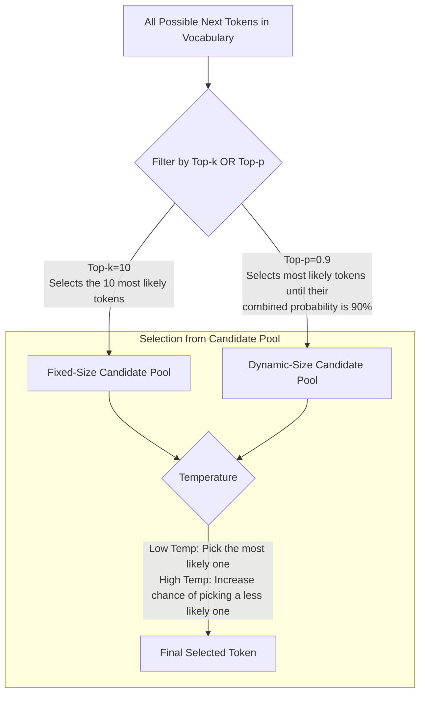

Welcome. Until now, our focus has been on crafting the *input* to the model—the prompt. We will now turn our attention to the model's internal "engine room." The settings we are about to explore control *how* the model generates its response. They govern its creativity, its predictability, its verbosity, and its adherence to structure.

**Analogy:** Think of the prompt as your destination address entered into a GPS. These settings are the GPS preferences: "Avoid Tolls," "Fastest Route," "Most Scenic Route." The destination remains the same, but *how* you get there can change dramatically based on these configurations. Understanding them is essential for building reliable and high-performing agentic systems.

---

### **Part 1: Generation Settings (Controlling Creativity and Length)**

These are the primary dials you will use to shape the tone and size of the output.

#### Temperature
*   **Simple Explanation:** This is the **creativity dial**. It controls the randomness of the output.
*   **Range:** `0.0` (most deterministic) to `1.0` or higher (most creative/random).
*   **Analogy:** A Temperature of `0.0` is like a scientist reading from a textbook—it will always say the most probable, straightforward thing. A Temperature of `1.0` is like a brainstorming session with a wild artist—it will explore less likely, more novel, and sometimes nonsensical ideas.
*   **Practical Guidance:**
    *   **Low Temperature (e.g., 0.1 - 0.3):** Use for factual, deterministic tasks where you want the most predictable and correct answer. Examples: Code generation, data extraction, summarization, question-answering.
    *   **High Temperature (e.g., 0.7 - 1.0):** Use for creative tasks where you want variety, novelty, or brainstorming. Examples: Writing marketing copy, generating story ideas, creating character dialogues.

#### Top-p (Nucleus Sampling)
*   **Simple Explanation:** This setting controls creativity by selecting from a pool of the most likely next words that add up to a certain probability `p`.
*   **Range:** `0.0` to `1.0`.
*   **Analogy:** Imagine the LLM has a "probability budget" of `p=0.9` (90%) for its next word. It will consider the most likely words first. If "the" has a 50% chance and "a" has a 40% chance, it will select from only those two words because they fill the 90% budget. If the top word "the" only has a 10% chance, it will keep adding more words to the list until their combined probability reaches 90%. This makes the selection pool *dynamic*.
*   **Practical Guidance:** A value like `0.9` is a common, balanced choice. It's generally recommended to alter **either** Temperature or Top-p, but not both, as they both control randomness.

#### Top-k
*   **Simple Explanation:** This setting limits the word selection to the `k` most likely next words, regardless of their probability.
*   **Range:** An integer, e.g., `1`, `10`, `50`.
*   **Analogy:** This is like giving the model a "Top 40 Hits" list and telling it that it can *only* pick its next word from that list, even if the 41st most likely word is a much better fit.
*   **Practical Guidance:** Less commonly used than Top-p because it's less dynamic. A high `k` (e.g., `50`) has little effect, while a very low `k` (e.g., `3`) can make the text feel very constrained and unnatural.

#### Visualizing the Sampling Controls

This diagram shows how Top-k and Top-p filter the total vocabulary to create a candidate pool for the next word. Temperature then adjusts the likelihood of words *within* that pool.

#### Max Tokens & Min Tokens
*   **Simple Explanation:** These settings control the length of the generated output.
*   **`Max Tokens`:** The absolute maximum number of tokens (words/sub-words) the model is allowed to generate. This is a critical safety and cost-control measure.
*   **`Min Tokens`:** The minimum number of tokens the model must generate. This is useful for preventing overly short or one-word answers when you need a more fleshed-out response.

#### Repetition Penalty
*   **Simple Explanation:** A penalty applied to words that have already appeared in the text, making them less likely to be chosen again.
*   **Range:** Typically `1.0` (no penalty) to `2.0` (high penalty).
*   **Analogy:** This is the "don't be a broken record" setting. It encourages the model to use a wider range of vocabulary and prevents it from getting stuck in repetitive loops.

---

### **Part 2: Sampling and Probability (Advanced Control)**

These settings offer finer-grained control over the token selection process.

#### Frequency Penalty & Presence Penalty
These are often confused, but they serve different purposes.
*   **Frequency Penalty:** Discourages repeating the *same word* over and over. The penalty increases each time the word is used.
    *   **Analogy:** A progressive tax on word usage. The more you use a specific word, the higher the "tax" becomes, making it less appealing. Use this for long-form content to improve readability and vocabulary diversity.
*   **Presence Penalty:** Penalizes a word simply for being *used at all*. It's a one-time penalty applied to any word that has already appeared.
    *   **Analogy:** A "cover charge" for a topic. Once you've introduced a topic (by using certain words), you're encouraged to move on to new ones. Use this for brainstorming tasks to maximize the number of unique ideas.

#### Logit Bias
*   **Simple Explanation:** Allows you to manually increase or decrease the probability of specific tokens appearing in the output.
*   **Analogy:** This is like putting your thumb on the scale to favor certain outcomes. You are "loading the dice" for or against specific words.
*   **Practical Guidance:** This is an incredibly powerful tool for controlling content.
    *   **Example 1 (Safety):** For a customer service bot, you could apply a strong negative bias to tokens related to profanity or making promises (e.g., "guarantee", "promise").
    *   **Example 2 (Brand Voice):** A company could apply a positive bias to its brand name and related product terms to ensure they are mentioned.

---

### **Part 3: Structural and Conversational Controls**

These settings manage the overall structure of the interaction.

#### Stop Sequences
*   **Simple Explanation:** A list of specific strings of text that, when generated, will immediately stop the output.
*   **Analogy:** This is like a "safe word" for the model. The moment it says one of these sequences, it stops talking.
*   **Practical Guidance:** Essential for creating predictable outputs that can be easily parsed. For example, if you are generating a list, you could set the stop sequence to `"\n\n"` to ensure the model doesn't ramble on after the list is complete.

#### JSON Mode
*   **Simple Explanation:** A special mode that forces the model's output to be a syntactically correct JSON object.
*   **Analogy:** This puts the model in a "strict form-filling" mode. It cannot generate free-form text, only valid JSON that conforms to the structure you hinted at in your prompt.
*   **Practical Guidance:** This is a game-changer for building reliable agentic systems. It dramatically reduces the chance of parsing errors and is a cornerstone of creating verifiable outputs (as discussed in Chapter 6).

#### System Prompt Weight
*   **Simple Explanation:** Controls how much influence the system prompt has over the user's most recent message.
*   **Analogy:** Think of this as the **volume control on the boss's instructions**. A high weight means the model will adhere very strictly to its core instructions (the system prompt), even if the user tries to lead it astray. A low weight means it will pay more attention to the user's immediate prompt.
*   **Practical Guidance:** Increase this weight for agents that must maintain a strict persona or follow safety guidelines, regardless of user input. For example, a therapy bot should maintain its supportive, non-judgmental persona (defined in the system prompt) even if the user becomes aggressive.