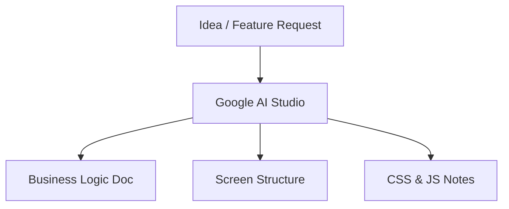
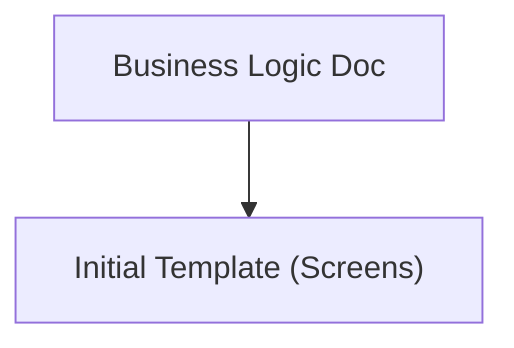
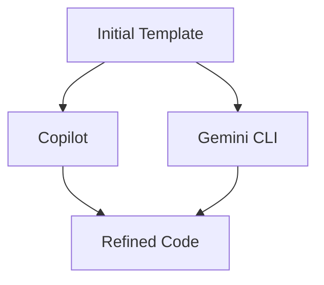
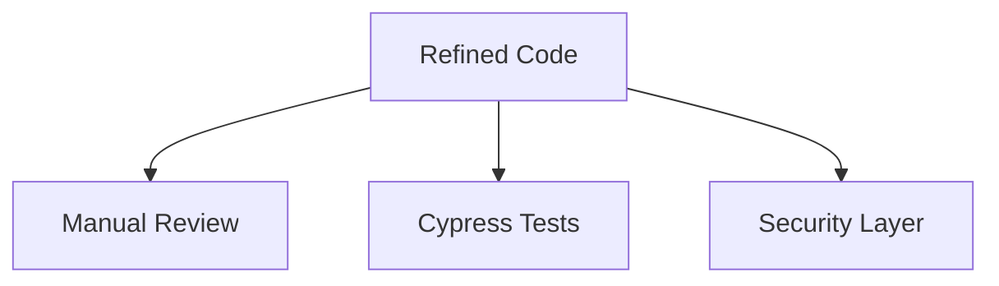
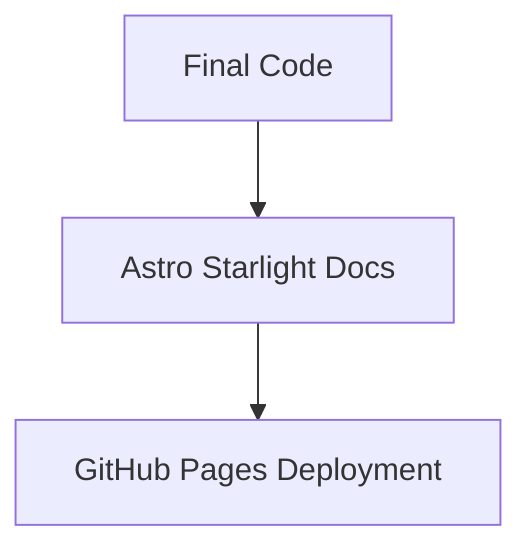

#  AI-Powered Angular Development Workflow

---

## 1. Business Logic & Docs

- Use **Google AI Studio** (2.5 Pro, 1M context)  
- Generate:
  - Business logic (English)
  - Screen elements & structure
  - CSS wireframes
  - JS/TS considerations
  - High-level docs

----------

## 2. Template Generation

-   Generate **first screen template** from docs
    
-   Contains layout, colors, components
    

----------

## 3. AI Refinement

-   Use **GitHub Copilot** → inline improvements
    
-   Use **Gemini CLI** → logic refinements
    

----------

## 4. Testing Layer

-   **Manual review**
    
-   **Cypress E2E testing**
    
-   Security checks (route guards, auth)
    

----------

## 5. Documentation & Deployment

-   Use **Astro Starlight** to generate docs
    
-   Deploy docs to **GitHub Pages** for reference
    

----------

# 🌟 Summary

1.  **AI Studio** → Business logic + docs
    
2.  **Templates** → First screen draft
    
3.  **Copilot & Gemini** → Refine
    
4.  **Testing** → Manual + Cypress
    
5.  **Docs & Deploy** → Starlight + GitHub Pages
    

