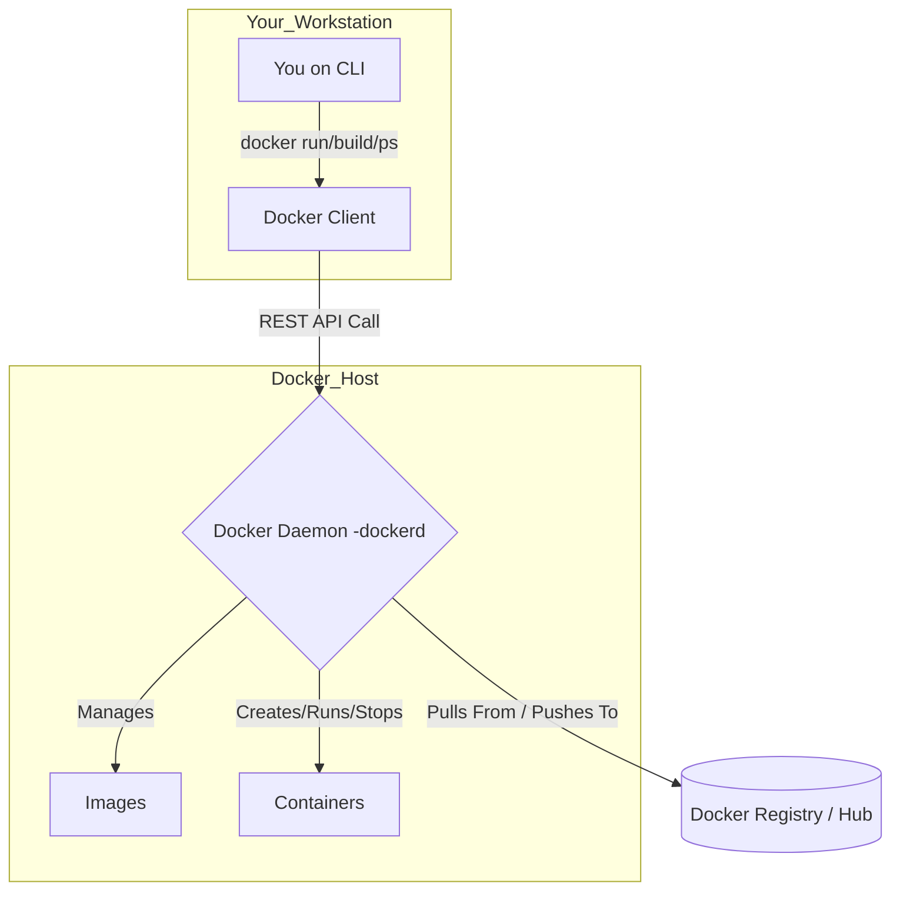

---
title: Docker Basics
---
***

### **Module 1: The First Principle — Understanding "Why" Containers Exist**

#### **What is Docker? The Solution to a Universal Problem**

Docker is an open-source platform for building, shipping, and running applications inside of containers.

As a Spring Boot developer, you have likely encountered the classic problem: your application runs perfectly on your local machine, but fails during testing or in production due to differences in the environment (e.g., a different Java patch version, a missing library, or a conflicting service).

Docker solves this by packaging your application (your `.jar` file) and all of its dependencies—including the exact Java Runtime Environment and OS libraries—into a single, standardized, portable unit called a container.

This provides:
*   **Consistency:** The application runs the same way everywhere. The environment is shipped with the app.
*   **Isolation:** Containers do not interfere with each other or the host system, eliminating dependency conflicts.
*   **Portability:** A container can run on any machine—developer laptop, on-premise server, or cloud VM—that has Docker installed.

##### **Key Vocabulary:**
*   **Containerization:** The process of packaging an application and its dependencies into a container. It is a lightweight form of virtualization.
*   **Docker Image:** The blueprint. A read-only template that contains the instructions for creating a container.
*   **Docker Container:** The running instance. A live, executable instance of an image. You can run many containers from a single image.

---
### **The Docker Architecture (Deep Dive)**

To master a tool, you must understand its components. Docker operates on a client-server model. It is not a single program.

*   **1. Docker Client:** When you type a command like `docker ps` in your terminal, you are using the Docker Client. It is a command-line interface (CLI) whose only job is to translate your commands into API requests and send them to the correct Docker Daemon.
*   **2. Docker Daemon (`dockerd`):** This is the engine. A persistent background process (a server) that listens for API requests from the Docker Client. The Daemon does all the real work: building images, managing containers (starting, stopping), and handling networking and storage.
*   **3. Docker Host:** This is simply the machine (your laptop, a server) where the Docker Daemon is running.
*   **4. Docker Registry:** A repository for storing and distributing your Docker images. **Docker Hub** is the public, default registry, but in a professional environment, you will almost always use a private registry (like AWS ECR, GCR, or a self-hosted one) for your company's proprietary application images.

---
### **Containers vs. Virtual Machines (Interview Gold)**

This is a cornerstone interview topic. A weak answer here signals a lack of fundamental knowledge. Your response must be clear and confident.

Both technologies isolate applications, but they do so at fundamentally different levels of the system stack.

| Aspect | Containers | Virtual Machines (VMs) |
| :--- | :--- | :--- |
| **Operating System** | Share the Host OS kernel | Run a full, independent Guest OS |
| **Resource Usage** | Lightweight, minimal overhead | Higher resource usage (CPU/RAM) |
| **Boot Time** | Seconds | Minutes |
| **Isolation** | Process-level isolation | Full hardware virtualization |
| **Portability** | Highly portable across OSes | Less portable, OS-dependent |
| **Performance** | Near-native performance | Slight performance overhead |
| **Size** | Typically smaller (MBs) | Larger (GBs) |

**The Sensi's Explanation for an Interview:**

"A Virtual Machine uses a *hypervisor* to virtualize physical hardware. This creates a self-contained virtual server on which you must install a complete, standalone *Guest Operating System*, with its own kernel. This provides very strong, hardware-level isolation but is heavy and slow to start.

A container, by contrast, operates at a higher level. It shares the *kernel of the Host OS*. It achieves isolation using Linux kernel features like **namespaces**, which make a containerized process *believe* it's the only process running, and **cgroups**, which limit how much CPU and memory that process can use. Because it doesn't need to boot a full OS, a container starts in seconds and has a much smaller resource footprint, allowing you to run many more containers on a single host compared to VMs."

***
### **Module 2: The Craftsman's Hands — Command Line Fluency**

These are your primary tools. Understand their purpose, not just their syntax.

#### **The Container Lifecycle: From Birth to Decommission**

*   `docker run hello-world`
    *   This is the command to create and start a new container from an image.
    *   **The Process:** The Docker daemon first checks if the `hello-world` image exists locally. If not, it pulls the image from Docker Hub. Then, it creates a new container based on that image, runs the container's default command, and in this case, the container then exits.

*   `docker ps`
    *   Lists all *currently running* containers.

*   `docker ps -a`
    *   Lists *all* containers, including those that have been stopped or have exited. This is critical for finding containers that failed on startup.

*   `docker stop <container_id_or_name>`
    *   Stops a running container by sending a graceful shutdown signal to the primary process inside it.

*   `docker start <container_id_or_name>`
    *   Restarts a container that has been stopped.

*   `docker rm <container_id_or_name>`
    *   Removes a stopped container. Its filesystem and metadata are deleted. Use the `-f` flag to force-remove a running container (generally bad practice).

#### **Interacting with a Running Container**

*   `docker run -it <image_name> /bin/bash`
    *   Runs a container in **interactive mode** (`-it`). This starts the container and immediately gives you a shell prompt (`/bin/bash`) inside it. This is useful for exploring an image's filesystem.

*   `docker logs <container_id_or_name>`
    *   This is your window into the application. It streams the standard output and standard error from the main process running inside the container. **This is the first command you run when your Spring Boot app fails to start.**

*   `docker logs -f <container_id_or_name>`
    *   The `-f` flag "follows" the log output in real-time, just like `tail -f`.

*   `docker exec -it <container_id_or_name> /bin/bash`
    *   **Your most powerful debugging tool.** This executes a *new* command (in this case, starting a shell) inside an *already running* container. You can use this to inspect files, check environment variables, and diagnose issues without stopping and restarting your application.

#### **Exposing Your Application to the World**

*   `docker run -d -p 8080:8080 nginx`
    *   The `-d` flag runs the container in **detached mode** (in the background).
    *   The `-p` flag handles **port mapping**. It connects a port on the Docker Host (the first `8080`) to a port inside the container (the second `8080`). This is how you make your Spring Boot application, which is listening on port 8080 *inside* the container, accessible to the outside world via the host machine's port 8080.