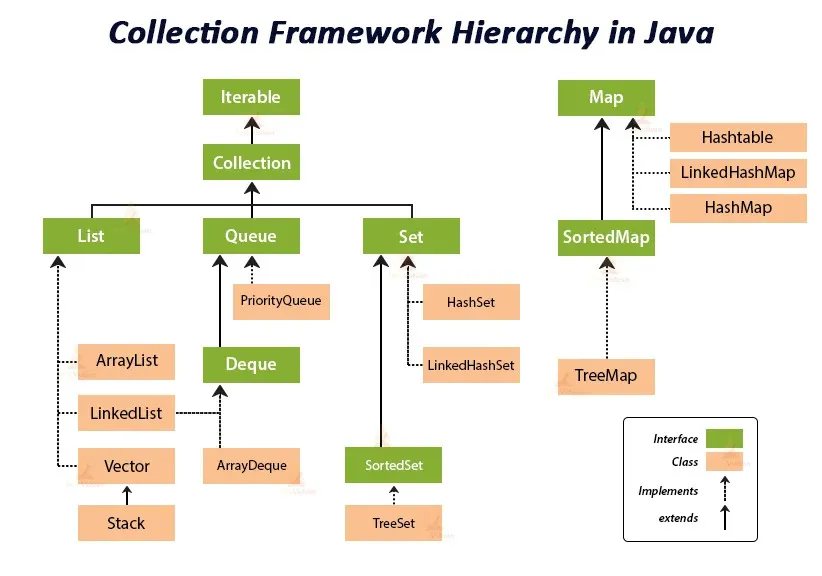

# Java Collections Framework - Introduction

## Overview

The Java Collections Framework is a unified architecture for representing and manipulating collections of objects. It provides a standardized way to store, retrieve, and manipulate groups of data, making your code more efficient, reusable, and easier to maintain.

All interfaces and classes in the Collections Framework are part of the **java.util** package.

## What is the Collections Framework?

The Collections Framework is essentially a toolbox that contains different types of containers designed for specific purposes. It provides:

- **Interfaces** - Abstract data types that represent collections (Collection, List, Set, Queue, Map)
- **Implementations** - Concrete classes that implement these interfaces (ArrayList, HashSet, HashMap, etc.)
- **Algorithms** - Static methods for performing operations like searching, sorting, and manipulation

## Why Use Collections Framework?

Before Java 2, developers used ad hoc classes like Vector, Stack, and Hashtable, which lacked a unified approach. The Collections Framework was designed to meet several goals :

- **High Performance** - Efficient implementations for fundamental data structures
- **Interoperability** - Different collection types work in similar manner
- **Extensibility** - Easy to extend or adapt collections to your needs
- **Standardization** - Consistent API across different collection types

## Understanding the Hierarchy

### The Root: Iterable Interface

At the root of the Java Collections Framework is the **Iterable** interface, which provides the ability to iterate over elements using the enhanced for-each loop. This is the topmost interface in the hierarchy.

### Collection Interface

The **Collection** interface extends the Iterable interface and serves as the foundation for all collections (except Map). It inherits iteration capabilities from Iterable and adds its own behavior for adding, removing, and retrieving elements.

### Core Interface Branches

From the Collection interface, three main branches extend :

**1. List Interface**
- Represents ordered collections
- Maintains insertion order
- Allows duplicate elements
- Supports positional access
- Common implementations: ArrayList, LinkedList

**2. Set Interface**
- Represents collections of unique elements
- Does not allow duplicates
- Does not guarantee order (except sorted variants)
- Common implementations: HashSet, LinkedHashSet, TreeSet

**3. Queue Interface**
- Represents FIFO (First-In-First-Out) collections
- Used for scheduling and buffering operations
- Extends to Deque (double-ended queue)
- Common implementations: PriorityQueue, ArrayDeque, LinkedList

### Map Interface (Separate Hierarchy)

The **Map** interface is part of the Collections Framework but does **not extend** the Collection interface. It represents key-value pair mappings where:
- Keys are unique
- Each key maps to exactly one value
- Common implementations: HashMap, TreeMap, LinkedHashMap, WeakHashMap

## Key Concepts to Understand

### Synchronization and Thread Safety

**Synchronization** controls access to shared objects by multiple threads, ensuring data integrity and preventing conflicts. This is crucial for maintaining thread safety in multi-threaded applications.

- Most collection implementations are **not synchronized** by default
- Use concurrent collections (ConcurrentHashMap, CopyOnWriteArrayList) for thread-safe operations
- Or wrap collections using `Collections.synchronizedList()` methods

### Performance Considerations

When choosing a collection type, consider performance during common operations :

- **Insertion** - How fast can elements be added?
- **Deletion** - How efficiently can elements be removed?
- **Retrieval** - How quickly can elements be accessed?
- **Search** - How fast can you find specific elements?

Performance is typically expressed using **Big-O notation**, which describes algorithmic complexity.

### Examples:
- ArrayList: O(1) for indexed access, O(n) for insertion at beginning
- LinkedList: O(1) for insertion at ends, O(n) for indexed access
- HashSet: O(1) average for add, remove, contains
- TreeSet: O(log n) for add, remove, contains

## Important Distinction: Collection vs Collections

A common source of confusion :

- **Collection** - An interface that represents a group of objects
- **Collections** - A utility class that provides static methods to operate on collections (sort, search, synchronize, etc.)

## What's Next?

In the upcoming sections, we'll explore:

1. Deep dive into each interface (List, Set, Queue, Map)
2. Detailed implementation comparisons
3. Common methods and usage patterns
4. Performance characteristics of different implementations
5. Best practices and when to use which collection
6. Advanced topics like concurrent collections

***

**Note**: This documentation focuses on modern Java Collections Framework (Java 8+), excluding legacy classes like Vector, Stack, Hashtable, and Dictionary, which are maintained only for backward compatibility.
