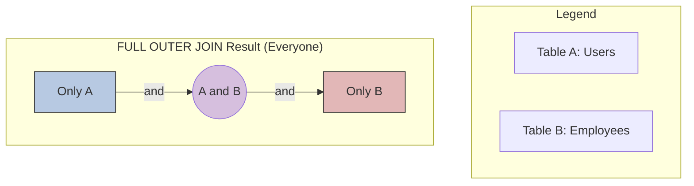

### **Mastering the `FULL OUTER JOIN`: The Logic of Totality**

#### **1. The "Why": The Philosophy of `FULL OUTER JOIN`**

A `FULL OUTER JOIN` exists to answer the comprehensive business question: **"Show me absolutely everything from both tables, linking them up where a relationship exists."**

It makes a promise to include:
1.  All rows that have a match in both tables (the `INNER JOIN` part).
2.  All rows from the left table that have **no match** in the right table (the `LEFT JOIN`'s unmatched part).
3.  All rows from the right table that have **no match** in the left table (the `RIGHT JOIN`'s unmatched part).

It is the grand union of both tables.

**Business Question:** "I have a list of all registered `Users` and a list of all `Employees`. I need a single, combined list that shows me who is both a user and an employee, who is only a user, and who is only an employee."



#### **2. Visualizing the Mechanics: How It Works**

Let's use our tables, but with a slight modification to illustrate the full concept. We'll add an order for a customer that doesn't exist.

**`Customers` (Left Table):**
| CustomerID | FirstName |
| :--- | :--- |
| 1 | John |
| 2 | Jane |
| 3 | Dana |

**`Orders` (Right Table):**
| OrderID | CustomerID | Amount |
| :--- | :--- | :--- |
| 101 | 2 | 50.00 |
| 102 | 1 | 75.00 |
| **104** | **4** | 120.00 |

Here's the logical process:
1.  **Find the Matches:** The database finds John (ID 1) and Jane (ID 2) who both have matching orders. These rows are combined.
2.  **Find the Left Orphans:** The database looks at the `Customers` table and finds Dana (ID 3), who has no matching order. It includes her and puts `NULL` in the `Orders` columns.
3.  **Find the Right Orphans:** The database looks at the `Orders` table and finds Order 104, which references a `CustomerID` of 4 that does not exist in the `Customers` table. It includes this order and puts `NULL` in the `Customers` columns.

**The Final Result:**
| CustomerID | FirstName | OrderID | Amount |
| :--- | :--- | :--- | :--- |
| 1 | John | 102 | 75.00 |
| 2 | Jane | 101 | 50.00 |
| 3 | Dana | **`NULL`** | **`NULL`** |
| **`NULL`** | **`NULL`** | 104 | 120.00 |

This result gives you a complete audit: customers with orders, customers without orders, and orders without a valid customer (a data integrity problem this query just helped you find!).

#### **3. The "How": Emulation in MySQL (The Critical Interview Topic)**

This is the single most important fact you must know for an interview.

**MySQL does not have a native `FULL OUTER JOIN` keyword.**

You must build it yourself. The standard and accepted method is to combine a `LEFT JOIN` and a `RIGHT JOIN` with a `UNION` operator.

**The Emulation Pattern:**
```sql
-- Part 1: The LEFT JOIN
-- This gets all customers, and any orders they have.
-- It will include John, Jane, and Dana. It will NOT include Order 104.
SELECT
    c.CustomerID,
    c.FirstName,
    o.OrderID,
    o.Amount
FROM
    Customers AS c
LEFT JOIN
    Orders AS o ON c.CustomerID = o.CustomerID

UNION

-- Part 2: The RIGHT JOIN
-- This gets all orders, and any customers they have.
-- It will include John, Jane, and Order 104. It will NOT include Dana.
SELECT
    c.CustomerID,
    c.FirstName,
    o.OrderID,
    o.Amount
FROM
    Customers AS c
RIGHT JOIN
    Orders AS o ON c.CustomerID = o.CustomerID;
```
*   **The Role of `UNION`:** When these two result sets are combined, `UNION` performs its magic. The records for John and Jane exist in *both* the `LEFT JOIN` and the `RIGHT JOIN` result. The `UNION` operator automatically discards these duplicates, ensuring that the matched records appear only once. The unmatched record for Dana from the left join and the unmatched record for Order 104 from the right join are unique, so they are included. The final output perfectly matches the logical `FULL OUTER JOIN` result.

#### **4. Interview Gold: Deep Knowledge and Scenarios**

**Q1: A developer tells you their `FULL OUTER JOIN` query isn't working in MySQL. What is the immediate problem?**

**Your Expert Answer:** "The immediate problem is that MySQL does not support the `FULL OUTER JOIN` syntax. The developer is likely coming from a PostgreSQL or SQL Server background where that keyword exists. I would explain that in MySQL, we must emulate this join. The standard pattern is to perform a `LEFT JOIN`, then a `RIGHT JOIN`, and combine the two results with a `UNION` clause to get the complete, de-duplicated set of all rows."

**Q2: When would you actually need a `FULL OUTER JOIN` in a real-world scenario?**

**Your Expert Answer:** "The primary use case is for **data reconciliation and auditing**. Imagine you have two different tables that *should* contain the same set of data, and you want to verify their consistency.

*   **Scenario:** We have a `Staging_Users` table that receives a daily data feed and our production `Production_Users` table. We need to find:
    *   Users who are in both tables (a match).
    *   New users who are in Staging but not yet in Production (left orphans).
    *   Users who have been removed from the feed but are still in Production (right orphans).

A `FULL OUTER JOIN` on `Staging_Users.UserID = Production_Users.UserID` would give you a single report showing all three of these conditions at once. It is the most efficient way to get a complete comparison of two datasets."

**Q3: In the emulation pattern, why is `UNION` typically used over `UNION ALL`?**

**Your Expert Answer:** "This is a subtle but important point. We use `UNION` because the records that match—the `INNER JOIN` part of the result—are present in *both* the `LEFT JOIN` result and the `RIGHT JOIN` result. If we used `UNION ALL`, these matched records would appear twice, which is incorrect for a `FULL OUTER JOIN`. The `UNION` operator's built-in duplicate removal is precisely what we need to elegantly filter out this overlap, leaving us with a clean and correct final set."

### **Summary: Join Types at a Glance**

| Join Type | Returns... | Business Purpose |
| :--- | :--- | :--- |
| **`INNER JOIN`** | Only the rows that have a match in both tables. | Finding the intersection of data; "Show me customers *with* orders." |
| **`LEFT JOIN`** | **All** rows from the left table, and matches from the right. | Finding what's missing in the right table; "Show me *all* customers, and *any* orders they have." |
| **`RIGHT JOIN`** | **All** rows from the right table, and matches from the left. | (Same as `LEFT JOIN`, but less readable. Best to avoid.) |
| **`FULL OUTER JOIN`** | **All** rows from **both** tables, matched where possible. | Data reconciliation and auditing; "Show me everyone and everything, linked or not." |