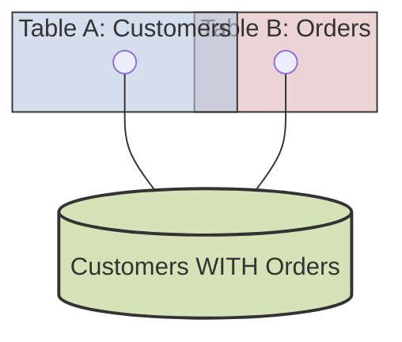

### **Mastering the `INNER JOIN`: The Logic of Intersection**

#### **1. The "Why": The Philosophy of `INNER JOIN`**

The `INNER JOIN` exists to answer one fundamental business question: **"Show me the data where a relationship exists between two tables."**

It is the join of **intersection** and **certainty**. It finds all the rows in one table that have a confirmed, matching partner in another table based on a rule you define. Any row in either table that does not have a matching partner is completely **excluded** from the result. It is the join for finding "matches."

**Think of it as the intersection of two sets.**



#### **2. Visualizing the Mechanics: How It Works**

Before we write a single line of code, let's visualize what the database is doing. Imagine we have these two simple tables:

**`Customers` Table:**
| CustomerID | FirstName |
| :--- | :--- |
| 1 | John |
| 2 | Jane |
| 3 | Dana |

**`Orders` Table:**
| OrderID | CustomerID | OrderDate |
| :--- | :--- | :--- |
| 101 | 2 | 2025-08-25 |
| 102 | 1 | 2025-08-25 |
| 103 | 2 | 2025-08-26 |

The database performs the following logical process for an `INNER JOIN`:

1.  It takes the first row from `Customers` (CustomerID: 1, Name: John).
2.  It scans the `Orders` table looking for a row where `Orders.CustomerID = 1`.
3.  It finds a match (OrderID: 102). A relationship exists! It combines these two rows into a single new row and adds it to the result set.
4.  It takes the second row from `Customers` (CustomerID: 2, Name: Jane).
5.  It scans `Orders` for `Orders.CustomerID = 2`.
6.  It finds two matches! (OrderID: 101 and 103). It creates two combined rows and adds both to the result set.
7.  It takes the third row from `Customers` (CustomerID: 3, Name: Dana).
8.  It scans `Orders` for `Orders.CustomerID = 3`.
9.  **It finds no match.** Because this is an `INNER JOIN`, Dana is **completely ignored**. She is not included in the final result.

**The Final Result:**

| CustomerID | FirstName | OrderID | OrderDate |
| :--- | :--- | :--- | :--- |
| 1 | John | 102 | 2025-08-25 |
| 2 | Jane | 101 | 2025-08-25 |
| 2 | Jane | 103 | 2025-08-26 |

Notice that Dana is gone. This is the defining characteristic of an `INNER JOIN`.

#### **3. The "How": Syntax and Best Practices**

Now, let's write the SQL for the visualization above.

```sql
SELECT
    c.CustomerID,      -- From the Customers table
    c.FirstName,       -- From the Customers table
    o.OrderID,         -- From the Orders table
    o.OrderDate        -- From the Orders table
FROM
    Customers AS c     -- Define the "left" table and give it a short alias 'c'
INNER JOIN             -- Specify the join type
    Orders AS o        -- Define the "right" table with its alias 'o'
ON
    c.CustomerID = o.CustomerID; -- The JOIN CONDITION, the rule for matching
```

**Dissection of the Syntax:**

*   **`FROM Customers AS c`**: We always start with one primary table. Using a short, intuitive alias (`c` for `Customers`) is a non-negotiable best practice. It dramatically improves readability.
*   **`INNER JOIN Orders AS o`**: This specifies both the type of join and the second table, also with an alias (`o`).
*   **`ON c.CustomerID = o.CustomerID`**: This is the most important part—the **join condition**. It tells the database the rule for matching rows. Here, we are matching the Primary Key of `Customers` to the Foreign Key in `Orders`.
*   **`SELECT c.CustomerID, o.OrderID ...`**: We use the aliases to tell the database precisely which columns we want from which table. This is critical to avoid "ambiguous column" errors if both tables had a column with the same name (e.g., a `LastModified` column).

#### **4. Advancing the Skill: Multi-Table `INNER JOIN`s**

Real-world queries often require chaining multiple joins together. The logic remains the same.

**Business Question:** "Show me a list of customer names, the products they bought, and the quantity of each product."

This requires linking `Customers` -> `Orders` -> `Order_Items` -> `Products`.

```sql
SELECT
    c.FirstName,
    p.ProductName,
    oi.Quantity
FROM
    Customers AS c
INNER JOIN
    Orders AS o ON c.CustomerID = o.CustomerID -- Link Customers to their Orders
INNER JOIN
    Order_Items AS oi ON o.OrderID = oi.OrderID -- Link each Order to its line items
INNER JOIN
    Products AS p ON oi.ProductID = p.ProductID; -- Link each line item to the Product info
```

**Mental Model:** Think of it as forging a chain. Each `JOIN` adds a new link, connecting one table to the next based on a specific `PK = FK` relationship.

#### **5. Interview Gold: Deep Knowledge and Pitfalls**

**Q1: What's the difference between an `INNER JOIN` and putting multiple tables in the `FROM` clause with a `WHERE` condition?**

This is a classic question that tests your knowledge of SQL standards.

**Bad, Old-school Syntax (Implicit Join):**
```sql
FROM Customers c, Orders o
WHERE c.CustomerID = o.CustomerID;
```

**Good, Modern Syntax (Explicit Join):**
```sql
FROM Customers c
INNER JOIN Orders o ON c.CustomerID = o.CustomerID;
```
**Your Expert Answer:** "While they can produce the same result, the explicit `INNER JOIN ... ON` syntax is vastly superior and the professional standard. Here's why:

1.  **Readability and Intent:** The explicit syntax clearly separates the **act of joining** tables (`ON` clause) from the **act of filtering** the data (`WHERE` clause). The older syntax mixes these two concerns, making complex queries hard to read.
2.  **Safety:** The biggest danger of the old syntax is accidentally forgetting the `WHERE` clause. If you do that, you create an unintentional `CROSS JOIN`, which can produce millions of incorrect rows and bring a server to its knees. The explicit `JOIN` syntax makes this mistake much harder to make."

**Q2: How does a database actually perform a join? What makes a join fast or slow?**

**Your Expert Answer:** "At a high level, the database needs a strategy to match rows. The most basic strategy is a 'Nested Loop Join'. Imagine the database is a person with two spreadsheets. It takes the first row from the first sheet and then reads through the *entire* second sheet to find matches. Then it takes the second row from the first sheet and reads the *entire* second sheet again. This is incredibly slow on large tables.

**This is where indexes are critical.** A Foreign Key constraint should always be indexed. When an index exists on the foreign key (e.g., `Orders.CustomerID`), the process changes completely. Now, for each customer row, the database can use the index to **instantly look up** the matching orders without scanning the whole table. This changes a slow, full-scan operation into a series of incredibly fast lookups, and it's the single most important factor for `JOIN` performance."

**Q3: What happens if you join on columns that are not a Primary Key/Foreign Key?**

**Your Expert Answer:** "You absolutely can. The `ON` clause can contain any valid logical condition, such as `ON tableA.date = tableB.date`. However, this is often a sign of a potential issue.

1.  **Performance:** If the columns in the join condition are not indexed, the join will likely be very slow, forcing a nested loop scan.
2.  **Incorrect Results (Row Multiplication):** The biggest danger is joining on non-unique columns. If you join `TableA` to `TableB` on `CityName`, and there are 10 'Johns' in `TableA` and 50 'Smiths' in `TableB`, and you joined on a non-unique last name, you might get an explosion of rows. This is why joining on a unique key (`PK` or `UNIQUE` key) is the standard—it guarantees a predictable 'one-to-many' or 'one-to-one' relationship, preventing unexpected row multiplication."