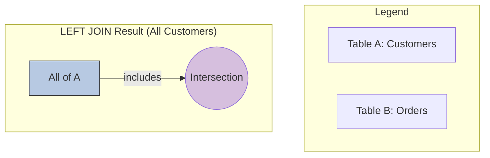

### **Mastering `OUTER JOIN`s: The Logic of Inclusion (LEFT & RIGHT JOIN)**

#### **1. The "Why": The Philosophy of `LEFT JOIN`**

The `LEFT JOIN` exists to answer the business question: **"Show me everything from this primary table, and for any records that have a relationship in the second table, show me that data too."**

It starts with a promise: **"I will include every single row from the table on the left."** It then tries to find a matching partner in the right table.

*   If a match is found, it combines the rows, just like an `INNER JOIN`.
*   If **no match** is found, it still keeps the row from the left table and simply fills in the columns from the right table with `NULL` values.

This ability to show "no match" is its superpower.

**Think of it as keeping all of set A, and pulling in the intersection from set B.**



#### **2. Visualizing the Mechanics: How `LEFT JOIN` Works**

Let's use our familiar tables, but focus on the "unmatched" customer, Dana.

**`Customers` (Left Table):**
| CustomerID | FirstName |
| :--- | :--- |
| 1 | John |
| 2 | Jane |
| 3 | Dana |

**`Orders` (Right Table):**
| OrderID | CustomerID | OrderDate |
| :--- | :--- | :--- |
| 101 | 2 | 2025-08-25 |
| 102 | 1 | 2025-08-25 |
| 103 | 2 | 2025-08-26 |

The database performs the following logical process for a `LEFT JOIN`:

1.  It starts with the **left** table (`Customers`). It takes the first row (John, ID 1) and promises to include it. It finds a matching order (102) and creates a combined row.
2.  It takes the second row (Jane, ID 2) and promises to include it. It finds two matching orders (101 and 103) and creates two combined rows.
3.  It takes the third row (Dana, ID 3) and **promises to include it, no matter what.**
4.  It scans the `Orders` table for a match where `CustomerID = 3`. It finds nothing.
5.  Instead of discarding Dana (like `INNER JOIN` would), it honors its promise. It keeps the row for Dana and fills in the columns from the `Orders` table with `NULL`.

**The Final Result:**

| CustomerID | FirstName | OrderID | OrderDate |
| :--- | :--- | :--- | :--- |
| 1 | John | 102 | 2025-08-25 |
| 2 | Jane | 101 | 2025-08-25 |
| 2 | Jane | 103 | 2025-08-26 |
| 3 | Dana | **`NULL`** | **`NULL`** |

Notice that Dana is present. The `NULL`s explicitly tell us: "Here is a customer for whom no matching order exists."

#### **3. The "How": Syntax for `LEFT JOIN`**

The syntax is nearly identical to `INNER JOIN`, but the `LEFT` keyword is a crucial instruction.

```sql
SELECT
    c.CustomerID,
    c.FirstName,
    o.OrderID,
    o.OrderDate
FROM
    Customers AS c     -- This is the LEFT table. All its rows will be preserved.
LEFT JOIN              -- The join type
    Orders AS o        -- This is the RIGHT table.
ON
    c.CustomerID = o.CustomerID;
```

*   **The Order is Critical:** In an `INNER JOIN`, the order of the tables doesn't change the final result. In a `LEFT JOIN`, it changes everything. `Customers LEFT JOIN Orders` is completely different from `Orders LEFT JOIN Customers`.

#### **4. The Single Most Important Use Case: Finding Unmatched Records**

This pattern is a hallmark of a proficient SQL developer.

**Business Question:** "Write a query to find all customers who have **never** placed an order."

**Your Expert Answer:**
"The most efficient way to solve this is to perform a `LEFT JOIN` from `Customers` to `Orders` and then filter for the rows where the `Orders` side is `NULL`."

```sql
SELECT
    c.CustomerID,
    c.FirstName
FROM
    Customers AS c
LEFT JOIN
    Orders AS o ON c.CustomerID = o.CustomerID
WHERE
    o.OrderID IS NULL; -- The magic filtering step
```

**Why This Works (The Mental Model):**
1.  The `LEFT JOIN` creates the full result set we saw in the visualization, including the row for Dana where `o.OrderID` and `o.OrderDate` are `NULL`.
2.  The `WHERE o.OrderID IS NULL` clause then acts as a filter on that result. It discards all the rows where a match was found (John and Jane) and keeps only the rows where no match was found (Dana).

**Result:**
| CustomerID | FirstName |
| :--- | :--- |
| 3 | Dana |

This is an elegant, readable, and highly performant way to find records that lack a relationship.

#### **5. `RIGHT JOIN`: The Mirror Image**

The `RIGHT JOIN` (or `RIGHT OUTER JOIN`) is the exact opposite of the `LEFT JOIN`. It makes a promise to include **every single row from the table on the right**. If a row from the right table has no match in the left, the columns from the left table are filled with `NULL`.

**Business Question:** "Show me every single Order, and if the customer record exists, show me their name."

```sql
SELECT
    c.FirstName,
    o.OrderID,
    o.OrderDate
FROM
    Customers AS c
RIGHT JOIN             -- The join type
    Orders AS o ON c.CustomerID = o.CustomerID;
```

**Interview Gold: The `RIGHT JOIN` Readability Debate**
**Interviewer:** "When would you use a `RIGHT JOIN`?"

**Your Expert Answer:** "In practice, I almost never use a `RIGHT JOIN`. While it is functionally valid, it often makes queries harder to read because developers are trained to read from top to bottom, thinking from the `FROM` clause downwards. A `LEFT JOIN` aligns with this natural reading order.

Any `RIGHT JOIN` can be rewritten as an equivalent and more intuitive `LEFT JOIN` simply by swapping the order of the tables.

For example, this `RIGHT JOIN`:
`FROM Customers c RIGHT JOIN Orders o ON c.CustomerID = o.CustomerID`

...is functionally identical to this `LEFT JOIN`:
`FROM Orders o LEFT JOIN Customers c ON o.CustomerID = c.CustomerID`

The second version is clearer because the primary table we're interested in (`Orders`) is specified first in the `FROM` clause. For code consistency and readability, I exclusively use `LEFT JOIN`."

#### **6. Interview Gold: The `WHERE` Clause Trap with `OUTER JOIN`s**

This is an advanced question that separates true experts.

**Interviewer:** "I want a list of all customers, and for customer 'Jane' (ID 2), I only want to see her orders placed on August 26th. A developer wrote this query, but it's not working correctly. It's only showing Jane and filtering out John and Dana. Why is it broken, and how do you fix it?"

**The Broken Query:**
```sql
SELECT
    c.FirstName, o.OrderID, o.OrderDate
FROM
    Customers AS c
LEFT JOIN
    Orders AS o ON c.CustomerID = o.CustomerID
WHERE
    o.OrderDate = '2025-08-26';
```

**Your Expert Answer:**
"This is a classic and subtle trap. The query is broken because a filter in the `WHERE` clause is applied **after** the join has been performed. It is effectively canceling out the 'outer' behavior of the `LEFT JOIN` and turning it into an `INNER JOIN`.

Here's the step-by-step breakdown of the error:
1.  The `LEFT JOIN` correctly produces the temporary table, including the row for `Dana` where `o.OrderDate` is `NULL`.
2.  The `WHERE o.OrderDate = '2025-08-26'` clause is then applied to this result.
3.  For `Dana`, the condition is `NULL = '2025-08-26'`, which evaluates to `UNKNOWN`, so Dana is filtered out.
4.  For `John`, the condition is `'2025-08-25' = '2025-08-26'`, which is `FALSE`, so John is filtered out.
5.  Only the row for `Jane`'s order on the 26th passes the filter.

**The Correct Solution** is to move the filtering condition for the *right table* from the `WHERE` clause into the `ON` clause.

**The Correct Query:**
```sql
SELECT
    c.FirstName, o.OrderID, o.OrderDate
FROM
    Customers AS c
LEFT JOIN
    Orders AS o ON c.CustomerID = o.CustomerID
                 AND o.OrderDate = '2025-08-26'; -- Condition moved here!```

**Why This Works:** By placing the date filter inside the `ON` clause, you are telling the database: 'When you are attempting to find matches for me in the `Orders` table, the match must satisfy *both* the ID condition *and* the date condition.' This filters the `Orders` table *before* the join logic is finalized, so the `LEFT JOIN` still honors its promise to keep all customers, even those for whom no match was found under the stricter conditions."