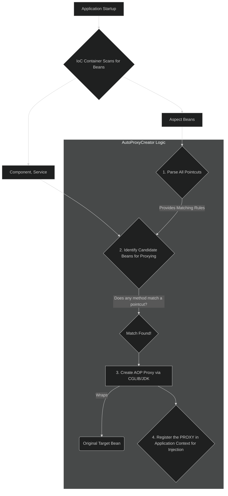
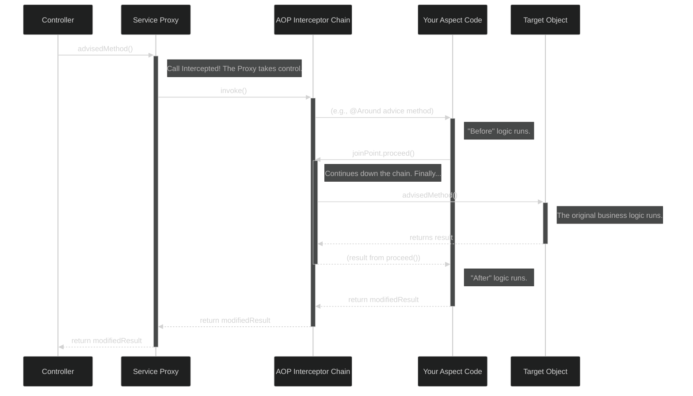

---

### **The Professional's Guide to Spring AOP: From Cross-Cutting Concerns to Production Mastery**

**Objective:** To provide a comprehensive, interview-ready understanding of Spring AOP, enabling an intermediate developer to architect, implement, and debug AOP-based solutions with the confidence of a senior engineer.

---

### **Module 1: The "Why" - The Problem AOP Solves**

Before mastering the "how," an advanced developer must deeply understand the "why."

Modern applications are built in layers. A `Controller` calls a `Service`, which calls a `Repository`. This is excellent for modularizing our primary business logic. However, certain system-wide responsibilities, known as **Cross-Cutting Concerns**, do not fit neatly into this model.

**Consider these typical requirements:**
*   **Logging:** "Log the entry, exit, and execution time of all public methods in the service layer."
*   **Security:** "Ensure that the user has an 'ADMIN' role before executing any method that starts with `delete`."
*   **Auditing:** "Record an audit trail whenever a method annotated with `@Auditable` is successfully executed."
*   **Caching:** "Cache the return value of any method in the `ExternalApiClient` class."

Without AOP, the logic for these concerns would be **scattered** across your codebase and **tangled** with business logic, violating the Single Responsibility Principle. AOP provides the mechanism to centralize these scattered and tangled concerns into a clean, reusable module: an **Aspect**.

---

### **Module 2: The AOP Lexicon - The Core Components**

To speak the language of AOP, you must master its vocabulary.

| Term | Definition |
| :--- | :--- |
| **Aspect** | A class that modularizes a cross-cutting concern. It is annotated with `@Aspect`. |
| **Join Point** | A specific point in the execution of the application, such as a method call or the handling of an exception. In Spring AOP, a join point *always* represents a method execution. |
| **Advice** | The action taken by an aspect at a particular join point. This is the code that actually runs. |
| **Pointcut** | A predicate or expression that matches join points. It defines *where* the advice should be executed. |
| **Target Object**| The original bean instance being advised by one or more aspects. |
| **AOP Proxy** | A dynamic object created by the Spring AOP framework that wraps the target object. The proxy intercepts method calls to the target, allowing the advice to be executed. |

---

### **Module 3: The Toolkit - The Five Types of Advice**

Spring AOP provides five types of advice. Knowing which one to use is a mark of experience.

All advice methods can accept a `JoinPoint` parameter, which gives contextual information about the method being advised (e.g., method name, arguments).

1.  **`@Before`**
    *   **Purpose:** Runs *before* the target method is executed.
    *   **Use Case:** Ideal for pre-condition checks, security validation, or logging method entry. It cannot prevent the target method from running (unless it throws an exception).
    *   **Code:**
        ```java
        @Before("execution(* com.example.service.*.*(..))")
        public void logMethodEntry(JoinPoint joinPoint) {
            log.info("Entering: {}", joinPoint.getSignature().toShortString());
        }
        ```

2.  **`@AfterReturning`**
    *   **Purpose:** Runs *after* the target method completes successfully (i.e., does not throw an exception).
    *   **Use Case:** Ideal for logging successful results, auditing, or post-processing the return value.
    *   **Code:**
        ```java
        @AfterReturning(pointcut = "execution(* com.example.service.*.*(..))", returning = "result")
        public void logMethodSuccess(JoinPoint joinPoint, Object result) {
            log.info("Successfully executed {} and returned: {}", joinPoint.getSignature().toShortString(), result);
        }
        ```

3.  **`@AfterThrowing`**
    *   **Purpose:** Runs only if the target method throws an exception.
    *   **Use Case:** Centralized error logging, sending alert notifications on failures, or mapping exceptions.
    *   **Code:**
        ```java
        @AfterThrowing(pointcut = "execution(* com.example.service.*.*(..))", throwing = "exception")
        public void logMethodException(JoinPoint joinPoint, Throwable exception) {
            log.error("Exception in {}: {}", joinPoint.getSignature().toShortString(), exception.getMessage());
        }
        ```

4.  **`@After` (Finally)**
    *   **Purpose:** Runs *after* the target method finishes, regardless of whether it completed successfully or threw an exception (like a `finally` block).
    *   **Use Case:** Releasing resources, cleanup tasks. It's less common than the others.
    *   **Code:**
        ```java
        @After("execution(* com.example.service.*.*(..))")
        public void cleanup(JoinPoint joinPoint) {
            log.info("Finished executing: {}", joinPoint.getSignature().toShortString());
        }
        ```

5.  **`@Around` (The Most Powerful)**
    *   **Purpose:** The only advice that *wraps* the target method. It has complete control: it can execute logic before and after the method, decide whether to execute the method at all, modify the arguments, and even modify the return value.
    *   **Use Case:** Caching, performance monitoring, transactional management.
    *   **Parameter:** It **must** accept a `ProceedingJoinPoint`, which has a `proceed()` method to invoke the target method.
    *   **Code:**
        ```java
        @Around("execution(* com.example.service.*.*(..))")
        public Object measureExecutionTime(ProceedingJoinPoint joinPoint) throws Throwable {
            long start = System.currentTimeMillis();
            Object result = joinPoint.proceed(); // Execute the target method
            long duration = System.currentTimeMillis() - start;
            log.info("{} executed in {} ms", joinPoint.getSignature(), duration);
            return result;
        }
        ```

---

### **Module 4: Mastering Pointcuts - The Targeting System**

A pointcut is an expression that tells the advice where to run.

#### **Pointcut Designators**

*   **`execution` (The Workhorse):** Matches method execution join points. Its signature is:
    `execution(modifiers-pattern? ret-type-pattern declaring-type-pattern? name-pattern(param-pattern) throws-pattern?)`
    *   `*` is a wildcard for any single item.
    *   `..` is a wildcard for zero or more items (useful for package names and parameters).
    *   **Example:** `execution(public * com.example.service..*.*(..))`
        *   `public *`: any public method with any return type.
        *   `com.example.service..*`: in any class within the `com.example.service` package or its sub-packages.
        *   `.*(..)`: with any name and any number of parameters.

*   **`@annotation` (The Declarative Switch):** Matches join points where the executed method has a given annotation. This is the cleanest way to apply advice explicitly.
    *   **Example:** `@annotation(com.example.annotation.LogExecutionTime)`

*   **`within`:** Matches all join points within certain types.
    *   **Example:** `within(com.example.service.*)` matches all methods in all classes directly inside the `service` package.

#### **Best Practice: Named Pointcuts**

Never repeat a complex pointcut expression. Define it once using `@Pointcut` and reuse it. This follows the **DRY (Don't Repeat Yourself)** principle.

```java
@Aspect
@Component
public class AuditingAspect {

    /**
     * A named pointcut that matches any method annotated with @Auditable.
     */
    @Pointcut("@annotation(com.example.annotation.Auditable)")
    public void auditableMethods() {}

    /**
     * A named pointcut for all methods in the service layer.
     */
    @Pointcut("within(com.example.service..*)")
    public void serviceLayer() {}
    
    // Combine them!
    @Before("auditableMethods() && serviceLayer()")
    public void audit(JoinPoint joinPoint) {
        // ... audit logic
    }
}
```

---

### **Module 5: The Internals - A Deep Dive Into the Proxy Mechanism**

This is the knowledge that distinguishes a senior developer.

#### **Act I: The Birth of the Proxy (Application Startup)**
During application startup, Spring's `AopAutoConfiguration` prepares the AOP framework.


**The Critical Takeaway:** The IoC container's bean registry is populated with the **Proxy object**, not the original target bean. Any other bean that `@Autowired` a `ReportGenerationService` gets a reference to this proxy.

#### **Act II: The Journey of a Request (Runtime Invocation)**
A client request triggers a method on your advised bean.


---

### **Module 6: Advanced Interview Scenarios & Pitfalls**

1.  **The Self-Invocation Problem:**
    *   **Scenario:** A method call from within the same class (`this.anotherMethod()`) bypasses the AOP proxy. The advice on `anotherMethod()` will not run.
    *   **Why:** The `this` keyword refers to the raw target object, not the proxy that wraps it. You are short-circuiting the AOP mechanism.
    *   **Solution:** Inject the bean into itself or use `AopContext.currentProxy()` to get a reference to the proxy and make the call on it.

2.  **JDK Dynamic Proxies vs. CGLIB:**
    *   **JDK Proxies:** Spring's original method. Can only proxy classes that implement at least one interface. It works by creating a proxy class that implements the same interface(s).
    *   **CGLIB:** Can proxy classes that do *not* implement an interface. It works by creating a subclass of the target class at runtime. It cannot proxy `final` classes or `final` methods.
    *   **Modern Spring Boot:** Defaults to CGLIB, as it is more flexible.

3.  **Advice Precedence:**
    *   **Scenario:** What if two different aspects advise the same method? Which one runs first?
    *   **Solution:** You can control the order by having your aspect classes implement the `Ordered` interface or, more simply, by using the `@Order` annotation (`@Order(1)`, `@Order(2)`). Lower numbers have higher precedence and run first.


For practical code examples, see the [Spring AOP Code Examples](/MyDocs/springboot/core/aop-code-example).