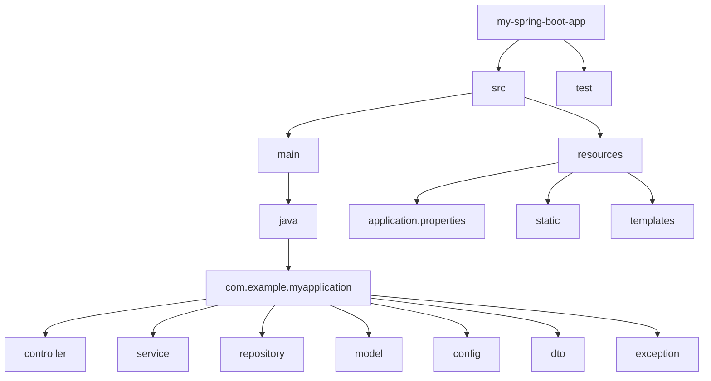

-----

## The Spring Boot Startup Process 🚀

When a Spring Boot application starts, it follows a well-defined sequence of steps to initialize the application, create and wire up components, and get ready to handle requests.

### 1\. The Entry Point: `main()` Method

Everything begins in the standard `public static void main(String[] args)` method. The key instruction here is `SpringApplication.run()`.

```java
import org.springframework.boot.SpringApplication;
import org.springframework.boot.autoconfigure.SpringBootApplication;

@SpringBootApplication
public class MySpringBootApplication {
    public static void main(String[] args) {
        // This single line kicks off the entire process
        SpringApplication.run(MySpringBootApplication.class, args);
    }
}
```

The `SpringApplication` class bootstraps the application, creating the Spring **Application Context** (the IoC container) and triggering the startup sequence.

### 2\. The Core Annotation: `@SpringBootApplication`

This single annotation is the key to Spring Boot's power and is a combination of three critical annotations:

* **`@SpringBootConfiguration`**: Marks the class as a source of bean definitions and application configuration.
* **`@EnableAutoConfiguration`**: Activates Spring Boot's auto-configuration mechanism. It intelligently configures your application based on the JAR dependencies present on the classpath.
* **`@ComponentScan`**: Tells Spring to scan the current package and its sub-packages for other components (like `@Service`, `@Repository`, `@Controller`, etc.) to register them as beans in the Application Context.

### 3\. Step-by-Step Startup Sequence

The `SpringApplication.run()` method orchestrates the following key steps:

1.  **Environment Preparation**: It prepares the application environment, loading configuration from `application.properties` or `application.yml` and resolving active profiles.

2.  **Banner Display**: A startup banner (from `banner.txt` or a default) is printed to the console.

3.  **Application Context Creation**: An `ApplicationContext` is created. For a web application, this is typically an `AnnotationConfigServletWebServerApplicationContext`.

4.  **Component Scanning & Bean Definition**: The `@ComponentScan` process kicks in, finding all your annotated classes and creating bean definitions for them.

5.  **Auto-Configuration Execution**: The `@EnableAutoConfiguration` process runs. Spring Boot inspects the classpath and your configuration. For example, if it finds the `spring-boot-starter-web` dependency, it automatically configures an embedded Tomcat server, Spring MVC, and other web-related beans. This process uses conditional annotations (`@ConditionalOnClass`, `@ConditionalOnProperty`, etc.) to decide which configurations to apply.

6.  **Application Context Refresh**: This is a core Spring phase where all beans are instantiated, dependencies are injected (`@Autowired`), and any post-processing is performed.

7.  **Embedded Server Startup**: If it's a web application, the embedded server (e.g., Tomcat, Jetty) is started and is ready to accept HTTP requests.

8.  **Runners Execution**: Finally, Spring Boot calls the `run()` method of any `CommandLineRunner` and `ApplicationRunner` beans in your context. This is the perfect place for executing custom logic after the application is fully initialized, such as seeding a database or printing summary logs.

-----

## A Typical Spring Boot Project Structure 📂

A well-organized project structure is crucial for maintainability. The following layout is a widely adopted convention.



### `src/main/java` - Java Source Code

This is where your application's logic resides, organized into packages based on their role (layer).

* **`controller`**: Contains classes annotated with **`@RestController`**. Their role is to handle incoming HTTP requests, process them (often by calling a service), and return an HTTP response.
* **`service`**: Contains classes annotated with **`@Service`**. This layer holds the core **business logic** of your application. It orchestrates calls to repositories and other services.
* **`repository`**: Contains interfaces that extend Spring Data JPA interfaces (like `JpaRepository`). Annotated with **`@Repository`**, they handle all database interactions.
* **`model` / `entity`**: Contains your Plain Old Java Objects (POJOs), typically annotated with `@Entity` to represent database tables.
* **`dto`** (Data Transfer Object): Simple objects used to transfer data between layers (e.g., from the controller to the service) or as a response to the client, preventing exposure of your internal entity models.
* **`config`**: Contains classes annotated with **`@Configuration`** to define beans, security settings, or other application-level configurations.
* **`exception` / `advice`**: Holds custom exception classes and global exception handlers (using **`@ControllerAdvice`**) to manage errors cleanly across the application.

### `src/main/resources` - Application Resources

This directory contains all non-Java files.

* **`application.properties` / `application.yml`**: The primary file for application configuration, such as database connection strings, server port, and custom properties.
* **`static`**: For static assets like CSS, JavaScript files, and images.
* **`templates`**: For server-side view templates, such as Thymeleaf or FreeMarker files.


