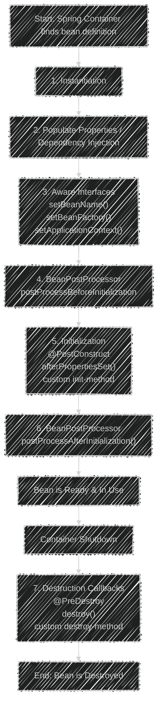

-----

# 🪼 Spring Boot Interview Notes (Complete Basics + Pro Touch)

-----


## 📌 1. IoC (Inversion of Control)

**Definition:**
IoC means **the control of object creation and dependency management is given to the container (Spring IoC Container)** instead of the programmer.

**Without IoC:**

```java
PatientRepository repo = new PatientRepository();
PatientService service = new PatientService(repo);
```

**With IoC:**

```java
@Service
public class PatientService {
    private final PatientRepository repo;
    public PatientService(PatientRepository repo) { this.repo = repo; }
}
```

👉 Spring creates the `PatientRepository` and `PatientService` objects and injects the dependencies for you.

**Advantages:**

* **Loose coupling** between classes.
* Centralized lifecycle & dependency management.
* Easy **testing** with mock objects.
* Promotes cleaner, more maintainable design.

-----

## 📌 2. Dependency Injection (DI)

**Definition:**
DI is the **process** through which the IoC container provides required dependencies (objects) to a class. It's one way to achieve IoC.

**Types of DI:**

1.  **Constructor Injection (✅ Preferred)**
    * Dependencies are clearly stated, ensures the object is always in a valid state, and supports immutability with `final` fields.
    <!-- end list -->
    ```java
    @Service
    public class PatientService {
        private final PatientRepository repo;

        public PatientService(PatientRepository repo) { // Dependencies provided on creation
            this.repo = repo;
        }
    }
    ```
2.  **Setter Injection**
    * Allows for optional dependencies and re-configuration but makes the object mutable.
    <!-- end list -->
    ```java
    @Service
    public class PatientService {
        private PatientRepository repo;

        @Autowired
        public void setRepo(PatientRepository repo) {
            this.repo = repo;
        }
    }
    ```
3.  **Field Injection (❌ Not Recommended)**
    * Hides dependencies, makes testing harder (requires reflection), and can violate the single responsibility principle.
    <!-- end list -->
    ```java
    @Service
    public class PatientService {
        @Autowired
        private PatientRepository repo;
    }
    ```

-----
## 📌 3. Bean
In Spring, a **bean** is any Java object whose lifecycle is **created, configured, and managed** by the Spring IoC (Inversion of Control) container. These beans form the backbone of your application.


## Ways to Create Beans

You can declare a class as a Spring bean in a few primary ways:

1.  **Stereotype Annotations**: This is the most common, annotation-based approach. You mark your classes with specific annotations, and Spring's component scanning finds them and registers them as beans.

      * `@Component`: A generic stereotype for any Spring-managed component.
      * `@Service`: Marks a class in the service layer (business logic).
      * `@Repository`: Marks a class in the persistence layer (data access).
      * `@Controller` or `@RestController`: Marks a class in the presentation layer (handling web requests).

2.  **Java-based Configuration**: You can explicitly declare beans within a `@Configuration` class using a method annotated with `@Bean`. This gives you fine-grained control over the bean's creation and configuration.

    ```java
    @Configuration
    public class AppConfig {

        @Bean
        public MyService myService() {
            return new MyService();
        }
    }
    ```

-----

### Bean Scopes

A bean's scope defines its lifecycle and visibility within the application.

  * **singleton** (Default): Only **one single instance** of the bean is created for the entire Spring container. Every request for the bean gets a reference to the same object. Ideal for stateless services and repositories.
  * **prototype**: A **new instance** is created every time the bean is requested. Perfect for stateful objects where each user or process needs an independent copy.
  * **request**: A new instance is created for each HTTP request. (Web-specific)
  * **session**: A new instance is created for each user's HTTP session. (Web-specific)
  * **application**: A single instance is created for the entire web application's lifecycle (`ServletContext`). (Web-specific)
  * **websocket**: A new instance is created for each WebSocket session. (Web-specific)

-----

## The Spring Bean Lifecycle

The Spring container manages a bean's entire journey, from its creation to its destruction. This lifecycle involves several key phases and callback methods that allow developers to hook into the process.

Here is a step-by-step breakdown of the lifecycle for a singleton bean:

1.  **Instantiation** 🏗️: The Spring container first creates an instance of the bean, typically by calling its constructor.

2.  **Populate Properties (Dependency Injection)**: The container injects all required dependencies into the bean. This is done through `@Autowired` on fields, constructors, or setter methods.

3.  **Aware Interfaces**: If the bean implements `Aware` interfaces (like `BeanNameAware` or `ApplicationContextAware`), the container calls their methods to provide the bean with information about its environment.

4.  **`BeanPostProcessor` (Before Initialization)**: The `postProcessBeforeInitialization()` method of any registered `BeanPostProcessor` is called. This allows for custom modifications before the bean is fully initialized.

5.  **Initialization Callbacks** 🛠️: The container calls the bean's initialization methods. This is where you can add custom logic that needs to run after all properties have been set. The order is:

      * A method annotated with `@PostConstruct`.
      * The `afterPropertiesSet()` method (if the bean implements the `InitializingBean` interface).
      * A custom `init-method` specified in the bean definition.

6.  **`BeanPostProcessor` (After Initialization)**: The `postProcessAfterInitialization()` method of any `BeanPostProcessor` is called. This step is crucial for applying proxies, which is how Spring AOP (Aspect-Oriented Programming) works.

7.  **Bean is Ready** ✅: The bean is now fully configured and ready to be used by the application. It will remain in the container until it's closed.

8.  **Destruction Callbacks** 🗑️: When the Spring container is shut down, it calls the bean's destruction methods to allow for a graceful cleanup of resources (like closing database connections or releasing files). The order is:

      * A method annotated with `@PreDestroy`.
      * The `destroy()` method (if the bean implements the `DisposableBean` interface).
      * A custom `destroy-method` specified in the bean definition.




-----

## 📌 4. ApplicationContext (The IoC Container)

**Definition:**
The `ApplicationContext` is the central interface in Spring for providing configuration information. It is the IoC container that:

* Creates and manages beans.
* Resolves dependencies.
* Handles bean scopes & lifecycle callbacks.
* Publishes application-wide events.
* Supports internationalization and AOP features.

**Difference between `BeanFactory` & `ApplicationContext`:**

* **`BeanFactory`**: The most basic IoC container, providing fundamental bean management and DI. It loads beans lazily.
* **`ApplicationContext`**: A superset of `BeanFactory`. It adds more enterprise-specific functionality like event propagation, AOP integration, and eager loading of singleton beans.
  👉 In Spring Boot, you almost always use `ApplicationContext`.

-----

## 📌 5. SpEL (Spring Expression Language)

**Definition:**
SpEL is a powerful expression language used to query and manipulate an object graph at runtime. It's often used for dynamic configuration within annotations.

**Examples:**

```java
// Injecting a simple calculation result
@Value("#{2 * 10}")
private int value;

// Accessing system properties
@Value("#{systemProperties['user.name']}")
private String userName;

// Referencing another bean's property
@Value("#{someOtherBean.someProperty}")
private String otherBeanValue;
```

**Advantages:**

* Inject dynamic values from properties, other beans, or system variables.
* Perform calculations and logical operations at runtime.
* Enables highly flexible and dynamic configuration.

-----

## 📌 6. AOP (Aspect-Oriented Programming)

**Definition:**
AOP is a programming paradigm that allows you to modularize **cross-cutting concerns** (like logging, security, and transaction management) that cut across multiple types and objects.

**Core Concepts:**

* **Aspect:** The class that implements the cross-cutting concern (e.g., `LoggingAspect`). Annotated with `@Aspect`.
* **Join Point:** A point during the execution of a program, such as a method call.
* **Advice:** The action taken by an aspect at a join point (e.g., log before a method runs). Types: `@Before`, `@After`, `@Around`.
* **Pointcut:** An expression that defines which join points the advice should apply to.

👉 **Why it matters:** Spring's declarative **`@Transactional`** annotation is powered by AOP. The transaction logic (begin, commit, rollback) is an aspect that gets applied around your repository method calls without you writing the boilerplate code.

-----

## 📌 7. @SpringBootApplication

This is a convenience annotation that is shorthand for three annotations:

1.  **`@SpringBootConfiguration`**: A specialized version of `@Configuration`. Marks the main class as a source of bean definitions.
2.  **`@EnableAutoConfiguration`**: Tells Spring Boot to start adding beans based on classpath settings, other beans, and various property settings.
3.  **`@ComponentScan`**: Scans for other components, configurations, and services in the same package as the main class and its sub-packages.

👉 If your beans are in a different package, you must specify it: `@ComponentScan(basePackages="com.example.otherpackage")`.

-----

## 📌 8. How Auto-Configuration *Really* Works

**Definition:**
Auto-configuration is Spring Boot's mechanism to automatically configure your application based on the **JAR dependencies** on the classpath.

**How it Works:**

1.  At startup, `@EnableAutoConfiguration` looks for a file in the classpath of all included JARs: `META-INF/spring/org.springframework.boot.autoconfigure.AutoConfiguration.imports`.
2.  This file lists all potential auto-configuration classes (e.g., `DataSourceAutoConfiguration`, `WebMvcAutoConfiguration`).
3.  Each configuration class uses conditions (`@ConditionalOnClass`, `@ConditionalOnBean`) to decide if it should activate. For example, `DataSourceAutoConfiguration` only runs if the `DataSource.class` is on the classpath.

-----

## 📌 9. Composition vs. Inheritance (Spring Boot Design Choice)

**Inheritance (`is-a` relationship):**

* A class `extends` another class.
* Creates **tight coupling** and a rigid class hierarchy.
* Difficult to change or extend.

**Composition (`has-a` relationship):**

* A class `HAS` an instance of another class.
* Promotes **loose coupling** and flexibility. You can easily swap out dependencies.
* This is the model encouraged by IoC and DI.

👉 **Spring Boot prefers Composition.** Instead of a `PatientService` extending a `JdbcTemplate`, we inject the `JdbcTemplate` into the service. This makes the code more modular, flexible, and testable.

**Example:**

```java
// Good: Composition via DI
@Service
public class PatientService {
    private final JdbcTemplate jdbc;
    public PatientService(JdbcTemplate jdbc) { this.jdbc = jdbc; }
}

// Bad: Inheritance
public class PatientService extends JdbcTemplate {
    // ... tightly coupled to JdbcTemplate implementation
}
```

-----

## 📌 10. Startup Flow in Spring Boot


**Steps:**

1.  **`SpringApplication.run()`** starts the process.
2.  Loads environment variables and profiles (`application-dev.yml`, etc.).
3.  Creates the `ApplicationContext`.
4.  Applies `@EnableAutoConfiguration` and performs component scanning.
5.  Creates and wires all singleton beans in the context.
6.  Starts the embedded server (Tomcat/Jetty/Undertow).
7.  Publishes lifecycle events.
8.  Runs any `CommandLineRunner` / `ApplicationRunner` beans for startup tasks.

-----
For a more detailed explanation of the startup process, see the [Detailed Spring Boot Startup Guide](/MyDocs/springboot/core/springboot-starter-details).

## 📌 11. The Web Layer: Handling Requests

* **`@RestController`**: Combines `@Controller` and `@ResponseBody`. Tells Spring that all methods will return JSON/XML responses directly.
* **`@RequestMapping("/api/patients")`**: Maps a URL path to a controller. Shortcuts: `@GetMapping`, `@PostMapping`, `@PutMapping`, `@DeleteMapping`.
* **`@RequestBody`**: Binds the incoming HTTP request body (JSON) to an object.
* **`@RequestParam`**: Binds a URL query parameter (`?name=John`).
* **`@PathVariable`**: Binds a value from the URL path (`/patients/{id}`).
* **`ResponseEntity<T>`**: An object representing the entire HTTP response (status code, headers, body), giving you full control.

-----

## 📌 12. Application Events

Spring has a built-in event mechanism for a **publisher-subscriber** model.

* **Publisher:** Injects `ApplicationEventPublisher` and calls `publisher.publishEvent(new MyEvent(...))`.
* **Listener:** A method annotated with `@EventListener` that takes the event object as a parameter.

👉 **Use Case:** Decoupling components. A `PatientService` can publish a `PatientRegisteredEvent` without knowing that an `EmailService` or `AuditService` is listening for it. This keeps the services loosely coupled.

-----

## 📌 13. Profiles & Configuration

Profiles allow you to define different configurations for different environments (dev, test, prod).

* Create profile-specific property files: `application-dev.yml`, `application-prod.yml`.
* Activate a profile using the property `spring.profiles.active=prod` or via a command-line argument `--spring.profiles.active=prod`.

👉 **Real-world use:** `dev` profile uses an in-memory H2 database, while the `prod` profile connects to a production PostgreSQL database.

-----

## 📌 14. CommandLineRunner / ApplicationRunner


Both `CommandLineRunner` and `ApplicationRunner` are Spring Boot interfaces that let you run custom code 
**right after the application context is created**, but before the app is fully started.  
They’re typically used for tasks like:  
- Loading initial data  
- Running scripts  
- Logging startup info  

---

## 1. CommandLineRunner

- Arguments come as a simple `String... args`.  
- Best for quick/raw argument handling.  

```java
import org.slf4j.Logger;
import org.slf4j.LoggerFactory;
import org.springframework.boot.CommandLineRunner;
import org.springframework.stereotype.Component;
import java.util.Arrays;

@Component
public class MyCommandLineRunner implements CommandLineRunner {

    private static final Logger logger = LoggerFactory.getLogger(MyCommandLineRunner.class);

    @Override
    public void run(String... args) throws Exception {
        logger.info("CommandLineRunner executed with arguments: {}", Arrays.toString(args));
        // Example: load initial data into DB
    }
}
```
---
## 2. ApplicationRunner

-Uses ApplicationArguments for more structured access.
-Can easily handle option arguments (--env=dev) and non-option arguments.
``` java
import org.slf4j.Logger;
import org.slf4j.LoggerFactory;
import org.springframework.boot.ApplicationArguments;
import org.springframework.boot.ApplicationRunner;
import org.springframework.stereotype.Component;

@Component
public class MyApplicationRunner implements ApplicationRunner {

    private static final Logger logger = LoggerFactory.getLogger(MyApplicationRunner.class);

    @Override
    public void run(ApplicationArguments args) throws Exception {
        // Example of accessing named argument like --env=dev
        if (args.containsOption("env")) {
            String environment = args.getOptionValues("env").get(0);
            logger.info("ApplicationRunner executed for environment: {}", environment);
        }

        // Accessing non-option arguments
        logger.info("Non-option arguments: {}", args.getNonOptionArgs());
    }
}
```

-----

### How to Run

Compile your application into a JAR file and run it from the terminal with arguments.

```bash
java -jar my-app.jar --env=dev first_arg second_arg
```

#### Expected Output

Spring Boot will automatically detect and run both beans. The output in your console will look something like this:

```
INFO 71... [           main] c.e.MyApplicationRunner    : ApplicationRunner executed for environment: dev
INFO 71... [           main] c.e.MyApplicationRunner    : Non-option arguments: [first_arg, second_arg]
INFO 71... [           main] c.e.MyCommandLineRunner    : CommandLineRunner executed with arguments: [--env=dev, first_arg, second_arg]
```

-----

## ✅ Quick Interview Checklist

* **IoC** → Container manages object creation and lifecycle.
* **DI** → How the container provides dependencies (constructor injection is best).
* **Bean** → An object managed by the Spring container.
* **`ApplicationContext`** → The advanced IoC container.
* **AOP** → Manages cross-cutting concerns like `@Transactional`.
* **`@SpringBootApplication`** → The 3-in-1 annotation that starts everything.
* **Auto-Configuration** → Magic that configures the app based on JARs present.
* **Composition > Inheritance** → Spring's design philosophy for flexibility.
* **Web Layer** → `@RestController`, `@GetMapping`, `@RequestBody` handle HTTP requests.
* **Profiles** → Manage configs for dev/test/prod.
* **Bean Scopes** → `singleton` (default), `prototype`, `request`, `session`.
* **Events** → Decouple logic via a pub-sub model.
* **Startup Flow** → `run()` → context → auto-config → scan → beans → server → runners.

-----

## 💡 10 Advanced "Tricky" Interview Q&A

1.  **What happens if you have two beans of the same type? How does Spring resolve this?**
    Spring throws a `NoUniqueBeanDefinitionException`. You can resolve it using:

    * **`@Primary`**: Mark one bean as the default choice.
    * **`@Qualifier("beanName")`**: Specify which bean to inject at the autowiring point.

2.  **How does Spring handle circular dependencies?**

    * For **constructor injection**, it fails with a `BeanCurrentlyInCreationException`. This is good as it signals a design problem.
    * For **setter/field injection**, Spring can resolve it by using a three-tier cache to store partially created objects, but this practice is discouraged.

3.  **What's the difference between `@Component`, `@Service`, and `@Repository`?**
    Functionally, they all register a bean. The difference is **semantic**:

    * `@Repository`: For the persistence layer. It also enables Spring's exception translation for database errors.
    * `@Service`: For the business logic layer.
    * `@Component`: A generic stereotype for any Spring-managed component.

4.  **How does `@Transactional` actually work?**
    It uses **AOP proxies**. Spring creates a proxy object that wraps your bean. When a `@Transactional` method is called, the proxy intercepts it, begins a transaction, calls your actual method, and then commits or rolls back the transaction upon completion.

5.  **How can you exclude a specific auto-configuration?**
    Use the `exclude` attribute on the `@SpringBootApplication` annotation:
    `@SpringBootApplication(exclude = {DataSourceAutoConfiguration.class})`

6.  **What is the difference between `@Configuration` and `@Component`?**
    A `@Configuration` class is special. Spring uses CGLIB to proxy it. This ensures that calls to `@Bean` methods within the class always return the same singleton instance, respecting the bean's scope. A plain `@Component` does not have this proxy behavior.

7.  **Why is constructor injection preferred over field injection?**

    * **Immutability:** Dependencies can be declared as `final`.
    * **Explicit Dependencies:** The constructor signature clearly shows all required dependencies.
    * **Testability:** It's easy to instantiate the class in a unit test by passing mocks to the constructor without reflection.

8.  **What's the purpose of the `spring-boot-starter-parent` POM?**
    It's a Maven project you inherit from. It manages **dependency versions** for a vast number of common libraries to ensure they are compatible, and it provides sensible default configurations for plugins.

9.  **What is the difference between `@Controller` and `@RestController`?**

    * `@Controller`: The classic Spring MVC controller. Methods typically return a view name to be resolved by a `ViewResolver`.
    * `@RestController`: A convenience annotation that combines `@Controller` and `@ResponseBody`. All methods in a `@RestController` will serialize the return object directly into the HTTP response body (e.g., as JSON).

10. **What is the difference between `application.properties` and `application.yml`?**
    Both are used for configuration. The choice is a matter of preference.

    * **`.properties`**: Uses a flat `key=value` structure.
    * **`.yml`**: Uses a hierarchical YAML structure, which is often more readable and less repetitive for complex, nested configurations. YAML properties are overridden by `.properties` if both are present.


