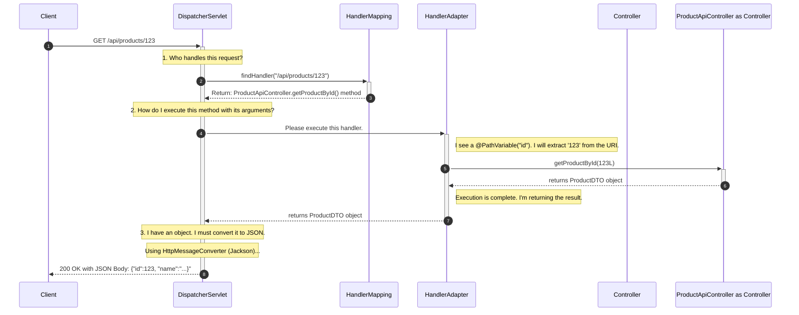

### **The Definitive Guide to Building REST APIs with Spring MVC (Part 1: The Core Foundation)**

**Objective:** To provide a comprehensive, interview-ready understanding of the core Spring MVC components and techniques required to build professional, production-grade RESTful APIs.

---

### **Module 1: The Core Architecture & Request Lifecycle**

**The Philosophy:** Before you can effectively use a tool, you must understand how it works. In Spring MVC, every web request embarks on a predictable journey. Mastering this journey is the absolute foundation of becoming an advanced developer.

When a client sends an HTTP request (e.g., `GET /api/products/123`), it is first received by your application server (like Tomcat). The server then passes it to a single, all-powerful servlet defined by Spring: the **`DispatcherServlet`**.

The `DispatcherServlet` is the **Front Controller**. It doesn't handle the request itself; instead, it acts as a traffic cop, orchestrating a chain of specialized components to process the request.

**The Key Components in the Chain:**

1.  **`HandlerMapping`:** Its only job is to inspect the incoming request's URI (`/api/products/123`) and determine which of your controller methods is responsible for handling it.
2.  **`HandlerAdapter`:** This is a crucial adapter. Once the `HandlerMapping` finds the correct method, the `HandlerAdapter` is what actually executes it. Its magic lies in its ability to process your method's arguments—it's the component that knows how to deserialize a JSON payload into a `@RequestBody` object or extract a value for a `@PathVariable`.
3.  **`HttpMessageConverter`:** After your controller method returns a Java object (like a `ProductDTO`), this component's job is to serialize that object into a specific format, typically JSON, to be sent back in the HTTP response body.

**The End-to-End Flow (Visualized for Interviews):**



---

### **Module 2: The Controller Layer: Handling API Requests**

This is your primary workspace. The controller's job is to define endpoints, extract information from the request, delegate business logic to a service layer, and prepare a response.

**`@RestController`** is a convenience annotation that combines `@Controller` and `@ResponseBody`. This tells Spring that every method in this class will have its return value written directly into the HTTP response body, making it perfect for REST APIs.

**Extracting Data from Requests (A Practical Guide):**

*   **`@PathVariable`**: Extracts values from the URI path itself.
    *   **Request:** `GET /api/products/123`
    *   **Code:**
        ```java
        @GetMapping("/products/{id}")
        public ProductDTO getProductById(@PathVariable("id") Long productId) {
            // productId variable will be 123
            return productService.findProduct(productId);
        }
        ```

*   **`@RequestParam`**: Extracts query parameters from the URI.
    *   **Request:** `GET /api/products/search?category=electronics&in_stock=true`
    *   **Code:**
        ```java
        @GetMapping("/products/search")
        public List<ProductDTO> searchProducts(
            @RequestParam("category") String category,
            @RequestParam(name = "in_stock", required = false, defaultValue = "false") boolean inStock) {
            // category will be "electronics", inStock will be true
            return productService.search(category, inStock);
        }
        ```

*   **`@RequestBody`**: Deserializes the entire request body (e.g., a JSON payload) into a Java object (a DTO). This is the most common annotation for `POST` and `PUT` requests.
    *   **Request:** `POST /api/products` with JSON body: `{"name": "Laptop", "price": 1200.00}`
    *   **Code:**
        ```java
        @PostMapping("/products")
        public ProductDTO createProduct(@RequestBody ProductCreateDTO newProduct) {
            // newProduct object will be populated from the JSON
            return productService.create(newProduct);
        }
        ```

*   **`@RequestHeader`**: Extracts a value from an HTTP header.
    *   **Request:** `GET /api/me` with header `Authorization: Bearer <token>`
    *   **Code:**
        ```java
        @GetMapping("/me")
        public UserProfileDTO getMyProfile(@RequestHeader("Authorization") String authToken) {
            // authToken will be "Bearer <token>"
            return userService.getProfileFromToken(authToken);
        }
        ```

---

### **Module 3: Crafting Professional API Responses**

Simply returning an object from your controller method works, but it defaults to an HTTP `200 OK` status. A professional API needs to communicate more precisely.

**`ResponseEntity<T>`** is your tool for total control. It's a wrapper object that lets you define the **HTTP Status Code**, **HTTP Headers**, and the **Response Body**.

```java
@RestController
@RequestMapping("/api/v1/orders")
public class OrderApiController {
    private final OrderService orderService;
    // ... constructor ...

    // Scenario 1: A successful GET request
    @GetMapping("/{id}")
    public ResponseEntity<OrderDTO> getOrderById(@PathVariable Long id) {
        OrderDTO order = orderService.findById(id);
        if (order == null) {
            // Use .notFound() for a standard 404 response
            return ResponseEntity.notFound().build(); 
        }
        // Use .ok() for a standard 200 response
        return ResponseEntity.ok(order);
    }

    // Scenario 2: A successful POST request
    @PostMapping
    public ResponseEntity<OrderDTO> createOrder(@RequestBody CreateOrderDTO orderDto) {
        OrderDTO createdOrder = orderService.create(orderDto);

        // REST Best Practice: On creation, return a 201 Created status and a 
        // "Location" header pointing to the URI of the newly created resource.
        URI location = URI.create("/api/v1/orders/" + createdOrder.getId());
        
        return ResponseEntity.created(location).body(createdOrder);
    }
    
    // Scenario 3: A successful DELETE request
    @DeleteMapping("/{id}")
    public ResponseEntity<Void> deleteOrder(@PathVariable Long id) {
        orderService.deleteById(id);
        // Best Practice: On successful deletion, return a 204 No Content status.
        // .build() is used because there is no response body.
        return ResponseEntity.noContent().build();
    }
}
```

---

### **Module 4: API Robustness - Validation and Exception Handling**

This is where we connect our knowledge of cross-cutting concerns to the web layer.

1.  **Input Validation:** Your API should never trust incoming data. We enforce validation rules on our DTOs using annotations. The `@Valid` annotation in the controller method triggers this process.
    ```java
    // DTO with validation rules
    public class CreateOrderDTO {
        @NotNull(message = "Customer ID cannot be null")
        private Long customerId;

        @NotEmpty(message = "Order must have at least one item")
        private List<OrderItemDTO> items;
    }
    
    // Controller method that enables validation
    @PostMapping
    public ResponseEntity<OrderDTO> createOrder(@Valid @RequestBody CreateOrderDTO orderDto) {
        // ... business logic ...
    }
    ```
    If validation fails, Spring throws a `MethodArgumentNotValidException`.

2.  **Centralized Exception Handling:** Our `@ControllerAdvice` (which you have mastered) is designed to intercept exceptions. We add a specific handler for `MethodArgumentNotValidException` to return a clean, helpful `400 Bad Request` response.

    ```java
    @ControllerAdvice
    public class GlobalApiExceptionHandler {
        
        // This handler specifically catches validation failures
        @ExceptionHandler(MethodArgumentNotValidException.class)
        public ResponseEntity<ErrorResponse> handleValidationExceptions(MethodArgumentNotValidException ex) {
            // Extract all field errors into a list of strings
            List<String> errors = ex.getBindingResult().getFieldErrors().stream()
                    .map(fieldError -> fieldError.getField() + ": " + fieldError.getDefaultMessage())
                    .collect(Collectors.toList());

            ErrorResponse errorResponse = new ErrorResponse(
                    HttpStatus.BAD_REQUEST.value(),
                    "Validation Failed",
                    errors
            );
            return new ResponseEntity<>(errorResponse, HttpStatus.BAD_REQUEST);
        }

        // Other handlers for ResourceNotFoundException, etc.
    }
    ```

---

### **Module 5: API Interception with `HandlerInterceptor`**

While AOP is for the service layer, `HandlerInterceptor` is the AOP of the web layer. It allows you to intercept requests *after* the `DispatcherServlet` has mapped them to a controller but *before* the controller method is executed.

**Key Differences from a `Filter`:**
*   A Filter is part of the Servlet API and runs *before* the `DispatcherServlet`. It knows nothing about Spring or which controller will be called.
*   An `HandlerInterceptor` is part of Spring MVC. It runs *after* the `DispatcherServlet` and has full access to the Spring context and knows which handler method is about to be invoked.

**A Practical Use Case: An API Key Authentication Interceptor**

```java
@Component
public class ApiKeyAuthInterceptor implements HandlerInterceptor {

    @Value("${api.secret.key}")
    private String secretApiKey;

    @Override
    public boolean preHandle(HttpServletRequest request, HttpServletResponse response, Object handler) throws Exception {
        String apiKey = request.getHeader("X-API-KEY");

        if (apiKey == null || !apiKey.equals(secretApiKey)) {
            // If authentication fails, we write an error response and stop the chain.
            response.setStatus(HttpServletResponse.SC_UNAUTHORIZED);

            response.getWriter().write("{\"error\":\"Invalid or missing API Key\"}");
            response.setContentType("application/json");
            return false; // This STOPS the request from reaching the controller.
        }

        // If the key is valid, continue the request processing.
        return true; 
    }
}

// Don't forget to register the interceptor
@Configuration
public class WebMvcConfig implements WebMvcConfigurer {
    @Autowired
    private ApiKeyAuthInterceptor apiKeyAuthInterceptor;

    @Override
    public void addInterceptors(InterceptorRegistry registry) {
        // We can even specify which paths this interceptor should apply to.
        registry.addInterceptor(apiKeyAuthInterceptor)
                .addPathPatterns("/api/v1/**"); // Only protect our API endpoints
    }
}
```