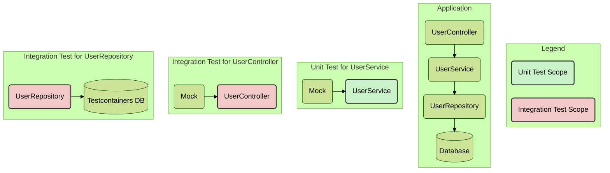

---
title : Junit Lecture 1
---


### 1. The Foundations of Unit Testing

#### **The "Why": The Purpose of Unit Testing**

At its core, a unit test is a microscope. We use it to examine a single, isolated "unit" of our code—typically a method within a class—divorced from all its dependencies. The reasons for this intense focus are critical:

*   **Blazing Speed:** A proper unit test executes in milliseconds because it has no external dependencies. It doesn't touch the file system, the database, or the network. You can run thousands of them in a few seconds, providing a rapid feedback loop during development.
*   **Pinpoint Precision:** When a well-written unit test fails, it points to the *exact* location of the problem. There is no ambiguity. The test for `UserService.calculateBonus()` failed; therefore, the bug is in the `calculateBonus` method. This precision is lost in larger tests.
*   **Refactoring Confidence:** This is perhaps the most significant benefit for a professional developer. A comprehensive suite of unit tests acts as a safety harness. You can refactor, optimize, or completely rewrite a method with the confidence that if you break existing functionality, a test will fail immediately. This enables agile development and prevents code calcification.
*   **Foundation of CI/CD:** Fast, reliable unit tests are the first gate in any Continuous Integration/Continuous Deployment (CI/CD) pipeline. They are the cheapest and fastest way to catch regressions before they are merged into the main codebase.

#### **The Boundary: Unit Test vs. Integration Test**

Understanding this boundary is non-negotiable. A unit test validates *one component in isolation*. An integration test validates the *interaction between several components*.

Let's visualize this within our standard layered architecture:


Notice in the "Unit Test for UserService" diagram, the real `UserRepository` is gone. It has been replaced by a "Mock"—a fake, controllable version. The test verifies `UserService`'s logic *only*. In contrast, integration tests (which we'll cover later) involve multiple real components, often powered by the Spring Test Context.

#### **The Pattern: Arrange–Act–Assert (AAA)**

This is the universal structure for a clean, readable test. It divides your test method into three distinct, logical phases.

1.  **Arrange:** Set up the world for your test. This is where you create objects, prepare inputs, and—most importantly for unit tests—define the behavior of your mocks. *(Given this user and this mock repository...)*
2.  **Act:** Execute the single unit of work you are testing. This is usually a single method call on the object under test. *(When I call the `createUser` method...)*
3.  **Assert:** Verify the outcome. Did the method return the correct value? Did it change the state of the object correctly? Did it call its dependencies as expected? *(Then I assert the returned user object is not null and has the correct name.)*

Following this pattern makes your tests incredibly easy to read and understand.

#### **The Setup: `pom.xml` Dependencies**

Spring Boot makes this incredibly simple. The `spring-boot-starter-test` dependency, included by default in any new project, bundles everything you need.

```xml
<dependency>
    <groupId>org.springframework.boot</groupId>
    <artifactId>spring-boot-starter-test</artifactId>
    <scope>test</scope>
</dependency>
```

This single starter transitively includes:
*   **JUnit 5:** The standard for writing tests in the Java ecosystem.
*   **Mockito:** The most powerful and popular mocking framework.
*   **AssertJ:** A "fluent" assertion library that provides more readable assertions (e.g., `assertThat(user.getName()).isEqualTo("John");`).
*   **Spring Test & Spring Boot Test:** The utilities for writing *integration tests* (e.g., `@SpringBootTest`), which we will cover later.

***

### 2. JUnit 5 Core for Unit Testing

**A crucial clarification:** Your heading mentions "Spring Boot Context." For pure unit tests, which is our current focus, **we do not load the Spring Boot Context**. Doing so turns a unit test into an integration test, making it slower and more complex. The following JUnit 5 features are used in isolation.

#### **Annotations & Lifecycle**

JUnit 5 provides annotations to manage the lifecycle of your tests.

*   `@Test`: Marks a method as a test method.
*   `@BeforeEach`: Executes a method *before* each and every `@Test` in the class. Ideal for setting up a clean state (e.g., re-initializing your object under test).
*   `@AfterEach`: Executes *after* each `@Test`. Useful for cleanup.
*   `@BeforeAll`: Executes a single static method *once* before any tests in the class are run. Used for expensive, shared setup (rarely needed in pure unit tests).
*   `@AfterAll`: Executes a single static method *once* after all tests in the class have finished.
*   `@DisplayName("A clear, descriptive name for the test")`: Provides a human-readable name for your test method that shows up in test reports, making them much easier to understand than `testWhenUserIsValidThenReturnSavedUser()`.

#### **Assertions**

Assertions are static methods (from `org.junit.jupiter.api.Assertions`) that verify a condition. If the condition is false, the test fails.

*   `assertEquals(expected, actual)`: Checks if two values are equal.
*   `assertNotNull(object)`: Checks that an object is not null.
*   `assertTrue(condition)`: Checks if a boolean condition is true.
*   `assertThrows(Exception.class, () -> { ... })`: A powerful assertion that verifies a specific exception is thrown by a piece of code.
*   `assertAll(...)`: Groups multiple assertions. All assertions are checked, and all failures are reported together, which is more efficient than writing separate tests.

#### **Parameterized Tests**

These allow you to run the same test logic with different input data, reducing code duplication.

*   `@ParameterizedTest`: Marks a method as a parameterized test.
*   `@ValueSource(strings = {"", "  "})`: Provides a simple array of literal values (strings, ints, etc.) to be passed as an argument to the test method, one at a time.
*   `@CsvSource({"john,doe", "jane,doe"})`: Provides comma-separated values, allowing you to pass multiple arguments to your test method for each run.

**Example:**

```java
@ParameterizedTest
@ValueSource(strings = {"", "  ", " \t\n"})
@DisplayName("Should return true for blank strings")
void isBlank_ShouldReturnTrueForBlankStrings(String input) {
    assertTrue(input.isBlank());
}
```

#### **Nested Tests with `@Nested`**

This feature is invaluable for organizing tests for a class with complex behavior. It allows you to group related test methods into an inner class, creating a clearer hierarchy.

**Example:**

```java
@DisplayName("Tests for a User Creation Service")
class UserCreationServiceTest {

    @Nested
    @DisplayName("When creating a valid user")
    class ValidUserScenarios {
        @Test
        @DisplayName("it should save the user to the database")
        void test1() { /* ... */ }

        @Test
        @DisplayName("it should return a user DTO")
        void test2() { /* ... */ }
    }

    @Nested
    @DisplayName("When the username already exists")
    class ExistingUserScenarios {
        @Test
        @DisplayName("it should throw a DuplicateUserException")
        void test3() { /* ... */ }
    }
}
```
***


### **Interview Gold**

*   **Question:** "You have a `ProductService` that depends on a `ProductRepository` and an external `PricingWebService`. Describe how you would unit test a method in `ProductService`. What are the boundaries of this test?"
    *   **Answer:** "To unit test a method in `ProductService`, I would focus exclusively on the logic within that service class. The boundary of the test ends at the `ProductService` itself. I would use a mocking framework like Mockito to create mock objects for both the `ProductRepository` and the `PricingWebService`. In the 'Arrange' phase of my test, I would stub the behavior of these mocks—for example, `when(mockRepository.findById(1L)).thenReturn(product)`. The test would then 'Act' by calling the `ProductService` method and 'Assert' on its return value or any side effects. Critically, there would be no database connection and no HTTP call. The test would not load any Spring `ApplicationContext`, ensuring it runs in milliseconds and provides precise feedback on the service's logic alone."

*   **Question:** "A junior developer on your team has written all their tests for services using `@SpringBootTest`. The build is now taking a very long time. How would you mentor them to fix this?"
    *   **Answer:** "I would first explain the core difference between unit and integration tests, likely using the 'Testing Pyramid' as a visual guide. I'd clarify that `@SpringBootTest` is a heavy annotation designed for integration testing, as it loads the entire Spring `ApplicationContext`, which is slow. For testing the business logic of a service class in isolation, this is unnecessary overhead. I would guide them to refactor their tests to be pure unit tests: removing `@SpringBootTest`, instantiating the service class directly (`new ProductService(...)`), and using `@Mock` from Mockito for its dependencies. This approach will dramatically increase the execution speed of the test suite, shorten the feedback loop, and adhere to best practices by testing one thing at a time."