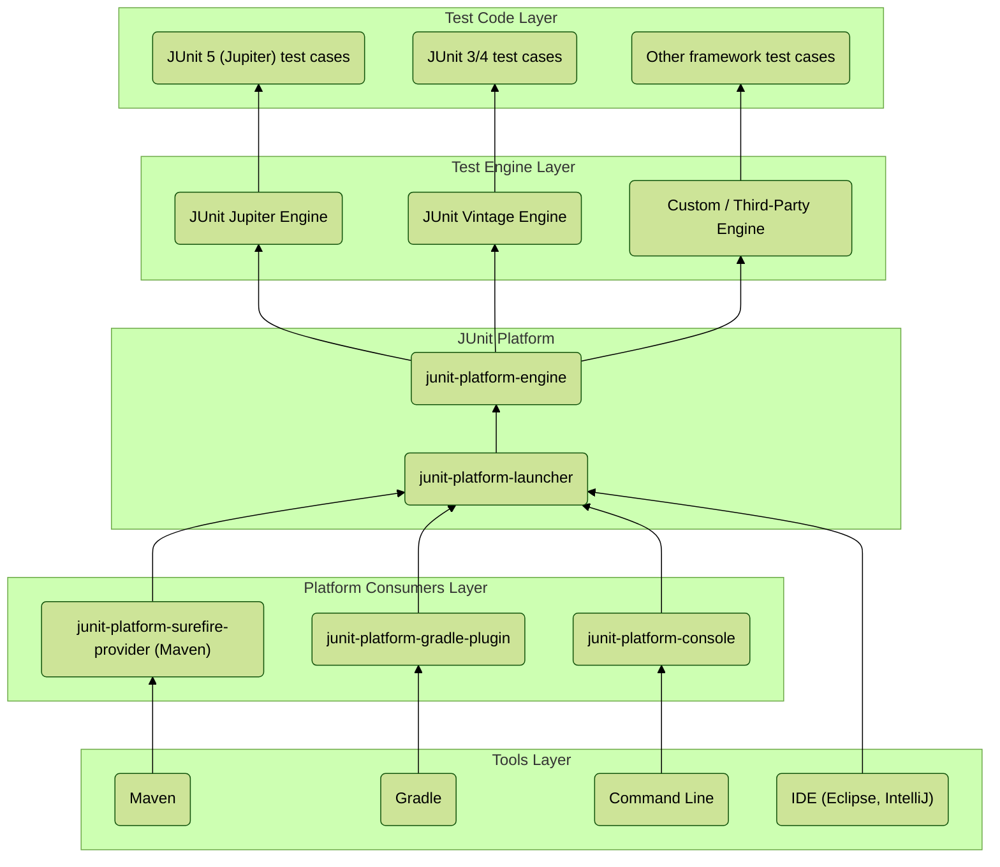

<pre>

</pre>

***

### The JUnit 5 Architecture: A Three-Part Harmony

JUnit 5 is not a single library. It is a collection of three distinct, high-level components:

1.  **JUnit Jupiter:** The *new* way to write tests. This is the combination of the new programming model and extension model. When you use `@Test`, `@DisplayName`, `@ParameterizedTest`, you are using the JUnit Jupiter API.
2.  **JUnit Vintage:** The bridge to the *past*. Its sole purpose is to allow you to run older JUnit 3 and JUnit 4 tests on the new JUnit 5 platform. This provides crucial backward compatibility, ensuring you don't have to rewrite your entire existing test suite to adopt JUnit 5.
3.  **JUnit Platform:** The foundation upon which everything is built. It is the bridge between the world of tests (Jupiter, Vintage, or others) and the tools that run them (IDEs, Maven, Gradle).

Now, let's map these concepts to the diagram you provided.

---

### Deconstructing the Diagram

#### **Top Layer: The Test Engines**

At the very top, we have the different types of tests you can write. The diagram correctly identifies three potential sources:

*   **JUnit Vintage:** This is the `TestEngine` responsible for understanding and running tests written with JUnit 3 or 4's annotations (e.g., `org.junit.Test`).
*   **JUnit Jupiter:** This is the primary `TestEngine` for JUnit 5. It knows how to find and execute tests written with the new Jupiter annotations (e.g., `org.junit.jupiter.api.Test`).
*   **Other Test Engine:** This is the most powerful concept. The JUnit Platform is `TestEngine`-agnostic. Anyone can write an engine to run any kind of test. Frameworks like Spock and Cucumber have written their own engines to run on the JUnit Platform.

**The "Why":** This design decouples the *writing* of tests from the *running* of tests. It allows for innovation and prevents vendor lock-in, creating a standard platform for any testing framework on the JVM to plug into.

#### **Middle Layer: The JUnit Platform Core**

This is the heart of the operation, shown in the large white box in your diagram. It consists of two main components:

1.  **`junit-platform-engine`:** This defines the API that a `TestEngine` (like Jupiter or Vintage) must implement. It provides the contract for how a test engine discovers and executes tests. This is the "northbound" interface connecting the platform to the test frameworks.

2.  **`junit-platform-launcher`:** This is the crucial coordinator. It provides the API that tools like IntelliJ or Maven use to initiate a test run. Its primary job, as correctly highlighted with the `discover()` annotation in your diagram, is to:
    *   **Discover:** Scan the classpath for available `TestEngine` implementations.
    *   **Delegate Discovery:** Ask each engine to find test classes and methods that it understands.
    *   **Delegate Execution:** Ask the appropriate engine to execute the tests that were found.

**The "Why":** The `Launcher` is the universal orchestrator. Your IDE or build tool doesn't need to know anything about JUnit Jupiter or JUnit Vintage. It only needs to know how to talk to the `Launcher`. The `Launcher` then figures out the rest, acting as a powerful abstraction layer.

#### **Bottom Layer: The Launchers & Providers**

This layer represents the clients of the `junit-platform-launcher`. These are the tools you interact with every day.

*   **Build Tools (Maven & Gradle):**
    *   `junit-platform-surefire-provider`: This is the plugin that allows Maven's `surefire` plugin (the default test runner) to talk to the `junit-platform-launcher`.
    *   `junit-platform-gradle-plugin`: This is the equivalent for Gradle.

*   **IDEs (IntelliJ, Eclipse):** As your diagram correctly indicates with the yellow arrow, IDEs typically have their own native integration. When you click the "run test" button, the IDE directly invokes the `junit-platform-launcher` to discover and run the tests, and then displays the results in a user-friendly way.

*   **Command Line:**
    *   `junit-platform-console`: A standalone executable that allows you to run tests directly from the command line, outside of any build tool.

**The "Why":** This layer provides the final link in the chain, making the entire platform accessible and usable from any development environment. The loose coupling means that as long as a tool knows how to use the launcher, it automatically supports any and all test engines that exist now or may be created in the future.

***

### **Interview Gold**

*   **Question:** "Can you sketch the high-level architecture of JUnit 5 and explain why it's a significant improvement over JUnit 4?"
    *   **Answer:** "Absolutely. The JUnit 5 architecture is fundamentally composed of three parts: the JUnit Platform, JUnit Jupiter, and JUnit Vintage. At the top, you have your test cases, which can be written using the new Jupiter API or legacy JUnit 4 syntax. These are understood by their respective 'Test Engines'—Jupiter for new tests and Vintage for old ones. Both of these engines plug into the central JUnit Platform. The platform's core is the 'Launcher,' which acts as the single point of contact for all tools like IDEs, Maven, and Gradle. When a test run is initiated, the tool tells the Launcher to start. The Launcher then discovers all available Test Engines on the classpath, asks them to find tests they can run, and then instructs them to execute those tests. This is a massive improvement over JUnit 4's monolithic design because it decouples the API for writing tests from the engine that runs them. This modularity provides backward compatibility through JUnit Vintage and, more importantly, makes the platform extensible, allowing other testing frameworks like Spock or Cucumber to run on the same platform, which was not possible before."

*   **Question:** "You are tasked with introducing a new, custom testing framework in your company. How could the JUnit 5 Platform architecture help you integrate it into your existing Maven build process?"
    *   **Answer:** "The JUnit 5 Platform architecture is perfectly designed for this. Instead of creating a whole new build plugin from scratch, we would implement a custom `TestEngine` for our new framework. This engine would be responsible for discovering and executing tests written with our framework's syntax and annotations. By packaging this engine as a standard dependency and including it in our project's `pom.xml`, the `junit-platform-launcher`, used by Maven's Surefire plugin, would automatically discover our custom engine during the test phase. It would then delegate discovery and execution to our engine alongside the standard JUnit Jupiter engine. This means our custom tests would run seamlessly within the `mvn test` lifecycle, and their results would be part of the standard test report, all without modifying the build process itself."