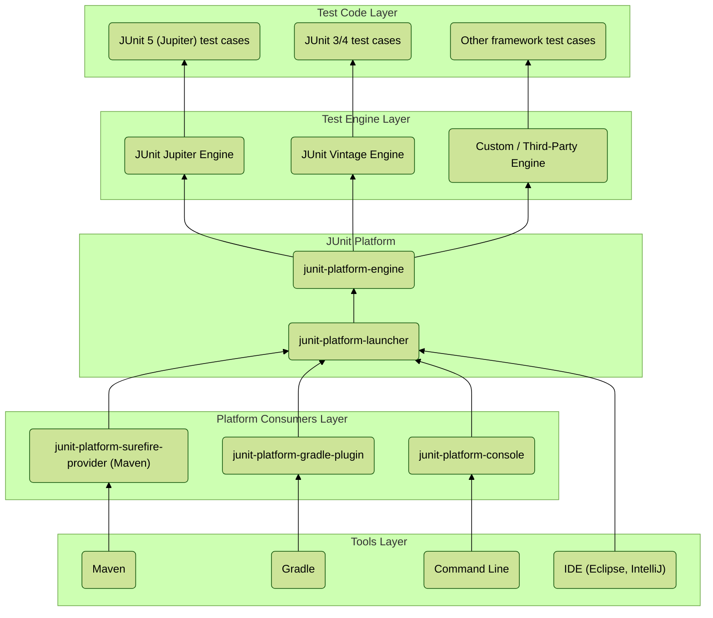

----------

## The JUnit 5 Architecture: A Three-Part Harmony

JUnit 5 is not a single library — it’s a **modular system** composed of three main parts:

1.  **JUnit Jupiter**  
    The _new_ programming and extension model. When you use annotations like `@Test`, `@DisplayName`, or `@ParameterizedTest`, you are using the Jupiter API. It’s backed by the **Jupiter Engine**, which actually discovers and runs these tests.
    
2.  **JUnit Vintage**  
    The _bridge to the past_. It allows tests written with JUnit 3 and 4 to run on the JUnit 5 platform. This ensures **backward compatibility**, so existing test suites don’t need to be rewritten.
    
3.  **JUnit Platform**  
    The _foundation layer_. It provides the APIs and infrastructure for launching test engines and connecting them with tools like IDEs, build tools (Maven, Gradle), and the CLI.
    

----------

## Deconstructing the Diagram

### **1. Test Code Layer**

This is where the actual test classes live:

-   JUnit Jupiter tests (`@Test` from `org.junit.jupiter.api`)
    
-   Legacy JUnit 3/4 tests (`org.junit.Test`)
    
-   Tests from other frameworks (e.g., Spock, Cucumber)
    

### **2. Test Engine Layer**

Each test type is handled by a dedicated `TestEngine`:

-   **Jupiter Engine** → runs JUnit 5 tests.
    
-   **Vintage Engine** → runs JUnit 3/4 tests.
    
-   **Other Engines** → any third-party or custom test engine (e.g., Spock, Cucumber).
    

👉 This **decouples test writing from test execution**, enabling extensibility.

### **3. JUnit Platform**

The platform core has two main APIs:

-   **`junit-platform-engine`**: Defines the contract a `TestEngine` must implement (discovery + execution).
    
-   **`junit-platform-launcher`**: The orchestrator. It discovers available engines, asks them to find tests, and then coordinates execution.
    

👉 Your IDE or build tool only talks to the **Launcher**, not individual engines.

### **4. Platform Consumers**

These are the **integration providers** that connect the launcher with developer tools:

-   **Maven** → via `junit-platform-surefire-provider`
    
-   **Gradle** → via `junit-platform-gradle-plugin`
    
-   **CLI** → via `junit-platform-console`
    
-   **IDEs** → direct integration (Eclipse, IntelliJ, VS Code, etc.)
    

### **5. Tools Layer**

Finally, the **tools developers use daily**:

-   Build tools (Maven, Gradle)
    
-   IDEs (Eclipse, IntelliJ, etc.)
    
-   Command Line
    

👉 These tools don’t care which test engines exist — as long as they can invoke the **Launcher**, everything just works.

----------

## Interview Gold

**Q:** _Can you sketch the high-level architecture of JUnit 5 and explain why it’s a significant improvement over JUnit 4?_  
**A:**  
“JUnit 5 consists of three main parts: the JUnit Platform, JUnit Jupiter, and JUnit Vintage. The Platform provides the Launcher, which acts as the single entry point for tools like IDEs, Maven, and Gradle. It automatically discovers all available Test Engines, like Jupiter for modern tests and Vintage for JUnit 3/4 tests. This modular design is a major improvement over JUnit 4’s monolithic runner — it provides backward compatibility, extensibility, and makes it easy for third-party frameworks (like Spock or Cucumber) to plug into the same ecosystem.”

**Q:** _How would you integrate a new custom testing framework into your company’s Maven build process using JUnit 5?_  
**A:**  
“We’d implement a custom `TestEngine` that knows how to discover and run tests written with our framework. Once packaged as a dependency and included in `pom.xml`, the JUnit Platform’s Launcher (invoked via Maven’s Surefire provider) would automatically discover and delegate to our engine. This way, our tests run seamlessly alongside JUnit Jupiter and Vintage tests, without any changes to Maven itself.”