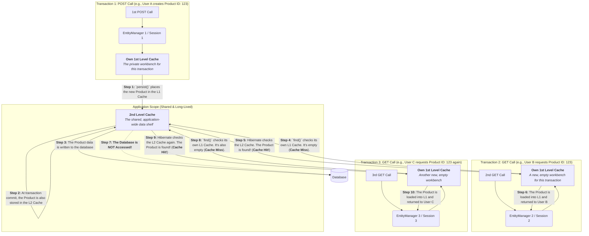

---

### **The Professional's Guide to JPA & Hibernate Caching**

**Objective:** To achieve a deep, architectural understanding of the multi-layered caching mechanisms available in JPA/Hibernate, focusing on their scope, configuration, use cases, and the common pitfalls encountered in production environments.

---

### **The Philosophy: Why We Cache**

The primary goal of caching is to **reduce the number of expensive database roundtrips**. Database interaction is often the biggest performance bottleneck in an application. By storing frequently accessed data in memory (closer to the application), we can dramatically improve response times and reduce the load on the database.

However, caching introduces a fundamental challenge: **data consistency**. A cache can become "stale," meaning the data in the cache is no longer the same as the data in the database. The art of caching is knowing which data is safe to cache and for how long.

Hibernate provides a sophisticated, multi-layered caching system.

---

### **Module 1: The First-Level (L1) Cache - The Transactional Workbench**

This is the most fundamental layer of caching. You cannot turn it off.

*   **What it is:** A mandatory, built-in cache that is scoped to a single **`Persistence Context`**.
*   **Analogy:** Think of the L1 cache as a **private workbench for a single worker (`EntityManager`)**.
*   **Scope:** In a Spring Boot application, the `Persistence Context` (and therefore the L1 cache) lives for the duration of a single **`@Transactional` method**. When the transaction ends, the L1 cache is destroyed. It is **not** shared between different transactions or different user requests.

**How it Works & Why it's Critical (Interview Gold):**

1.  **Guarantees Object Identity (Repeatable Reads within a Transaction):**
    If you fetch the same entity by its ID multiple times within the same transaction, **only the first call will generate a SQL query**. Subsequent calls will retrieve the identical Java object directly from the L1 cache.

    ```java
    @Transactional
    public void demonstrateL1Cache() {
        // 1. First call: Hits the database, executes SELECT statement.
        //    Product with ID 1 is loaded into the L1 cache.
        Product product1 = productRepository.findById(1L).orElse(null);

        // 2. Second call: NO database hit.
        //    The identical Product object is returned directly from the L1 cache.
        Product product2 = productRepository.findById(1L).orElse(null);

        // This will be TRUE, proving it's the exact same object in memory.
        assert product1 == product2;
    }
    ```
    This reduces database traffic and ensures data consistency *within* a single unit of work.

2.  **Enables Transactional Write-Behind & Dirty Checking:**
    When you modify a managed entity, Hibernate does not immediately execute an `UPDATE` statement. It simply notes the change (marks the entity as "dirty") in the L1 cache. At the end of the transaction, Hibernate "flushes" the cache, inspects all dirty entities, and generates the necessary `UPDATE` statements in a single, optimized batch.

---

### **Module 2: The Second-Level (L2) Cache - The Shared Application Shelf**

This is the cache that most people refer to when they talk about "Hibernate caching." It is optional and must be explicitly configured.

*   **What it is:** A cache that is scoped to the **`EntityManagerFactory`**.
*   **Analogy:** If the L1 cache is a worker's private workbench, the L2 cache is a **shared parts shelf accessible by the entire factory**.
*   **Scope:** The L2 cache is **shared across the entire application**. It persists between transactions and is accessible by all user requests.

**When to Use L2 Caching:**
The L2 cache is only suitable for **"reference data"**—data that is **read frequently but updated rarely**.
*   **Excellent Candidates:** `Country`, `Category`, `UserRole`, `ProductConfiguration`.
*   **Poor Candidates:** `StockPrice`, `Order` (transactional data), `User` (if frequently updated).

#### **Configuring the L2 Cache in Spring Boot**

1.  **Add Dependencies:** You need a caching provider. EhCache 3 is a popular choice.
    ```xml
    <dependency>
        <groupId>org.springframework.boot</groupId>
        <artifactId>spring-boot-starter-cache</artifactId>
    </dependency>
    <dependency>
        <groupId>org.hibernate.orm</groupId>
        <artifactId>hibernate-jcache</artifactId>
    </dependency>
    <dependency>
        <groupId>org.ehcache</groupId>
        <artifactId>ehcache</artifactId>
    </dependency>
    ```

2.  **Enable Caching in `application.yml`:**
    ```yaml
    spring:
      jpa:
        properties:
          hibernate:
            cache:
              use_second_level_cache: true
              region.factory_class: jcache # Use JCacheRegionFactory
      cache:
        jcache:
          config: classpath:ehcache.xml # Point to your cache configuration file
    ```

3.  **Annotate Your Entity:** You must explicitly mark which entities are eligible for L2 caching.
    ```java
    @Entity
    @jakarta.persistence.Cacheable // JPA standard annotation
    @org.hibernate.annotations.Cache(usage = CacheConcurrencyStrategy.READ_WRITE) // Hibernate specific
    public class ProductCategory {
        @Id
        private Long id;
        private String name;
        // ...
    }
    ```

**Cache Concurrency Strategies (Advanced Topic):**
The `usage` attribute is crucial. It tells Hibernate how to manage concurrent access to cached data.
*   **`READ_ONLY`:** For data that *never* changes. Fastest.
*   **`READ_WRITE`:** For data that can be updated. This strategy uses soft locks to maintain consistency. When an item is updated, Hibernate will invalidate it in the cache across the application. **This is the most common strategy.**
*   **`NONSTRICT_READ_WRITE`:** For data where slight staleness is acceptable. Offers better performance than `READ_WRITE` but without the strong consistency guarantees.

---

### **Module 3: The Query Cache - Caching the Question, Not Just the Answer**

This is a separate, specialized cache that works alongside the L2 cache.

*   **What it is:** A cache that stores the **results of queries**.
*   **Crucial Distinction:** The L2 cache stores entities by their primary key (e.g., `ProductCategory[ID=5]`). The Query Cache stores the results of a specific query invocation (e.g., "the result for `findAllByCategory('Electronics')` is a list containing IDs").

**How it Works:**
1.  When a cacheable query runs, Hibernate stores the query, its parameters, and the resulting list of entity **IDs** in the Query Cache.
2.  When the *exact same query with the exact same parameters* is run again, Hibernate retrieves the list of IDs from the Query Cache.
3.  It then tries to load each entity by its ID from the **L2 Cache**. If an entity is not in the L2 cache, it will then hit the database.

**Configuration:**
1.  **Enable in `application.yml`:**
    ```yaml
    spring.jpa.properties.hibernate.cache.use_query_cache: true
    ```
2.  **Mark the Query as Cacheable:** You must explicitly do this for each query.
    ```java
    // Using JpaRepository
    @QueryHints({ @QueryHint(name = "org.hibernate.cacheable", value = "true") })
    List<Product> findBySomeCriteria(String criteria);

    // Using EntityManager directly
    entityManager.createQuery("...")
                 .setHint("org.hibernate.cacheable", true)
                 .getResultList();
    ```

**Interview Gold: The Dangers of the Query Cache**
The Query Cache is extremely brittle. If *any* change is made to a `Product` entity (any insert, update, or delete), Hibernate **invalidates the entire query cache region for the `Product` table**. This means all cached queries for `Product` are wiped. If you have a high-write table, the constant invalidations can actually *hurt* performance more than they help. It is best used for queries on tables that are almost exclusively read-only.

---

### **Module 4: The N+1 Select Problem (A Caching-Related Performance Killer)**

This is the most common performance problem in JPA applications and is a classic interview question.

*   **The Problem:** Occurs when you fetch a list of parent entities with a lazy-loaded collection of child entities. You execute **1** query for the parents, and then **N** additional queries for the children, one for each parent.

*   **Solution:** Tell Hibernate to fetch the children in the initial query using a **`JOIN FETCH`** in JPQL or by using an **Entity Graph**.

    ```java
    // N+1 Problem
    @Query("SELECT p FROM Post p") // Fetches all posts (1 query)
    List<Post> findAllPosts();      // When you access post.getComments(), it fires N more queries.

    // Solution with JOIN FETCH
    @Query("SELECT p FROM Post p LEFT JOIN FETCH p.comments") // (1 query for everything)
    List<Post> findAllPostsWithComments();
    ```

---

### **Summary & The Big Picture**

This is how all the caches work together when a query is executed for the first time vs. the second time.

**First Request for a Cacheable Query:**
1.  Check Query Cache -> **Miss**
2.  Execute SQL query against the DB.
3.  DB returns rows.
4.  For each row, create an entity. Check L2 Cache -> **Miss**.
5.  Store each entity in the L2 Cache.
6.  Store each entity in the L1 Cache.
7.  Store the query result (list of IDs) in the Query Cache.
8.  Return the list of entities to the application.

**Second Request for the Same Cacheable Query (in a new transaction):**
9.  Check Query Cache -> **Hit!** Get the list of entity IDs.
10.  For each ID, check the L2 Cache -> **Hit!** Get the entity object.
11.  Store the retrieved entity in the new transaction's L1 Cache.
12.  Return the list of entities to the application.
13.  **Result: Zero database queries.**


