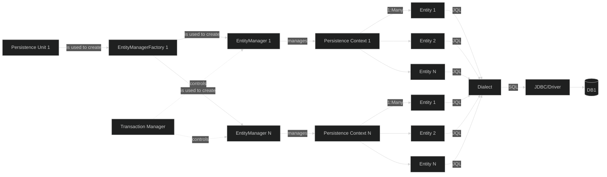
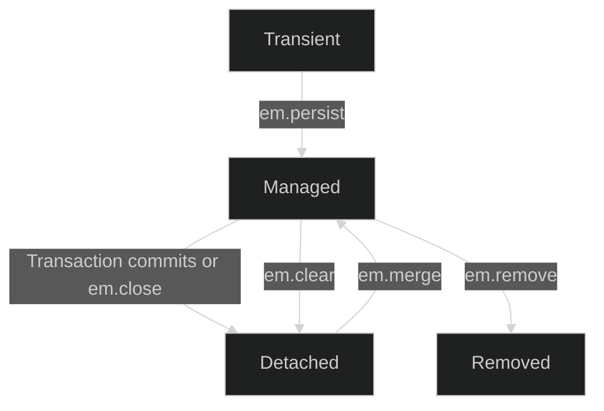
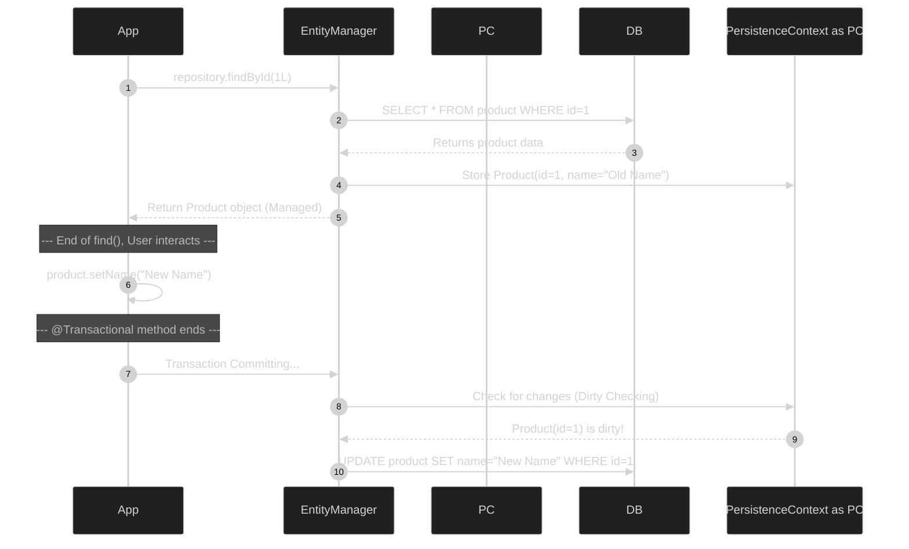
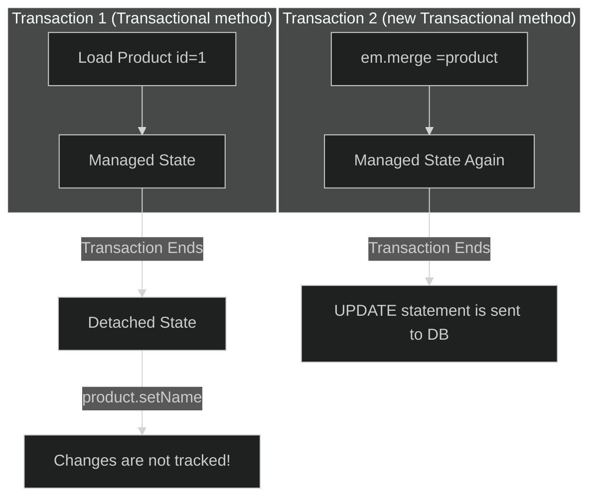

---

title: Jpa Core

---

  

---

  

###  **The Professional's Guide to Spring Data JPA: Module 1 - The Core Foundation**

  

**Objective:** To achieve a deep, architectural understanding of JPA, Hibernate, and their integration with Spring Boot, focusing on the internal mechanisms and lifecycle events that are critical for interviews and professional development.

  

---

  

###  **1. JPA vs. Hibernate: The Blueprint and The Engine**

  

This is the most fundamental concept, and you must articulate it clearly.

  ```mermaid
---
config:
  theme: dark
---
graph LR
  subgraph ORM_Framework
    direction LR
    JPA[JPA<br/>interface]
    Hibernate[Hibernate<br/>implementation]
  end
  AL[Application Logic] --> JPA
  JPA --> Hibernate
  Hibernate --> JDBC[JDBC<br/>interface]
  JDBC --> Driver[Specific DB Driver<br/>implementation]
  Driver --> RDB[Relational DB]
  classDef orm stroke:#f39c12,stroke-width:2px;
  class JPA,Hibernate orm;
```

*  **JPA (Jakarta Persistence API): The Specification**

Think of JPA as a **blueprint** or an **interface** in Java. It is a standard, official specification published by the Jakarta EE working group. It defines a set of concepts, APIs (like `@Entity`, `@Id`, `EntityManager`), and behaviors for Object-Relational Mapping (ORM). JPA itself **does not do anything**. It is just a set of rules and contracts.

  

*  **Hibernate: The Implementation**

Think of Hibernate as the powerful **engine** or the **class that implements the interface**. It is a concrete software library that implements the JPA specification. When you use `@Entity`, Hibernate is the code that knows how to read that annotation and translate it into database operations. It provides the `EntityManager`, manages the entity lifecycle, and generates the SQL.

  

**Interview Gold (Q&A):**

*  **Q:** "What's the relationship between JPA and Hibernate?"

*  **A:** "JPA is the standard specification—the 'what.' It defines the API and rules for ORM. Hibernate is the most popular implementation of that specification—the 'how.' By coding to the JPA interfaces, like `EntityManager`, we create a portable application that is not tightly coupled to Hibernate. In theory, we could swap Hibernate for another JPA implementation like EclipseLink with minimal code changes."

  

###  **The JPA Architecture: A Deep Dive for the Professional Developer**

  

This document provides a detailed, architectural breakdown of the components involved in every JPA operation, from configuration to database interaction. We will treat the diagram you provided as our foundational map.

  



  

---

  

###  **Act I: The Heavyweights - The Application-Scoped Setup**

  

These components are created **once** when your Spring Boot application starts. They are heavyweight, expensive to initialize, and designed to be singletons that serve the entire application lifecycle.

  

####  **1. Persistence Unit**

*  **Analogy:** The **Master Blueprint** or the **Recipe Book**.

*  **What it is:** In a modern Spring Boot application, the Persistence Unit is an *in-memory representation* of your persistence configuration. It's the aggregation of all the information JPA needs to bootstrap itself.

*  **It contains:**

1.  **DataSource Information:** The JDBC URL, username, password, and driver class from your `application.yml`.

2.  **Entity Class Discovery:** The list of all classes in your project annotated with `@Entity`.

3.  **JPA Provider Details:** The fact that you are using Hibernate as the engine.

4.  **Properties:** Other configurations, like the database `Dialect` and DDL generation strategy (`ddl-auto`).

  

####  **2. `EntityManagerFactory`**

*  **Analogy:** The **Heavy-Duty Industrial Factory**.

*  **Lifecycle and Scope:** It is a **thread-safe singleton object**, created **once per application startup**.

*  **Why is it heavyweight?** Its creation is an expensive, one-time process. It parses your entity classes, validates their mappings, builds metadata models, and prepares caches. This upfront cost is why it's a singleton; you would never want to recreate it for every request.

*  **Sole Purpose:** Its *only* job is to be a factory that efficiently creates short-lived `EntityManager` instances. It does **not** interact with the database for CRUD operations itself.

  

---

  

###  **Act II: The Workers - The Transaction-Scoped Operation**

  

These components are lightweight, short-lived, and tied directly to a single unit of work—typically, a single transaction.

  

####  **1. `EntityManager`**

*  **Analogy:** A **Worker on the Factory Floor** or a **single, short conversation with the database.**

*  **Lifecycle and Scope:** It is a **non-thread-safe object**. In Spring, an `EntityManager` is created or retrieved from the factory at the beginning of a `@Transactional` method and is **closed** at the end of it.

*  **Why is it not thread-safe?** Because it is designed to be used by a single thread for a single, atomic operation. Sharing it across threads would lead to data corruption and concurrency issues.

*  **Purpose:** This is the primary API for persistence operations. When your `JpaRepository` calls `save(entity)`, `findById(id)`, or `delete(entity)`, it is delegating that call to the underlying `EntityManager`'s `persist()`, `find()`, or `remove()` methods.

  

####  **2. `Persistence Context`**

*  **Analogy:** The **Worker's Workbench** or a **Transactional Cache**.

*  **What it is:** This is the **most critical concept in JPA**. The Persistence Context is a first-level cache that is created and owned by a specific `EntityManager`. It's a map-like structure (`Map<EntityID, EntityObject>`) that holds and tracks the state of all entities involved in the current transaction.

*  **Its Superpowers (Interview Gold):**

1.  **Transactional Write-Behind:** When you call `repository.save(product)`, Hibernate does **not** immediately run an `INSERT` statement. It places the new entity in the Persistence Context. All changes are queued up and only "flushed" to the database at the very end of the transaction, allowing Hibernate to perform optimizations like statement batching.

2.  **Identity and Repeatable Reads:** If you call `repository.findById(123L)` multiple times within the same transaction, **only the first call hits the database**. Subsequent calls will retrieve the identical Java object directly from the Persistence Context, guaranteeing object identity (`product1 == product2`) and saving database roundtrips.

3.  **Dirty Checking:** At the end of a transaction, the `EntityManager` flushes the Persistence Context. During this flush, it compares the current state of every managed entity with its original state (when it was first loaded). If any difference is found (if the object is "dirty"), Hibernate **automatically generates and executes an `UPDATE` statement**. This is why you often don't need to call `repository.save()` on an already-existing entity after modifying it.

  

####  **3. `Transaction Manager` (The Unseen Orchestrator)**

*  **Analogy:** The **Factory Foreman** or the **Supervisor**.

*  **What it is:** This is a core Spring component (not JPA-specific, but essential for integration). The `@Transactional` annotation tells Spring's Transaction Manager to get involved.

*  **Its Role:**

1.  At the start of an advised method, the Foreman **begins a transaction**.

2.  It asks the `EntityManagerFactory` for a new Worker (`EntityManager`).

3.  It binds this `EntityManager` to the current thread so that all repository calls within that thread use the same worker and the same workbench (`PersistenceContext`).

4.  At the end of the method, if no exceptions occurred, it instructs the `EntityManager` to **flush** its workbench and **commit** the transaction.

5.  If an exception occurred, it instructs the `EntityManager` to discard its changes and **rollback** the transaction.

  

---

  

###  **Act III: The Translation Pipeline - From Java to SQL**

  

This is the final leg of the journey, where your object-oriented intent is converted into raw database commands.

  

*  **Managed Entities:** These are the Java objects currently living on the "workbench" (the Persistence Context). They are "alive" and being tracked for changes.

*  **JPQL (Jakarta Persistence Query Language):** This is a database-agnostic, object-oriented query language. You write queries against your **Java Entity names and fields**, not your database table and column names (e.g., `SELECT u FROM UserEntity u WHERE u.firstName = 'John'`).

*  **Dialect:** This is Hibernate's **Universal Translator**. Every database (PostgreSQL, MySQL, Oracle) has slightly different SQL syntax and features. The `PostgreSQLDialect` knows how to translate standard JPQL into the specific SQL variant that PostgreSQL understands, including correct syntax for things like pagination or date functions. This is what makes your JPA code portable across different databases.

*  **JDBC Driver:** The final, low-level Java API. The dialect-generated native SQL is handed off to the configured JDBC driver, which sends it over the network to the database for execution.

  

###  **3. Configuration in Spring Boot**

  

*  **Dependency:** You only need the starter. It pulls in `spring-data-jpa`, `hibernate-core`, and the `tomcat-jdbc` connection pool.

```xml

<dependency>

<groupId>org.springframework.boot</groupId>

<artifactId>spring-boot-starter-data-jpa</artifactId>

</dependency>

```

*  **Configuration (`application.yml`):**

```yaml

spring:

datasource:

url: jdbc:postgresql://localhost:5432/mydatabase

username: myuser

password: mypassword

driver-class-name: org.postgresql.Driver

jpa:

hibernate:

ddl-auto: validate  # Use 'validate' in prod, 'update' in dev

properties:

hibernate:

dialect: org.hibernate.dialect.PostgreSQLDialect

format_sql: true  # Pretty-prints SQL in logs for readability

show-sql: true  # Logs the generated SQL to the console

```

  

---

  

###  **4. Spring Data JPA vs. Hibernate: The Abstraction**

  

*  **Hibernate:** The powerful engine that requires you to work directly with the `EntityManager`.

*  **Spring Data JPA:** An even higher-level abstraction built *on top* of a JPA provider like Hibernate. Its goal is to eliminate boilerplate data access code. The `JpaRepository` interface is the heart of this. **When you call `productRepository.findById(1L)`, Spring Data JPA is calling `entityManager.find(Product.class, 1L)` for you under the hood.**

  

You don't choose between them. You use Spring Data JPA *to more easily work with* Hibernate.

  

---

  

###  **5. The Entity Lifecycle: The Journey of an Object**

  

An `@Entity` object can be in one of four states. Understanding these states is crucial for debugging and performance tuning.

  



  

####  **State 1: Transient (or New)**

A brand new Java object that has no connection to the database or a Persistence Context. It's just an object in memory.

```java

// This product is in the TRANSIENT state.

// JPA/Hibernate has no knowledge of it.

Product  product  =  new  Product();

product.setName("Laptop");

```

*  **Characteristics:** No ID (usually), not tracked, changes will not be saved.

  

####  **State 2: Managed (or Persistent)**

An entity that is currently being tracked by a Persistence Context. This is the "magic" state.

*  **How it gets here:**

1.  After you call `entityManager.persist(product)` or `repository.save(product)`.

2.  After you fetch it from the database using `entityManager.find()` or `repository.findById()`.

*  **Characteristics:**

*  It has a database ID.

*  **Dirty Checking:** At the end of the transaction, Hibernate will automatically check if any fields of any managed entity have changed. If they have, it generates an `UPDATE` SQL statement *automatically*, without you needing to call `save()` again. This is a critical concept.

  



  

####  **State 3: Detached**

An entity that was once managed but whose Persistence Context has been closed.

*  **How it gets here:** The `@Transactional` method it was loaded in has completed, or you've manually called `em.close()` or `em.detach()`.

*  **Characteristics:** It still has a database ID, but changes to it are **no longer tracked**. Hibernate is no longer aware of it. To save changes to a detached entity, you must re-attach it to a new Persistence Context using `entityManager.merge()`.

  



  

####  **State 4: Removed**

A managed entity that has been marked for deletion from the database.

*  **How it gets here:** You pass a managed entity to `entityManager.remove()` or `repository.delete()`.

*  **Characteristics:** It is still tracked by the Persistence Context until the transaction commits, at which point Hibernate will issue a `DELETE` SQL statement.