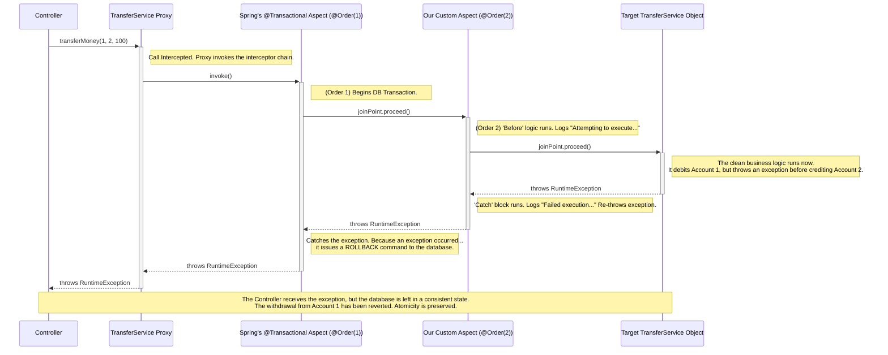

---

### **Production-Grade AOP: A Real-World Implementation**

**Objective:** To demonstrate the power and elegance of Spring AOP by implementing two distinct, critical cross-cutting concerns—**auditable logging** and **transactional integrity**—on a core business operation.

---

### **The Scenario: A Secure, Atomic Money Transfer Service**

Imagine we are building the core of a banking application. Our primary requirement is to create a service that can transfer funds between two accounts.

**The Business Rules are Non-Negotiable:**

1.  **Atomicity:** The transfer must be an "all or nothing" operation. It is unacceptable to withdraw funds from the source account if the deposit into the destination account fails. The entire operation must succeed, or the database must be left completely unchanged.
2.  **Auditability:** Every single transfer attempt, whether successful or failed, must be logged for security and compliance reasons. The log must include which accounts were involved, the amount, and the outcome.

An intermediate developer might try to solve this by writing logging and transaction management code directly inside the business method. An advanced developer knows this is a path to unmaintainable code. We will use AOP.

---

### **Part 1: The Core Business Logic (The "Target")**

First, we write the business logic in its purest form, completely free of any cross-cutting concerns.

#### **The Entity (`Account.java`)**

```java
@Entity
@Table(name = "accounts")
@Getter @Setter // For brevity
public class Account {
    @Id
    @GeneratedValue(strategy = GenerationType.IDENTITY)
    private Long id;
    private String ownerName;
    private BigDecimal balance; // ALWAYS use BigDecimal for financial calculations
}
```

#### **The Repository (`AccountRepository.java`)**

```java
@Repository
public interface AccountRepository extends JpaRepository<Account, Long> {}
```

#### **The Service (`TransferService.java`) - Pure Business Logic**
This class focuses *only* on the steps of the money transfer.

```java
@Service
public class TransferService {
    private final AccountRepository accountRepository;

    public TransferService(AccountRepository accountRepository) {
        this.accountRepository = accountRepository;
    }

    public void transferMoney(Long fromAccountId, Long toAccountId, BigDecimal amount) {
        // Find the accounts from the database
        Account fromAccount = accountRepository.findById(fromAccountId)
            .orElseThrow(() -> new AccountNotFoundException("Source account not found"));
            
        Account toAccount = accountRepository.findById(toAccountId)
            .orElseThrow(() -> new AccountNotFoundException("Destination account not found"));

        // Check for sufficient funds
        if (fromAccount.getBalance().compareTo(amount) < 0) {
            throw new InsufficientFundsException("Insufficient funds in source account");
        }

        // Perform the transfer
        fromAccount.setBalance(fromAccount.getBalance().subtract(amount));
        toAccount.setBalance(toAccount.getBalance().add(amount));

        // Save the updated accounts back to the database
        accountRepository.save(fromAccount);
        accountRepository.save(toAccount);
    }
}
```
**The Problem:** Look at the `transferMoney` method. It is clean, but it satisfies neither of our business rules. If the second `save()` call fails, the money has been withdrawn but not deposited. There is also no logging.

---

### **Part 2: Solution with AOP - Decoupling the Concerns**

We will now create two distinct aspects to solve our two business rules, leaving the `TransferService` code clean.

#### **Aspect 1: Audit Logging (Our Custom Aspect)**

We need detailed, structured logs. We'll use a custom annotation to declaratively enable this.

**Step 1.1: Create the `@Auditable` Annotation**

```java
@Target(ElementType.METHOD)
@Retention(RetentionPolicy.RUNTIME)
public @interface Auditable {}
```

**Step 1.2: Create the `AuditLogAspect`**
This aspect uses `@Around` advice for maximum detail. It's a textbook example of a robust logging aspect.

```java
@Aspect
@Component
@Order(2) // We want the audit log to be inside the transaction
public class AuditLogAspect {
    private static final Logger log = LoggerFactory.getLogger(AuditLogAspect.class);

    @Around("@annotation(com.example.prod.annotation.Auditable)")
    public Object audit(ProceedingJoinPoint joinPoint) throws Throwable {
        String methodName = joinPoint.getSignature().toShortString();
        Object[] args = joinPoint.getArgs();

        log.info("AUDIT LOG: Attempting to execute {} with arguments {}", methodName, args);

        try {
            Object result = joinPoint.proceed();
            log.info("AUDIT LOG: Successfully executed {} and returned {}", methodName, result);
            return result;
        } catch (Throwable e) {
            log.error("AUDIT LOG: Failed execution of {} with exception {}", methodName, e.getClass().getSimpleName());
            // Re-throw the exception so the transactional aspect can handle it
            throw e;
        }
    }
}
```

#### **Aspect 2: Transactional Integrity (Spring's Built-in Aspect)**

This is the "aha!" moment for an intermediate developer. **Spring's `@Transactional` annotation is powered by AOP.** You are not just using an annotation; you are applying a pre-built, production-hardened aspect to your code.

We simply apply the annotation to our service. Spring handles the rest.

---

### **Part 3: The Final Result - The "Advised" Service**

Now, we apply our aspects declaratively to our clean `TransferService`.

```java
@Service
public class TransferService {
    // ... repository and constructor ...

    @Transactional // Spring's AOP for Atomicity
    @Auditable     // Our custom AOP for Logging
    public void transferMoney(Long fromAccountId, Long toAccountId, BigDecimal amount) {
        // The business logic remains identical and clean.
        // It has no knowledge of transactions or logging.
        Account fromAccount = accountRepository.findById(fromAccountId)
            .orElseThrow(() -> new AccountNotFoundException("Source account not found"));
            
        Account toAccount = accountRepository.findById(toAccountId)
            .orElseThrow(() -> new AccountNotFoundException("Destination account not found"));

        if (fromAccount.getBalance().compareTo(amount) < 0) {
            throw new InsufficientFundsException("Insufficient funds in source account");
        }

        fromAccount.setBalance(fromAccount.getBalance().subtract(amount));
        toAccount.setBalance(toAccount.getBalance().add(amount));

        accountRepository.save(fromAccount);
        // Let's simulate a failure here to test the rollback!
        if (toAccountId.equals(999L)) {
            throw new RuntimeException("Simulating a critical database error during deposit!");
        }
        accountRepository.save(toAccount);
    }
}
```

---

### **Visualizing the Flow: The AOP Interceptor Chain**

This is the most critical concept to master. When you apply multiple aspects, Spring creates a chain of interceptors. The `@Order` annotation controls their sequence.



### **Conclusion: The Mark of a Professional**

By using AOP, we have achieved:

1.  **Separation of Concerns:** Our `TransferService` is dumb. It only knows how to transfer money. It has no idea it's being audited or that it's running inside a transaction.
2.  **Declarative Configuration:** We can add or remove complex behaviors like transactions and auditing with a single annotation, without touching the core business logic.
3.  **Maintainability and Reusability:** Our `AuditLogAspect` can be applied to any other service method in the application just by adding the `@Auditable` annotation. The logic is defined in exactly one place.

This is the power of Aspect-Oriented Programming. You have moved beyond simply writing code that works; you are now architecting a system that is clean, robust, and built for the long term. This is the path to becoming an advanced developer.