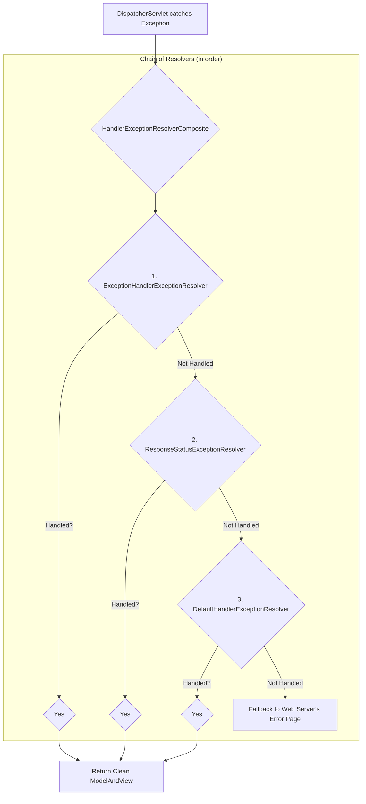
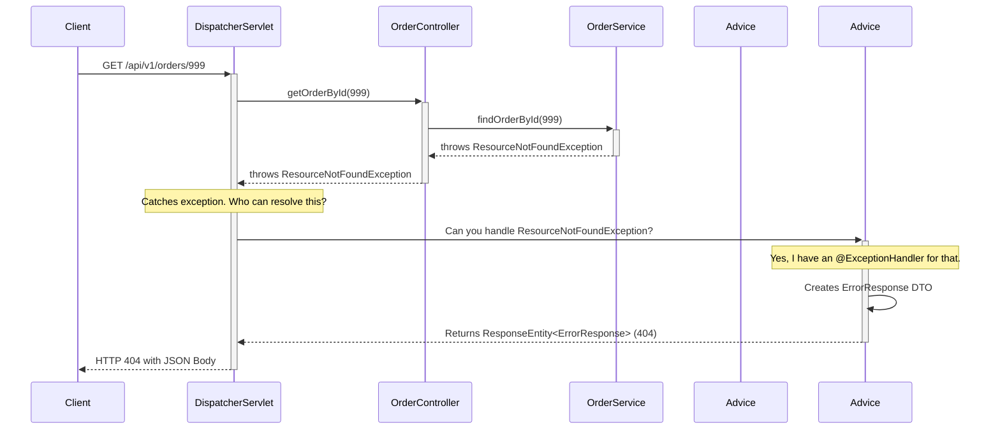

---

### **The Guide to Flawless Exception Handling in Spring Boot**

#### **The Philosophy: Why We Obsess Over Exceptions**

Before we write a single line of code, understand the goal. In production, unhandled exceptions are catastrophic. They lead to:

1.  **Poor User Experience:** Clients receive ugly, unhelpful stack traces or generic server error pages.
2.  **Security Vulnerabilities:** Stack traces can leak internal information about your framework, database schema, or code structure, which can be exploited.
3.  **Debugging Nightmares:** Without a consistent error structure, tracking down issues in logs becomes a painful, time-consuming process.

Our goal is to intercept *every possible exception* and transform it into a **standardized, clean, and helpful JSON error response**.

---

#### **Part 1: The Internal Mechanism (The "Why" Behind the Magic)**

Let's demystify the diagrams you've seen. When an exception is thrown from your controller, it doesn't just crash. The `DispatcherServlet` catches it and begins a process of delegation.

It asks a list of `HandlerExceptionResolver` beans, "Can you handle this exception?" This is a classic **Chain of Responsibility** design pattern.



Here's who these "resolvers" are, in order of importance for a REST API:

1.  **`ExceptionHandlerExceptionResolver` (The Star Player):** This is the most important one. It looks for methods annotated with **`@ExceptionHandler`** within your controllers or, more importantly, a **`@ControllerAdvice`** class. If it finds a handler that matches the exception type, it uses it. **This is the one we will master.**
2.  **`ResponseStatusExceptionResolver` (The Quick & Dirty):** This resolver looks for the **`@ResponseStatus`** annotation on your custom exception class itself. If it finds one (e.g., `@ResponseStatus(HttpStatus.NOT_FOUND)`), it simply translates that exception into the specified HTTP status code with an empty body. It's simple, but not flexible enough for production error bodies.
3.  **`DefaultHandlerExceptionResolver` (The Housekeeper):** This one handles standard Spring exceptions. For example, it converts a `MethodArgumentTypeMismatchException` into a `400 Bad Request`. It’s a useful fallback but not our primary tool.

An advanced developer doesn't just know these exist; they know they are a chain and that the `ExceptionHandlerExceptionResolver` is the most powerful and is consulted *first*. This is why our `@ControllerAdvice` strategy works so well—it hijacks the process at the earliest, most powerful stage.

---

### **Part 2: The Production-Ready Architecture**

We will now implement a robust, global exception handling strategy.

#### **Step 1: The Foundation - Custom Semantic Exceptions**

Never throw generic exceptions like `new Exception("Something bad happened")`. Create your own exception classes that describe the *business problem*.

**Why?** This allows you to handle different business errors in different ways. A "resource not found" should result in a 404, while an "invalid input" should be a 400.

```java
// --- ResourceNotFoundException.java ---
// This is for business errors, so it's a RuntimeException.
// It maps to a 404 Not Found.
public class ResourceNotFoundException extends RuntimeException {
    public ResourceNotFoundException(String message) {
        super(message);
    }
}

// --- InvalidInputException.java ---
// This can be used for complex validation failures that annotations can't cover.
// It maps to a 400 Bad Request.
public class InvalidInputException extends RuntimeException {
    public InvalidInputException(String message) {
        super(message);
    }
}

// --- PaymentRequiredException.java ---
// A highly specific business exception.
// Maps to a 402 Payment Required (or more commonly 400).
public class PaymentRequiredException extends RuntimeException {
    public PaymentRequiredException(String message) {
        super(message);
    }
}
```

#### **Step 2: The Contract - The Standardized Error DTO**

Define the single, unchanging JSON structure that your API will *always* return for any error. This is your public error contract. A Java `record` is perfect for this immutable data structure.

```java
// --- ErrorResponse.java ---
import java.time.LocalDateTime;
import java.util.List;

// Using a record for a concise, immutable DTO.
public record ErrorResponse(
    int statusCode,
    LocalDateTime timestamp,
    String message,
    String path,
    List<String> details // For validation errors
) {
    // Overloaded constructor for simpler errors without details list
    public ErrorResponse(int statusCode, LocalDateTime timestamp, String message, String path) {
        this(statusCode, timestamp, message, path, null);
    }
}
```

#### **Step 3: The Command Center - The `@ControllerAdvice`**

This is the heart of our strategy. A class annotated with `@ControllerAdvice` becomes a global, cross-cutting component that can intercept exceptions from *any* controller.

**Why?** It provides **a single source of truth** for your error handling logic. You don't litter your controllers with exception-handling code. Your controllers stay clean and focused on the "happy path."

Here is a production-grade implementation:

```java
package com.example.prod.exception;

import org.slf4j.Logger;
import org.slf4j.LoggerFactory;
import org.springframework.http.HttpStatus;
import org.springframework.http.ResponseEntity;
import org.springframework.web.bind.MethodArgumentNotValidException;
import org.springframework.web.bind.annotation.ControllerAdvice;
import org.springframework.web.bind.annotation.ExceptionHandler;
import org.springframework.web.context.request.ServletWebRequest;
import org.springframework.web.context.request.WebRequest;

import java.time.LocalDateTime;
import java.util.List;
import java.util.stream.Collectors;

@ControllerAdvice
public class GlobalExceptionHandler {

    private static final Logger log = LoggerFactory.getLogger(GlobalExceptionHandler.class);

    // Handler for our specific "Resource Not Found" business exception
    @ExceptionHandler(ResourceNotFoundException.class)
    public ResponseEntity<ErrorResponse> handleResourceNotFoundException(
            ResourceNotFoundException ex, WebRequest request) {
        
        ErrorResponse errorResponse = new ErrorResponse(
                HttpStatus.NOT_FOUND.value(),
                LocalDateTime.now(),
                ex.getMessage(),
                ((ServletWebRequest) request).getRequest().getRequestURI()
        );
        return new ResponseEntity<>(errorResponse, HttpStatus.NOT_FOUND);
    }

    // Handler for @Valid annotation failures
    @ExceptionHandler(MethodArgumentNotValidException.class)
    public ResponseEntity<ErrorResponse> handleValidationExceptions(
            MethodArgumentNotValidException ex, WebRequest request) {
        
        List<String> validationErrors = ex.getBindingResult().getFieldErrors().stream()
                .map(error -> error.getField() + ": " + error.getDefaultMessage())
                .collect(Collectors.toList());

        ErrorResponse errorResponse = new ErrorResponse(
                HttpStatus.BAD_REQUEST.value(),
                LocalDateTime.now(),
                "Validation Failed",
                ((ServletWebRequest) request).getRequest().getRequestURI(),
                validationErrors
        );
        return new ResponseEntity<>(errorResponse, HttpStatus.BAD_REQUEST);
    }

    // A generic, catch-all handler for any other unexpected exceptions
    @ExceptionHandler(Exception.class)
    public ResponseEntity<ErrorResponse> handleGlobalException(
            Exception ex, WebRequest request) {
        
        // CRITICAL: Log the full stack trace for unexpected errors for debugging.
        // Never expose this stack trace in the API response.
        log.error("An unexpected error occurred at path: {}", ((ServletWebRequest)request).getRequest().getRequestURI(), ex);

        ErrorResponse errorResponse = new ErrorResponse(
                HttpStatus.INTERNAL_SERVER_ERROR.value(),
                LocalDateTime.now(),
                "An internal server error occurred. Please try again later.",
                ((ServletWebRequest) request).getRequest().getRequestURI()
        );
        return new ResponseEntity<>(errorResponse, HttpStatus.INTERNAL_SERVER_ERROR);
    }
}
```

---

#### **Part 3: Putting It All Together - The Full Flow**

Let's see how this works in a real-world example.

**The Service Layer (Throws the exceptions)**
```java
@Service
public class OrderService {
    public Order findOrderById(Long id) {
        // ... logic to find order
        if (order == null) {
            // Throw our specific, semantic exception.
            throw new ResourceNotFoundException("Order with ID " + id + " was not found.");
        }
        return order;
    }
}
```

**The Controller Layer (Clean and Simple)**
```java
@RestController
@RequestMapping("/api/v1/orders")
public class OrderController {
    private final OrderService orderService;
    // ... constructor

    @GetMapping("/{id}")
    public ResponseEntity<OrderResponseDTO> getOrderById(@PathVariable Long id) {
        // No try-catch blocks! The controller stays clean.
        // It focuses on its job: handling HTTP and delegating.
        Order order = orderService.findOrderById(id);
        return ResponseEntity.ok(orderMapper.toDto(order));
    }
}
```

**The Final Visualization:**
Here is what happens when a client requests a non-existent order.



---

### **Interview Gold: Advanced Topics**

This is what will set you apart from other candidates.

1.  **Question:** "What's the difference between handling exceptions in `@ControllerAdvice` vs. using `@ResponseStatus` on the exception itself?"
    *   **Answer:** "`@ResponseStatus` is a static, simple mechanism. It couples the exception directly to an HTTP status code but provides no ability to create a custom, detailed response body. The `@ControllerAdvice` approach is far more powerful and flexible. It decouples the exception from the HTTP response, allowing a centralized place to build rich, consistent JSON error bodies, log errors effectively, and handle different exceptions in nuanced ways. For any serious application, `@ControllerAdvice` is the superior professional strategy."

2.  **Question:** "What happens if an error occurs *before* the `DispatcherServlet` is reached, like a request for a completely invalid URL?"
    *   **Answer:** "Those exceptions are handled by the servlet container (e.g., Tomcat) itself. However, Spring Boot provides a fallback mechanism through the `ErrorController` interface, with `BasicErrorController` being the default implementation. It renders the famous 'Whitelabel Error Page' by default but can be customized. This handles errors that occur outside the scope of the Spring MVC dispatch process, such as a 404 for an unknown path or a 401 if a security filter rejects a request early."

3.  **Question:** "How would you handle a `ConstraintViolationException` from the database layer versus a `MethodArgumentNotValidException` from the web layer?"
    *   **Answer:** "While both relate to invalid data, they originate from different layers. `MethodArgumentNotValidException` comes from Spring's `@Valid` annotation on DTOs and should be handled in the `GlobalExceptionHandler` to return a `400 Bad Request` with field-specific details. A `ConstraintViolationException` from JPA/Hibernate (e.g., a `unique` constraint violation) often indicates a deeper business logic error or a race condition. I would also handle this in the `GlobalExceptionHandler`, but I would typically map it to a `409 Conflict` status code to signal to the client that their request conflicts with the current state of the resource (e.g., 'An account with this email already exists'). Logging would also be more critical for the latter to investigate potential data integrity issues."