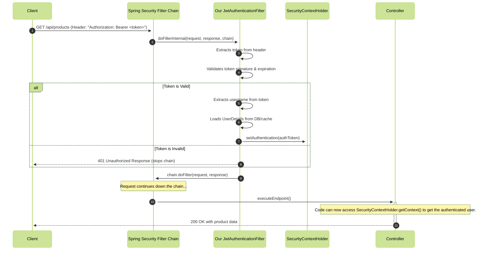

--
title: JWT
---

### **The Professional's Guide to JWT Integration in Spring Security**


A professional JWT implementation is not one giant class. It is decoupled into three distinct components for clarity, testability, and adherence to the Single Responsibility Principle.

1.  **`JwtService` (The Token Factory):** A simple component whose only job is to create, parse, and validate JWTs. It knows nothing about Spring Security or HTTP requests. It is the pure JWT logic.
2.  **`JwtAuthenticationFilter` (The Gatekeeper):** The core of our integration. This is a Spring Security `Filter` whose only job is to intercept every incoming HTTP request, extract and validate the JWT, and populate the `SecurityContext`.
3.  **`SecurityConfig` (The Architect):** The `@Configuration` class where we define our `SecurityFilterChain` bean. This is where we wire our custom filter into Spring Security's machinery at the correct position.

---

### **The Production-Ready Code**

#### **Component 1: The `JwtService`**
This component encapsulates all interactions with the JWT library (e.g., `jjwt`).

```java
@Service
public class JwtService {

    @Value("${application.security.jwt.secret-key}")
    private String secretKey;
    @Value("${application.security.jwt.expiration}")
    private long jwtExpiration;

    // A more secure way is to have a method that generates a key from the secret
    private Key getSignInKey() {
        byte[] keyBytes = Decoders.BASE64.decode(secretKey);
        return Keys.hmacShaKeyFor(keyBytes);
    }

    public String generateToken(UserDetails userDetails) {
        // You can add extra claims here if needed
        Map<String, Object> extraClaims = new HashMap<>();
        return buildToken(extraClaims, userDetails, jwtExpiration);
    }

    private String buildToken(Map<String, Object> extraClaims, UserDetails userDetails, long expiration) {
        return Jwts.builder()
                .setClaims(extraClaims)
                .setSubject(userDetails.getUsername())
                .setIssuedAt(new Date(System.currentTimeMillis()))
                .setExpiration(new Date(System.currentTimeMillis() + expiration))
                .signWith(getSignInKey(), SignatureAlgorithm.HS256)
                .compact();
    }
    
    public boolean isTokenValid(String token, UserDetails userDetails) {
        final String username = extractUsername(token);
        return (username.equals(userDetails.getUsername())) && !isTokenExpired(token);
    }

    public String extractUsername(String token) {
        return extractClaim(token, Claims::getSubject);
    }
    
    private boolean isTokenExpired(String token) {
        return extractExpiration(token).before(new Date());
    }

    private Date extractExpiration(String token) {
        return extractClaim(token, Claims::getExpiration);
    }
    
    public <T> T extractClaim(String token, Function<Claims, T> claimsResolver) {
        final Claims claims = extractAllClaims(token);
        return claimsResolver.apply(claims);
    }

    private Claims extractAllClaims(String token) {
        return Jwts.parserBuilder()
                .setSigningKey(getSignInKey())
                .build()
                .parseClaimsJws(token)
                .getBody();
    }
}
```

#### **Component 2: The `JwtAuthenticationFilter` (The CORE of the lesson)**
This is the bridge between HTTP and Spring Security. We extend `OncePerRequestFilter` to ensure it runs only once per request.

```java
@Component
@RequiredArgsConstructor // Lombok for constructor injection
public class JwtAuthenticationFilter extends OncePerRequestFilter {

    private final JwtService jwtService;
    private final UserDetailsService userDetailsService;

    @Override
    protected void doFilterInternal(
            @NonNull HttpServletRequest request,
            @NonNull HttpServletResponse response,
            @NonNull FilterChain filterChain
    ) throws ServletException, IOException {

        final String authHeader = request.getHeader("Authorization");
        
        // 1. Basic check for the header
        if (authHeader == null || !authHeader.startsWith("Bearer ")) {
            filterChain.doFilter(request, response); // If no token, pass to the next filter
            return;
        }

        final String jwt = authHeader.substring(7); // Extract token from "Bearer "

        try {
            final String userEmail = jwtService.extractUsername(jwt);

            // 2. If token is valid AND user is not already authenticated
            if (userEmail != null && SecurityContextHolder.getContext().getAuthentication() == null) {
                UserDetails userDetails = this.userDetailsService.loadUserByUsername(userEmail);

                // 3. Perform the validation
                if (jwtService.isTokenValid(jwt, userDetails)) {
                    // 4. Create the Authentication object
                    UsernamePasswordAuthenticationToken authToken = new UsernamePasswordAuthenticationToken(
                            userDetails,
                            null, // We don't have credentials
                            userDetails.getAuthorities()
                    );
                    authToken.setDetails(new WebAuthenticationDetailsSource().buildDetails(request));

                    // 5. This is the magic step: Update the SecurityContextHolder
                    SecurityContextHolder.getContext().setAuthentication(authToken);
                }
            }
            filterChain.doFilter(request, response);
        } catch (ExpiredJwtException | MalformedJwtException e) {
            // Handle JWT exceptions by sending a proper 401 response
            response.setStatus(HttpServletResponse.SC_UNAUTHORIZED);
            response.getWriter().write("{\"error\":\"" + e.getMessage() + "\"}");
            response.setContentType("application/json");
        }
    }
}
```

#### **Component 3: The `SecurityConfig`**
This is where we assemble our fortress, disabling old features and plugging in our new filter.

```java
@Configuration
@EnableWebSecurity
@RequiredArgsConstructor
@EnableMethodSecurity // To enable @PreAuthorize, etc.
public class SecurityConfig {

    private final JwtAuthenticationFilter jwtAuthFilter;
    private final AuthenticationProvider authenticationProvider; // You'd have this bean configured elsewhere

    @Bean
    public SecurityFilterChain securityFilterChain(HttpSecurity http) throws Exception {
        http
                // 1. Disable CSRF for stateless APIs
                .csrf(AbstractHttpConfigurer::disable)

                // 2. Define the authorization rules
                .authorizeHttpRequests(req ->
                        req.requestMatchers("/api/v1/auth/**").permitAll() // Whitelist auth endpoints
                                .anyRequest().authenticated() // Secure all other endpoints
                )
                // 3. Set session management to STATELESS
                .sessionManagement(session -> session.sessionCreationPolicy(SessionCreationPolicy.STATELESS))
                
                // 4. Wire up the authentication provider
                .authenticationProvider(authenticationProvider)
                
                // 5. THIS IS THE KEY: Add our custom JWT filter BEFORE the standard UsernamePasswordAuthenticationFilter
                .addFilterBefore(jwtAuthFilter, UsernamePasswordAuthenticationFilter.class);

        return http.build();
    }
}
```

---

### **The Flow Diagram: The Journey of a Secured Request**



---

### **Advanced Interview Questions: Proving Your Production Expertise**

1.  **Q: In your `JwtAuthenticationFilter`, you call the `UserDetailsService`. Doesn't this cause a database hit on every single request, and doesn't that defeat the purpose of a "stateless" token?**
    *   **A:** "That's an excellent and critical point. Yes, in this naive implementation, it does cause a database hit. While the token validation itself is stateless, fetching the user details is not. In a production environment, you would absolutely introduce a cache (like Redis or Caffeine) in front of the `UserDetailsService`. The user details would be cached with a short TTL. This provides the best of both worlds: the stateless flexibility of JWTs for authentication, combined with a high-performance cache for user details, ensuring we only hit the database infrequently."

2.  **Q: Why do you extend `OncePerRequestFilter` instead of just implementing the standard `Filter` interface?**
    *   **A:** "`OncePerRequestFilter` is a Spring-provided convenience class that guarantees the filter is executed only **once per request**, even in the presence of internal server forwards or dispatches. A standard `Filter` might be invoked multiple times for the same request if it's forwarded (e.g., from one servlet to another). For an authentication filter, running it multiple times would be inefficient and could lead to unexpected behavior. Using `OncePerRequestFilter` is the professional standard for this reason."

3.  **Q: Look at your `SecurityConfig`. Why is the `JwtAuthenticationFilter` added *before* `UsernamePasswordAuthenticationFilter`? What would happen if it were added *after*?**
    *   **A:** "It's added *before* because we want to handle our primary authentication mechanism (the JWT) first. We want to identify the user from their token and populate the `SecurityContext` early in the chain. If we added it *after*, other filters that might rely on the `Authentication` object being present (like those that handle authorization) could run before our user is even identified. The `UsernamePasswordAuthenticationFilter` is for processing HTML form logins; in a stateless API, we typically bypass it entirely, so placing our filter before it ensures our logic takes precedence."

4.  **Q: In your filter's `catch` block, you're handling exceptions. What is the responsibility of an `AuthenticationEntryPoint` and how does it relate to your filter's exception handling?**
    *   **A:** "My filter's `try-catch` block handles exceptions that occur *during token validation*. It's a direct and immediate way to stop the request and return a 401. An `AuthenticationEntryPoint`, on the other hand, is a more generic component in the filter chain. It's invoked by Spring's `ExceptionTranslationFilter` when an unauthenticated user tries to access a protected resource and an `AuthenticationException` is thrown. While my filter handles the explicit case of a *bad token*, the `AuthenticationEntryPoint` would handle the case where the user provided *no token at all*. In a robust setup, both would be configured to return a consistent JSON 401 error response."

5.  **Q: You are securing your API with JWT. How would you modify your `SecurityFilterChain` to also support a traditional, stateful form login for a web-based admin console on the same application?**
    *   **A:** "This is a great hybrid scenario. I would use `securityMatcher` to create multiple, independent `SecurityFilterChain` beans. One chain would be configured with a `securityMatcher("/api/**")`, and in this chain, I would disable CSRF, set session management to stateless, and add my `JwtAuthenticationFilter`. I would then create a second `SecurityFilterChain` bean with a `securityMatcher("/admin/**")`. In this second chain, I would *enable* CSRF, keep the default stateful session management, and configure `http.formLogin()`. This allows me to apply completely different security models to different parts of my application based on the URL pattern."