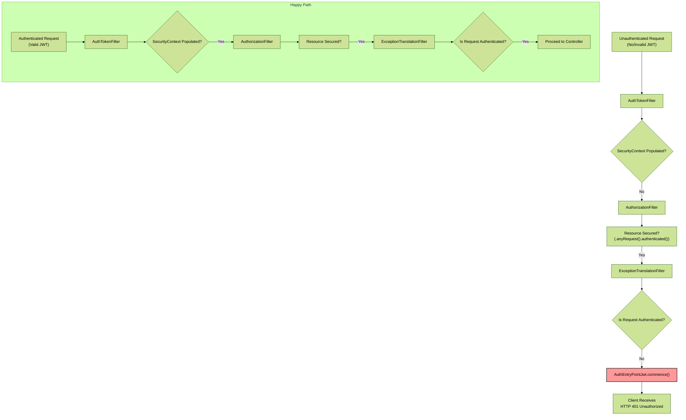

--- 
title : AuthEntryPointJwt
---

### **5. `AuthEntryPointJwt`: Professional Error Handling**

Think of this component as the bouncer at the door of your club. If someone tries to enter a restricted area without a valid ticket (authentication), the bouncer doesn't give them a detailed explanation of the club's security systems. They give a firm, standardized, and clear response: "You are not authorized to be here." The `AuthEntryPointJwt` does exactly this for your API.

#### **5.1. The `AuthenticationEntryPoint` Interface**

*   **The Contract:** This is a simple, functional interface with a single method: `commence(HttpServletRequest, HttpServletResponse, AuthenticationException)`.
*   **The Trigger Condition:** Spring Security invokes the `commence` method under a very specific circumstance: **when an unauthenticated user attempts to access a resource that requires authentication, and the framework does not have an authenticated `Principal` in the `SecurityContextHolder`.**

Let's visualize the exact moment this component is triggered within the Spring Security filter chain.

As the diagram shows, the `ExceptionTranslationFilter` is a key orchestrator. It catches security-related exceptions. If it catches an `AuthenticationException` (or simply sees that no one is authenticated), it delegates the response generation to your configured `AuthenticationEntryPoint`. This is precisely where your custom logic takes over from Spring Security's default behavior (which is often a login page redirect, unsuitable for a REST API).

#### **5.2. Secure by Default: Why Your Implementation is Strong**

Your implementation in `AuthEntryPointJwt.java` is an excellent example of a secure, production-grade error handler.

1.  **Clear Status Code:** `response.setStatus(HttpServletResponse.SC_UNAUTHORIZED);`
    *   This correctly sets the HTTP status code to `401 Unauthorized`. This is the universally recognized signal for "authentication is required and has failed or has not yet been provided." It is machine-readable and allows clients to programmatically handle re-authentication.

2.  **Standardized Media Type:** `response.setContentType(MediaType.APPLICATION_JSON_VALUE);`
    *   This explicitly tells the client that the response body is JSON. It prevents browsers from misinterpreting the response (e.g., trying to render it as HTML) and ensures API clients can parse it correctly.

3.  **No Information Leakage:**
    *   The `AuthenticationException authException` parameter contains details about *why* authentication failed. **You correctly do not include `authException.getMessage()` in the response body.** Exposing internal exception messages like "Bad credentials" or "User account is locked" can provide attackers with valuable information for targeted attacks.
    *   Your generic message, `"Authentication required to access this resource"`, is perfect. It gives the legitimate user the necessary information without leaking any internal system state.

4.  **Actionable Context:** The response body you construct is highly professional:
    *   `"status": 401`
    *   `"error": "Unauthorized"`
    *   `"message": "Authentication required..."`
    *   `"path": "/api/patients/123"`
    *   `"timestamp": "..."`
    *   This provides the client developer with everything they need to debug the issue: the status, a consistent error type, a human-readable message, the exact path that failed, and a timestamp for correlating with server logs.

#### **5.3. Interview Focus: The Importance of an API Error Contract**

**Question:** *"Your `AuthEntryPointJwt` provides a custom error response. Why is this component so important for the overall architecture of a professional API?"*

**Your Answer:**
"The `AuthEntryPointJwt` is crucial because it helps establish a **consistent and secure error-handling contract** for all API consumers. This has several major benefits:

1.  **Predictability for Clients:** By guaranteeing that any unauthenticated access attempt will result in a `401` status with a predictable JSON body, we make life easier for frontend and mobile developers. They can write robust, generic error-handling logic that trusts the structure of our error responses. They don't have to guess whether the response will be HTML, plain text, or an empty body.

2.  **Enhanced Security:** It serves as a centralized control point to ensure we never leak sensitive information. By standardizing on a generic message for all authentication failures, we adhere to the OWASP principle of **"Error Handling and Logging"**, which recommends against providing attackers with detailed error messages that could reveal vulnerabilities or system architecture.

3.  **Improved Debugging and Monitoring:** Our implementation logs the specific URI that was attempted (`logger.error("Unauthorized access attempt - URI: {}", requestURI)`). When this log is correlated with the timestamp in the JSON response sent to the client, our operations team can very quickly diagnose issues. We can see if a specific endpoint is being frequently hit by unauthenticated users, which could indicate a misconfigured client or a potential probing attack.

In essence, this component transforms a security failure from a potentially chaotic server exception into a predictable, secure, and observable event, which is a hallmark of a mature, production-ready API."