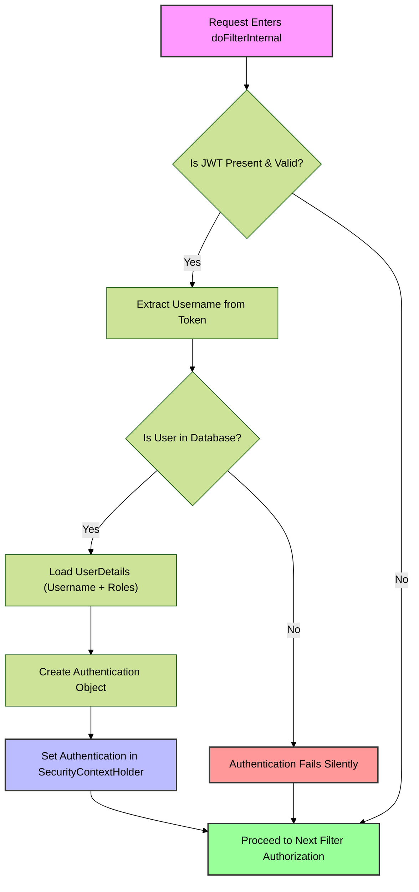
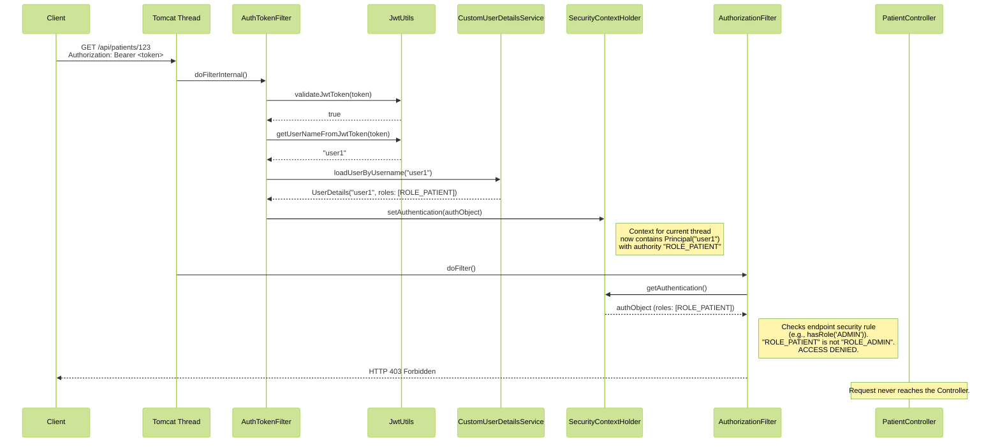

### **3. `AuthTokenFilter`: The Entry Gatekeeper**

If the `SecurityConfig` is the blueprint, the `AuthTokenFilter` is the vigilant gatekeeper standing at the main entrance to your application. Its sole job is to inspect the credentials (the JWT) of every request trying to access a protected resource, validate them, and establish the user's identity for the duration of that request.

#### **3.1. `OncePerRequestFilter`: The Correct Foundation**

*   **Why extend this class?** Spring's `FilterChain` can sometimes process a single HTTP request multiple times, especially in complex server setups involving internal forwards or includes (e.g., dispatching from one servlet to another). Extending the base `Filter` interface could lead to your authentication logic running multiple times for the same request, which is inefficient and can cause unexpected behavior.
*   **The Guarantee:** `OncePerRequestFilter`, as its name implies, provides a simple but powerful guarantee: **it will execute only once per request, regardless of any internal dispatches**. This makes it the standard, correct base class for any filter that performs authentication or modifies the request, ensuring your logic is idempotent and predictable.
*   **Interview Insight:** Stating that you chose `OncePerRequestFilter` to prevent redundant authentication logic during servlet forwards or includes demonstrates a practical, in-depth knowledge of the Servlet API and its interaction with Spring Security.

#### **3.2. Authentication Flow Decomposition**

Your `doFilterInternal` method perfectly executes the five critical steps of token-based authentication. Let's visualize this flow as a decision process within the filter.

Let's break down each step with reference to your code:

1.  **Parse:** `String jwt = parseJwt(request);`
    *   **Responsibility:** Extracts the raw token string from the `Authorization` header.
    *   **Logic:** It checks if the header exists and starts with the mandatory `Bearer ` prefix. This is the standard defined by RFC 6750 for bearer tokens.

2.  **Validate:** `if (jwt != null && jwtUtils.validateJwtToken(jwt))`
    *   **Responsibility:** Offloads the complex cryptographic verification to `JwtUtils`.
    *   **Logic:** This is a crucial security checkpoint. It verifies the token's signature to ensure it hasn't been tampered with and checks the `exp` claim to ensure it hasn't expired.

3.  **Identify:** `String username = jwtUtils.getUserNameFromJwtToken(jwt);`
    *   **Responsibility:** Extracts the user's identity from the token's claims.
    *   **Logic:** After cryptographic validation, this step reads the `sub` (subject) claim from the token's payload. The system now knows *who* the token belongs to.

4.  **Hydrate:** `UserDetails userDetails = userDetailsService.loadUserByUsername(username);`
    *   **Responsibility:** Enriches the identity with real-time, authoritative details from the database.
    *   **Logic:** This is a critical step. The JWT might contain claims about roles, but those could be stale. This database lookup ensures that the user still exists, is enabled, and has the most current set of permissions (`GrantedAuthority`). It prevents a user who was recently disabled from using a still-valid JWT.

5.  **Authenticate:** `SecurityContextHolder.getContext().setAuthentication(authentication);`
    *   **Responsibility:** Officially marks the current request as authenticated within the Spring Security framework.
    *   **Logic:** It creates a `UsernamePasswordAuthenticationToken` (in this context, it's used as a general-purpose "Authenticated Principal Token") containing the `UserDetails`. Placing this object in the `SecurityContextHolder` is the **final act of authentication**. Downstream components, like the `AuthorizationFilter` or your controller methods, will now see the user as logged in.

#### **3.3. The `SecurityContextHolder`: A Thread-Local Container**

*   **What is it?** The `SecurityContextHolder` is the central place where Spring Security stores the identity (`Authentication` object) of the currently authenticated user.
*   **The `ThreadLocal` Magic:** It uses a `ThreadLocal` variable internally. This means the `Authentication` object you set is tied specifically to the **current execution thread**. When a request comes into your web server, it is assigned a thread. Your `AuthTokenFilter` populates the `SecurityContextHolder` for that thread. Later, when your controller method executes on the *same thread*, it can access that same security context.
*   **Why is this important?** It makes the `Principal` or `Authentication` object available anywhere in your application logic without needing to pass it as a parameter through every method call. You can access it statically (`SecurityContextHolder.getContext().getAuthentication()`) or have it injected directly by Spring into your controller methods (`@AuthenticationPrincipal UserDetails userDetails`). When the request is finished and the thread is returned to the pool, the `SecurityContextHolder` is automatically cleared, ensuring no identity information leaks between requests.

#### **3.4. Interview Focus: Whiteboarding the Request Flow**

**Question:** *"A client sends a GET request with a valid JWT to `/api/patients/123`. Draw the path of this request through your security layer and explain how a '403 Forbidden' response would be generated if the user was a 'PATIENT' but the endpoint required 'ADMIN'."*

**Your Whiteboard/Diagram:**

**Explanation for the Interviewer:**
"The request is intercepted by the `AuthTokenFilter`. It uses `JwtUtils` to validate the token and extract the username, 'user1'. It then calls the `CustomUserDetailsService` to fetch the user's current authorities from the database, which in this case is `ROLE_PATIENT`. An `Authentication` object containing these details is then placed in the `SecurityContextHolder` for the current thread.

The filter chain continues to the `AuthorizationFilter`. This filter retrieves the `Authentication` object we just set. It then checks the security rules defined for the `/api/patients/123` endpoint. If that endpoint is secured with, for example, `@PreAuthorize("hasRole('ADMIN')")`, the `AuthorizationFilter` will see that the authenticated principal has `ROLE_PATIENT` but lacks the required `ROLE_ADMIN`. At this point, it immediately halts the request processing and generates an HTTP **403 Forbidden** response. The request never reaches the `PatientController`, enforcing our security rules."