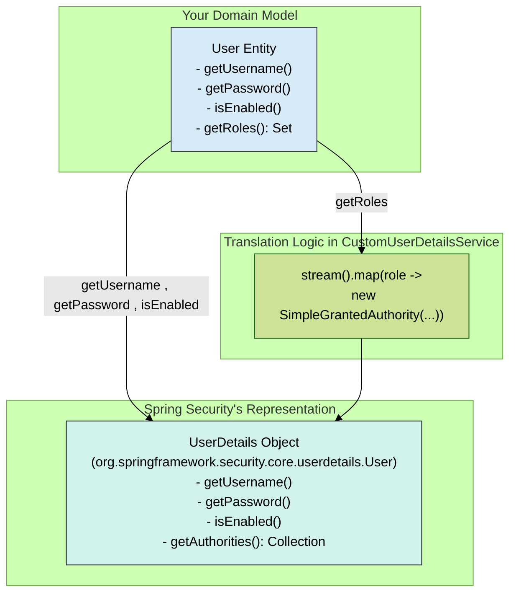
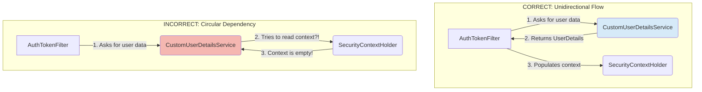

### **4. `CustomUserDetailsService`: Connecting Identity to Security**

Think of this service as a translator. It takes a simple identifier (a username) and provides a fully-formed, universally understood identity object (`UserDetails`) that the rest of the Spring Security framework can work with. It is the authoritative source for user identity and permissions at the moment of authentication.

#### **4.1. The `UserDetailsService` Contract**

The `UserDetailsService` interface is a prime example of the **Strategy Pattern** in Spring Security. It defines a contract for one single, critical responsibility:

*   **`UserDetails loadUserByUsername(String username) throws UsernameNotFoundException;`**

That's it. The contract is deceptively simple but profoundly important.
*   **Its Job:** Given a `username`, it must return a valid `UserDetails` object.
*   **The Exception:** If the user cannot be found, it **must** throw a `UsernameNotFoundException`. Any other exception will be treated as a generic server error. This specific exception is a clear signal to the framework that the authentication attempt failed because the principal does not exist.
*   **Decoupling:** By coding to this interface, the core framework (`AuthenticationManager`, filters, etc.) remains completely decoupled from your storage mechanism. It doesn't know if you are using JPA, LDAP, a text file, or a remote web service to store users. It only knows that it can ask the `UserDetailsService` for a user and get a standardized `UserDetails` object back.

#### **4.2. Bridging Your Model and Spring Security**

Your implementation correctly performs the "translation" from your custom `User` entity to Spring Security's `UserDetails`. This is a mapping process where you adapt your specific data model to the required interface.

Here is a visual representation of that mapping:



*   **Direct Mapping:** Fields like `username`, `password`, and the `enabled` status are directly mapped.
*   **Collection Transformation:** The most important transformation is converting your `Set<Role>` into a `Collection<? extends GrantedAuthority>`. Your code `user.getRoles().stream().map(role -> (GrantedAuthority) new SimpleGrantedAuthority(role.getRoleName().name()))` does this perfectly. Spring Security uses the `GrantedAuthority` interface to represent permissions (often prefixed with `ROLE_`).

#### **4.3. Performance & Caching**

This is a critical consideration for a production system.

*   **The Problem:** In your stateless JWT architecture, `AuthTokenFilter` calls `loadUserByUsername` on **every single authenticated request**. If your API receives 1,000 requests per second, this translates to 1,000 database queries per second just to retrieve user details. This is a significant and unnecessary performance bottleneck.
*   **The Solution: Caching**
    *   The `UserDetails` object for a given user is an ideal candidate for caching. User roles and status change infrequently.
    *   By adding Spring's caching abstraction, you can store the `UserDetails` object in memory after the first lookup. Subsequent requests for the same user will hit the cache, returning the data instantly without touching the database.

*   **Implementation Example:**
    1.  **Enable Caching:** Add `@EnableCaching` to a configuration class.
    2.  **Annotate the Method:**
        ```java
        // In CustomUserDetailsService.java
        import org.springframework.cache.annotation.Cacheable;

        @Override
        @Cacheable("userDetails") // "userDetails" is the name of the cache
        public UserDetails loadUserByUsername(String username) throws UsernameNotFoundException {
            // ... your existing logic
        }
        ```
*   **Interview Talking Point: Cache Invalidation:**
    *   A good interviewer will follow up: *"What happens when an admin changes a user's roles? How do you ensure your cache doesn't serve stale permissions?"*
    *   **Your Answer:** "That's a critical point. We handle cache invalidation in the service layer where user data is modified. For example, in our `AdminUserService`, the method for updating a user would be annotated with `@CacheEvict`."
        ```java
        // In another service, e.g., AdminUserService.java
        import org.springframework.cache.annotation.CacheEvict;

        @CacheEvict(value = "userDetails", key = "#user.username")
        public void updateUser(User user) {
            // ... logic to save user updates to the database
        }
        ```    *   This demonstrates that you understand the full lifecycle of cached data, not just the retrieval part.

#### **4.4. Interview Focus: Separation of Concerns**

**Question:** *"Why is it a bad architectural practice to inject and use the `SecurityContextHolder` inside your `CustomUserDetailsService`?"*

**Your Answer:**
"Injecting the `SecurityContextHolder` into a `UserDetailsService` violates the fundamental principle of **Separation of Concerns** and creates a logical circular dependency.

1.  **Defined Roles:** The `UserDetailsService` has one role: a **data access object** for security principals. Its job is to fetch raw identity data from a source like a database. The `AuthTokenFilter` (or other authentication providers) has a different role: to take that data and **populate** the `SecurityContextHolder`, thereby establishing an authenticated session for the current request.

2.  **Unidirectional Flow:** The flow of control and data must be unidirectional. The filter calls the service to get data, and then the filter updates the context.

Let me illustrate the correct flow versus the incorrect, circular flow."


"As the diagram shows, the `UserDetailsService` is a foundational layer. It's called *during* the authentication process. At that point, the `SecurityContextHolder` has not yet been populated for the current request. Attempting to read from it inside the `UserDetailsService` would be trying to access the result of an operation that hasn't finished yet. It fundamentally misunderstands the distinct responsibilities of the components in the Spring Security chain."