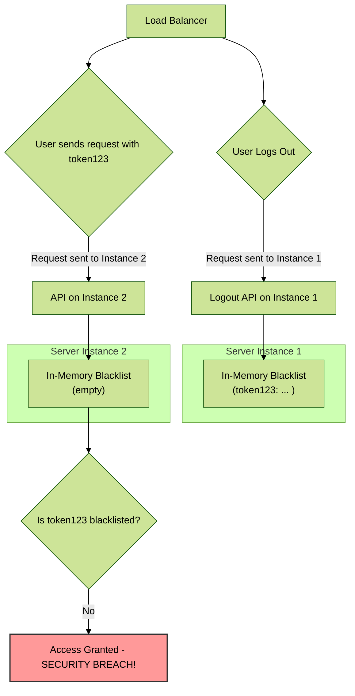
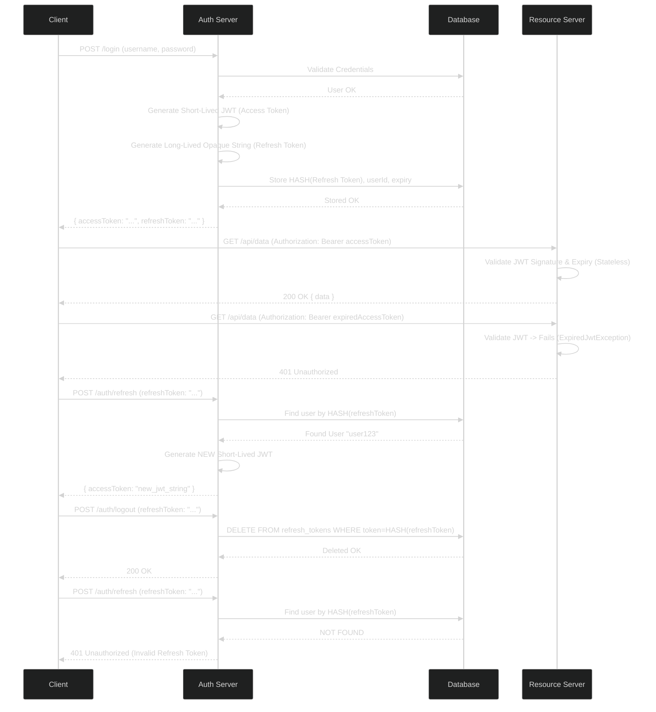

### **6. The Revocation Dilemma: Moving Beyond a Naive Blacklist**

The core promise of JWT is **statelessness**. The server doesn't need to store anything to validate a token. But this promise comes with a significant drawback: a standard JWT, once issued, is **valid until it expires**. You cannot kill it from the server side. If a user logs out, or an admin bans them, their JWT remains a valid key to your application until its `exp` claim is reached. This is the revocation problem.

#### **6.1. Analyzing Your `TokenBlacklistService`**

Your `TokenBlacklistService` is a common first attempt to solve the revocation problem. It's a clever idea, but let's critically analyze why it is not a production-grade solution.

*   **The Flaw: A Stateful Solution for a Stateless Problem**
    *   **The Core Conflict:** The very existence of your `blacklistedTokens` map breaks the principle of statelessness. To check if a token is valid, your server now depends on an internal state (the blacklist). This negates the primary architectural benefit of using JWTs.
    *   **Failure in a Distributed Environment:** This is the critical failure point. Imagine your application is successful and you need to scale it to run on more than one server instance to handle the load.

    
  * As the diagram shows, a user logs out on Instance 1, and `token123` is added to its local, in-memory blacklist. A moment later, the load balancer sends their next request to Instance 2. Instance 2 has its own separate memory and knows nothing about `token123` being revoked. It validates the token's signature and expiration (which are still valid) and grants access. **Your security is completely broken.**

*   **Memory Leak Risk & Scalability Issues:**
    *   The `ConcurrentHashMap` will grow indefinitely with every logout event until your scheduled cleanup runs. A high volume of logouts could lead to high memory consumption and potentially an `OutOfMemoryError`.
    *   To fix the distributed issue, you might think of using a shared cache like Redis. Now, every single API request requires not only a cryptographic check but also a network call to Redis. At this point, you have simply re-invented traditional server-side sessions, but with more complexity.

*   **Conclusion:** The in-memory JWT blacklist is an anti-pattern for serious, scalable applications. It is a stateful patch on a stateless technology that fails under distributed load and negates the core benefits of JWT.

#### **6.2. The Industry Standard: The Refresh Token Pattern**

This pattern elegantly solves the revocation problem by embracing a hybrid approach. It keeps the frequent, short-lived communication stateless while making the long-term session stateful and controllable.

*   **Core Concept:** You issue two different tokens at login.
    1.  **Access Token (JWT):** This is the token you're already using. Its key characteristic is that it is **very short-lived** (e.g., 5-15 minutes). It contains the user's identity and roles and is sent with every API request. Its short lifespan drastically reduces the window of opportunity for a compromised token to be used.
    2.  **Refresh Token (Opaque String):** This is a long-lived (e.g., 7-30 days), cryptographically random, and **opaque** string. "Opaque" means it contains no data; it's just a unique identifier. This token is stored in a new database table, e.g., `refresh_tokens`, linked to the `userId` and with its own expiry date.

*   **The Flow: A Detailed Look**

Let's visualize the entire lifecycle.

*   **The Power of Revocation:** As shown in step #4, logging out is a simple database `DELETE` operation. If an admin wants to forcibly log out a user, they just delete all refresh tokens associated with that `userId`. The user's short-lived access token will expire within minutes, and their refresh token is now useless, effectively locking them out of the system immediately.

#### **6.3. Interview Focus: Championing the Refresh Token Pattern**

**Question:** *"How do you handle JWT revocation, for instance, when a user logs out?"*

**Your Answer:**
"Direct JWT revocation is an anti-pattern because it violates the stateless nature of the tokens. A JWT is like cash—possession implies validity until it expires. Trying to maintain a server-side blacklist of all logged-out tokens is not scalable and fails in a distributed environment.

The industry-standard and architecturally sound solution is the **Refresh Token Pattern**.

1.  **Dual Token System:** At login, we issue two tokens: a very short-lived JWT Access Token, say for 15 minutes, and a long-lived, opaque Refresh Token, perhaps for 7 days.
2.  **Stateless API Calls:** The short-lived Access Token is used to authenticate all API requests. This keeps our API endpoints fast and stateless, as they only need to perform a cryptographic check.
3.  **Stateful Session Management:** The Refresh Token is stored in a database table, linked to the user. Its only purpose is to be exchanged for a new Access Token when the old one expires.
4.  **Centralized Revocation:** Revocation is now a simple, stateful operation. When a user logs out, we simply delete their Refresh Token from our database. When an admin bans a user, we delete all of their Refresh Tokens. The user can continue to use their Access Token for a maximum of 15 minutes, after which they will be unable to get a new one, effectively logging them out of the system.

This hybrid approach gives us the best of both worlds: the performance and scalability of stateless JWTs for our APIs, and the security and control of stateful sessions for managing user lifecycle events like logout and revocation."