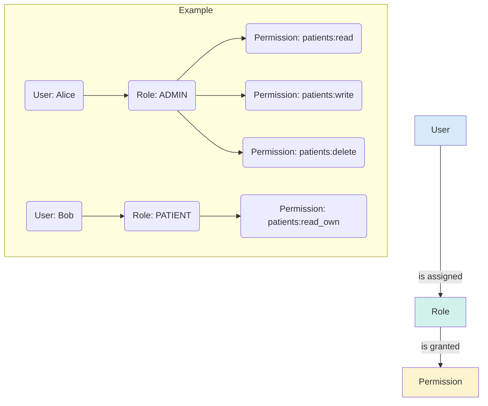

Role-Based Access Control is the standard practice for managing user permissions in modern applications. Instead of checking *who* a user is, we check what *roles* they have, and grant access based on the permissions associated with those roles. This makes your application more secure, scalable, and easier to manage.

### **Step 1: The Core Concepts of RBAC**

Before writing any code, you must understand the three pillars of RBAC:

1.  **Principal (The "Who"):** This is the entity making the request. In our case, this is the `User`.
2.  **Role (The "What"):** A role is a collection of permissions. It typically represents a job function or level of authority within the system (e.g., `ROLE_ADMIN`, `ROLE_DOCTOR`, `ROLE_PATIENT`).
3.  **Permission (The "Action"):** A permission is a granular authority to perform a single action (e.g., `patients:read`, `patients:write`, `appointments:delete`).

The most flexible RBAC models separate Roles from Permissions. A User is assigned one or more Roles, and each Role is granted one or more Permissions.



This model is powerful because you can change a role's permissions, and it automatically applies to all users with that role. You don't need to update each user individually.

### **Step 2: Designing the Database Model (The Source of Truth)**

To implement this, you need to represent these relationships in your database using JPA entities. You already have a `User` and `Role` entity; let's refine them and introduce a `Permission` entity for maximum flexibility.

**`User.java` (Minor Change)**
Ensure the relationship to `Role` is `@ManyToMany` and eagerly fetched so roles are loaded with the user.

```java
@Entity
@Table(name = "users")
public class User {
    // ... id, username, password, etc.

    @ManyToMany(fetch = FetchType.EAGER)
    @JoinTable(
        name = "user_roles",
        joinColumns = @JoinColumn(name = "user_id"),
        inverseJoinColumns = @JoinColumn(name = "role_id")
    )
    private Set<Role> roles = new HashSet<>();

    // ... getters and setters
}
```

**`Role.java` (Updated with Permissions)**
Now, a Role is no longer just a name; it's a container for Permissions.

```java
@Entity
@Table(name = "roles")
public class Role {
    @Id
    @GeneratedValue(strategy = GenerationType.IDENTITY)
    private Long id;

    @Enumerated(EnumType.STRING)
    @Column(length = 20, unique = true)
    private AppRoles roleName; // Use your existing enum for role names

    @ManyToMany(fetch = FetchType.EAGER)
    @JoinTable(
        name = "role_permissions",
        joinColumns = @JoinColumn(name = "role_id"),
        inverseJoinColumns = @JoinColumn(name = "permission_id")
    )
    private Set<Permission> permissions = new HashSet<>();

    // ... constructors, getters, and setters
}
```

**`Permission.java` (New Entity)**
This new entity represents the most granular level of access.

```java
@Entity
@Table(name = "permissions")
public class Permission {
    @Id
    @GeneratedValue(strategy = GenerationType.IDENTITY)
    private Long id;

    @Column(unique = true, nullable = false)
    private String name; // e.g., "patients:read", "patients:write"

    // ... constructors, getters, and setters
}
```

### **Step 3: Translating Database Models to Spring Security Authorities**

This is the most critical step. Spring Security doesn't know about your `Role` or `Permission` objects. It only understands one thing: the `GrantedAuthority` interface. Your `CustomUserDetailsService` must translate the roles and permissions from your database into a collection of `GrantedAuthority` objects.

**Spring Security Convention:**
*   For roles, the authority string should be prefixed with `ROLE_` (e.g., `ROLE_ADMIN`).
*   For permissions, you can use the name directly (e.g., `patients:write`).

Let's upgrade your `CustomUserDetailsService`:

```java
@Service
@Slf4j
public class CustomUserDetailsService implements UserDetailsService {

    private final UserRepository userRepository;
    // ... constructor

    @Transactional(readOnly = true)
    @Override
    public UserDetails loadUserByUsername(String username) throws UsernameNotFoundException {
        User user = userRepository.findByUsername(username.trim())
                .orElseThrow(() -> new UsernameNotFoundException("User not found with username: " + username));

        // Create a flat collection of all authorities (roles + permissions)
        List<GrantedAuthority> authorities = new ArrayList<>();

        // 1. Add authorities for the user's roles
        for (Role role : user.getRoles()) {
            authorities.add(new SimpleGrantedAuthority(role.getRoleName().name())); // e.g., "ROLE_ADMIN"

            // 2. Add authorities for the permissions within each role
            for (Permission permission : role.getPermissions()) {
                authorities.add(new SimpleGrantedAuthority(permission.getName())); // e.g., "patients:write"
            }
        }

        return new org.springframework.security.core.userdetails.User(
                user.getUsername(),
                user.getPassword(),
                user.isEnabled(),
                true, true, true,
                authorities // Use the combined list of authorities
        );
    }
}
```
Now, when a user logs in, their `Authentication` object in the `SecurityContextHolder` will contain a complete list of all their roles and fine-grained permissions.

### **Step 4: Configuring and Enforcing Access Control**

With your `UserDetails` now populated with rich authorities, you can enforce access rules. The recommended way is through **Method-Level Security**.

First, ensure it's enabled in your `SecurityConfig`:
`@EnableMethodSecurity` (You already have this, which is great).

Now, you can secure your controller methods using the `@PreAuthorize` annotation. This annotation uses Spring Expression Language (SpEL) to define access rules *before* the method is executed.

**Common SpEL Expressions for RBAC:**

| Expression                             | Description                                                                 |
| -------------------------------------- | --------------------------------------------------------------------------- |
| `hasRole('ROLE_NAME')`                 | Returns `true` if the current user has the specified role.                  |
| `hasAnyRole('ROLE_1', 'ROLE_2')`       | Returns `true` if the user has any of the specified roles.                  |
| `hasAuthority('PERMISSION_NAME')`      | Returns `true` if the user has the specified granular permission.           |
| `hasAnyAuthority('PERM_1', 'PERM_2')`  | Returns `true` if the user has any of the specified permissions.            |
| `permitAll()`                          | Always `true`.                                                              |
| `denyAll()`                            | Always `false`.                                                             |
| `isAuthenticated()`                    | Returns `true` if the user is not anonymous.                                |

#### **Example Implementation in a Controller:**

Let's imagine a `PatientController`.

```java
@RestController
@RequestMapping("/api/patients")
public class PatientController {

    // Only users with the ROLE_ADMIN or ROLE_DOCTOR can get all patients.
    @GetMapping
    @PreAuthorize("hasAnyRole('ROLE_ADMIN', 'ROLE_DOCTOR')")
    public ResponseEntity<List<Patient>> getAllPatients() {
        // ... logic
    }

    // A user needs the specific 'patients:read' permission to view a patient.
    // This is more flexible than checking the role!
    @GetMapping("/{id}")
    @PreAuthorize("hasAuthority('patients:read')")
    public ResponseEntity<Patient> getPatientById(@PathVariable Long id) {
        // ... logic
    }

    // Only users with the 'patients:write' permission can create a patient.
    @PostMapping
    @PreAuthorize("hasAuthority('patients:write')")
    public ResponseEntity<Patient> createPatient(@RequestBody Patient newPatient) {
        // ... logic
    }

    // To delete, a user must be an ADMIN. This is a very strict rule.
    @DeleteMapping("/{id}")
    @PreAuthorize("hasRole('ROLE_ADMIN')")
    public ResponseEntity<Void> deletePatient(@PathVariable Long id) {
        // ... logic
    }

    // An advanced example: a user can only update their OWN record unless they are an admin.
    @PutMapping("/{username}")
    @PreAuthorize("hasRole('ROLE_ADMIN') or #username == authentication.principal.username")
    public ResponseEntity<User> updateUserProfile(@PathVariable String username, @RequestBody UserUpdateDTO dto) {
        // Here, '#username' refers to the method parameter, and
        // 'authentication.principal.username' is the currently logged-in user.
        // ... logic
    }
}
```

By following these four steps—defining concepts, modeling the database, translating to authorities, and enforcing rules at the method level—you will have built a robust, scalable, and secure RBAC system.