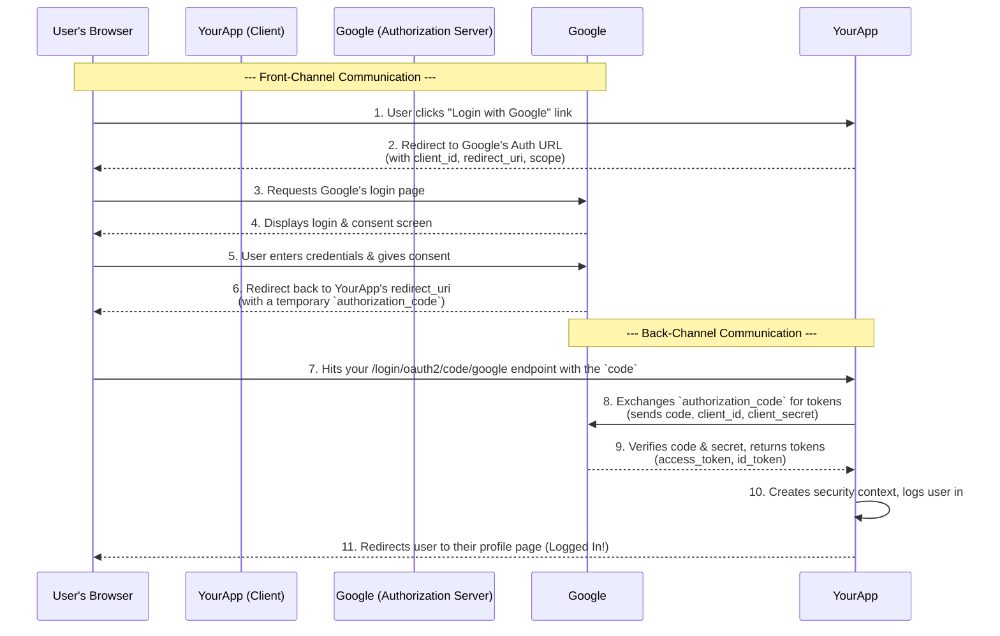

### **Part 1: The Client Perspective - Federated Identity & Social Login**

**Objective:** To configure a Spring Boot application to act as an **OAuth 2.0 Client**, delegating user authentication to a third-party Identity Provider like Google.

---

#### **1.1. Core Theory: Why Not Just Use a Login Form?**

For years, the standard has been to build your own user authentication system: a `users` table, password hashing, registration forms, etc. While necessary for some applications, this approach has significant downsides:

*   **Security Burden:** You are responsible for securely storing passwords, handling password resets, and protecting against credential-stuffing attacks. This is a massive and ongoing responsibility.
*   **User Friction:** Users have to create *yet another* account, remember another password, and often suffer from "registration fatigue."
*   **Lack of Trust:** A new user might not trust your brand-new application with their personal information or a password they reuse elsewhere.

**Federated Identity** is the solution. It's the concept of trusting a reputable, external party to handle the difficult process of authentication. Your application doesn't ask, "What is your password?" Instead, it asks a trusted provider like Google, "Can you please verify this user for me and tell me who they are?"

This establishes a triangle of trust between the user, your application, and the identity provider.

#### **The Four Roles**

To understand any OAuth 2.0 flow, you must be able to identify these four actors. We will use "Login with Google to access YourApp" as our example.

1.  **Resource Owner:** **The End-User.** This is the person sitting at the browser. They own their identity and their data (e.g., their Google profile information). They are the ones who grant permission.
2.  **Client:** **Your Spring Boot Application (`YourApp`).** It wants to access the user's identity on their behalf. It is the client of the Authorization Server.
3.  **Authorization Server:** **Google's Identity Platform.** This is the trusted server that manages the user's account and password. Its job is to authenticate the Resource Owner and issue tokens to the Client upon receiving the owner's consent.
4.  **Resource Server:** **Google's Profile API.** This is the API that hosts the user's data. The tokens issued by the Authorization Server are used to access resources here. In a simple login scenario, the Authorization Server and Resource Server are often the same system.

#### **The Valet Parking Analogy**

This is the best way to visualize the roles:

*   You (**Resource Owner**) drive your car (**Resource Server**) to a restaurant.
*   You give the key to a valet (**Client**).
*   Crucially, you don't give them your master house key. You give them a limited-use valet key (**Access Token**).
*   This key only allows specific actions (drive the car, park it) for a limited time. You (**Authorization Server**) are the one who authorizes this limited access.

---

#### **1.2. The Authorization Code Grant Flow**

This is the most secure and widely used OAuth 2.0 flow for web applications. Its primary security benefit is that the most sensitive credentials (like the `client_secret`) are only ever transmitted on the **back-channel** (server-to-server), never through the user's browser.

#### **Step-by-Step Breakdown**

Let's visualize the entire process from the user clicking a button to being logged into your application.



#### **OpenID Connect (OIDC): The Missing Piece**

You will often hear OIDC mentioned with OAuth 2.0. The distinction is critical:

*   **OAuth 2.0 is for AUTHORIZATION:** Its primary goal is to grant permission. The `access_token` it provides is a key that lets your app *access resources* (like a Google Calendar API). It doesn't inherently contain information about *who the user is*.
*   **OpenID Connect is for AUTHENTICATION:** It is a thin, identity layer built on top of OAuth 2.0. When you request the `openid` scope, the Authorization Server will return an additional token called the **`id_token`**.

The **`id_token`** is a **JWT** that contains verifiable claims about the user (e.g., their email, name, profile picture). Your application decodes and trusts this `id_token` as proof of the user's identity. This is the final piece that makes "Social Login" possible.

---

#### **1.3. Practical Implementation: `oauth2Login()`**

Let's build this. The beauty of Spring Security is that it handles almost the entire flow (all 11 steps in the diagram) with minimal configuration.

**1. Add Dependencies**
Ensure you have the `spring-boot-starter-oauth2-client` in your `pom.xml`.

**2. Configuration (`application.yml`)**
First, you must go to the Google Cloud Console, create a new project, and configure the "OAuth consent screen." Then, create "OAuth 2.0 Client IDs" credentials, specifying your application's redirect URI (e.g., `http://localhost:8080/login/oauth2/code/google`). Google will give you a Client ID and a Client Secret.

```yaml
spring:
  security:
    oauth2:
      client:
        registration:
          google: # This name must match the redirect URI path
            client-id: YOUR_GOOGLE_CLIENT_ID.apps.googleusercontent.com
            client-secret: YOUR_GOOGLE_CLIENT_SECRET
            scope:
              - openid      # This is the OIDC scope for authentication
              - profile     # Gets basic profile info
              - email       # Gets the user's email address
```

**3. The Magic of `oauth2Login()`**
Now, configure your `SecurityFilterChain` to enable the OAuth 2.0 Login flow.

```java
@Configuration
@EnableWebSecurity
public class SecurityConfig {

    @Bean
    SecurityFilterChain defaultSecurityFilterChain(HttpSecurity http) throws Exception {
        http
            .authorizeHttpRequests(auth -> auth
                .requestMatchers("/").permitAll() // Allow the home page
                .anyRequest().authenticated()      // Secure everything else
            )
            .oauth2Login(Customizer.withDefaults()); // Enable OAuth2 Login with default settings

        return http.build();
    }
}
```
That's it. With this configuration, Spring Security automatically:
*   Creates a default login page with a "Login with Google" link.
*   Creates the redirect endpoint (`/login/oauth2/code/google`) to handle the callback from Google.
*   Orchestrates the entire back-channel code-for-token exchange.
*   Parses the `id_token` and creates a `SecurityContext` for the user.

**4. Accessing the Authenticated Principal**
After a successful login, you can access the user's details in your controllers using the `@AuthenticationPrincipal` annotation. Spring Security provides the identity as an `OAuth2User` object.

```java
@RestController
public class MainController {

    @GetMapping("/")
    public String home() {
        return "Welcome, Guest!";
    }

    @GetMapping("/profile")
    public Map<String, Object> userProfile(@AuthenticationPrincipal OAuth2User principal) {
        // 'principal.getAttributes()' contains all the claims from the ID token
        return principal.getAttributes();
    }
}
```
If you visit `/profile`, you'll see a JSON response with your name, email, picture URL, etc., all provided by Google.

**5. Mapping External Identities to Local Roles (Critical Step)**
A user logging in with Google is just an "authenticated user." They don't have any roles (`ROLE_ADMIN`, `ROLE_DOCTOR`) in your system yet. You need to map their external identity to your internal RBAC system. The `GrantedAuthoritiesMapper` is the perfect tool for this.

Let's say you want to grant `ROLE_ADMIN` to any user logging in with a `@my-company.com` email address.

```java
@Configuration
public class AuthoritiesConfig {

    @Bean
    public GrantedAuthoritiesMapper userAuthoritiesMapper() {
        return (authorities) -> {
            Set<GrantedAuthority> mappedAuthorities = new HashSet<>();

            authorities.forEach(authority -> {
                // For OAuth2, the authority is an OidcUserAuthority
                if (authority instanceof OidcUserAuthority oidcUserAuthority) {
                    OidcIdToken idToken = oidcUserAuthority.getIdToken();
                    OidcUserInfo userInfo = oidcUserAuthority.getUserInfo();

                    // Map the user's email to a specific role
                    String email = idToken.getEmail();
                    if (email != null && email.endsWith("@my-company.com")) {
                        mappedAuthorities.add(new SimpleGrantedAuthority("ROLE_ADMIN"));
                    }
                }
                // Keep the original authorities
                mappedAuthorities.add(authority);
            });

            return mappedAuthorities;
        };
    }
}
```

Now, wire this mapper into your `SecurityConfig`:

```java
@Configuration
@EnableWebSecurity
public class SecurityConfig {

    // Inject your custom mapper
    private final GrantedAuthoritiesMapper userAuthoritiesMapper;

    public SecurityConfig(GrantedAuthoritiesMapper userAuthoritiesMapper) {
        this.userAuthoritiesMapper = userAuthoritiesMapper;
    }

    @Bean
    SecurityFilterChain defaultSecurityFilterChain(HttpSecurity http) throws Exception {
        http
            .authorizeHttpRequests(auth -> auth
                // Now you can use role-based security!
                .requestMatchers("/admin").hasRole("ADMIN")
                .requestMatchers("/").permitAll()
                .anyRequest().authenticated()
            )
            .oauth2Login(oauth2 -> oauth2
                .userInfoEndpoint(userInfo -> userInfo
                    // Tell Spring Security to use your custom mapper
                    .userAuthoritiesMapper(this.userAuthoritiesMapper)
                )
            );

        return http.build();
    }
}

```

