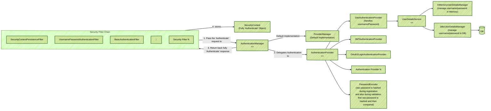

### **The Professional's Guide to Spring Security: Module 1 - Core Concepts & Architecture**

**Objective:** To achieve a deep, architectural understanding of Spring Security's foundational components, enabling you to articulate its internal workings with the clarity and precision of a senior engineer.

---

#### **1. What is Spring Security and Why is it Needed?**

Spring Security is a powerful and highly customizable framework that provides both **authentication** and **authorization** to Java applications.

Think of it as a set of sophisticated security guards and access control lists for your application. Its primary goal is to intercept incoming web requests and apply security rules before they ever reach your controller's business logic.

**Why it is essential (The "Business Case"):**
*   **Decouples Security Logic:** It allows you to manage security as a separate, cross-cutting concern. Your `OrderService` should only be concerned with order logic, not with verifying user identity.
*   **Provides Comprehensive Defense:** It protects against a wide range of common vulnerabilities, including session fixation, clickjacking, CSRF, and more, with battle-tested implementations.
*   **Declarative and Extensible:** It allows you to declare security rules rather than programmatically checking them everywhere. It is highly extensible, allowing you to integrate with any authentication mechanism, from JWT to LDAP to OAuth2.

---

#### **2. Authentication vs. Authorization: The Two Pillars of Security**

This is the most fundamental concept, and you must be able to explain it without hesitation.

*   **Authentication (AuthN): "Who are you?"**
    *   **Definition:** The process of verifying a user's identity. It's about proving you are who you say you are.
    *   **Analogy:** Presenting your driver's license to a security guard. The guard verifies that the ID is legitimate and that the picture matches your face.
    *   **In Practice:** The user provides credentials (like a username/password or a JWT). The system validates these credentials against a trusted source (like a database or an identity provider).

*   **Authorization (AuthZ): "What are you allowed to do?"**
    *   **Definition:** The process of determining if an *authenticated* user has the necessary permissions to access a specific resource or perform a certain action.
    *   **Analogy:** The security guard has verified your ID (authentication). Now, they check their access list to see if you are allowed to enter the "VIP Lounge" (authorization).
    *   **In Practice:** After successful authentication, the system checks the user's assigned roles or authorities (e.g., `ROLE_ADMIN`, `READ_PRIVILEGE`) against the permissions required for the requested endpoint.

**Interview Gold:** Always state clearly: "Authentication must always happen before authorization." You cannot determine what a user is allowed to do until you first know who they are.

---

#### **3. The Security Architecture: Key Components**

Spring Security is not magic. It is a well-defined system of collaborating components.

##### **`SecurityContextHolder`, `SecurityContext`, and `Authentication`**
*   **`SecurityContextHolder`:** A thread-local object. This is the most important concept. It stores the security context for the current thread of execution. Because it's thread-local, the security information is automatically available to all methods called during a single request, without needing to pass it as a parameter.
*   **`SecurityContext`:** An interface held within the `SecurityContextHolder`. Its primary job is to hold the `Authentication` object.
*   **`Authentication`:** The heart of the matter. This object represents the currently authenticated user. It contains:
    1.  **Principal:** The user's identity (e.g., a `UserDetails` object, a username string).
    2.  **Authorities:** A collection of granted authorities (roles/permissions) the user possesses.
    3.  **Authenticated Flag:** A boolean indicating whether the user has been successfully authenticated.

##### **The `AuthenticationManager`**
*   **Role:** The central component responsible for processing an authentication request.
*   **How it works:** It receives an `Authentication` object with the user's submitted credentials (e.g., username/password). It then delegates to one or more configured `AuthenticationProvider`s to perform the actual validation. If a provider succeeds, the `AuthenticationManager` returns a fully populated, authenticated `Authentication` object.

---

#### **4. The `SecurityFilterChain`: The Modern Fortress Wall**

This is the core of modern Spring Security configuration and a critical topic for interviews.

**The Concept:** Spring Security protects your application by passing every incoming request through a chain of filters. Each filter is a small, specialized component responsible for a single security task.

**Analogy:** Imagine a medieval castle's gatehouse. An incoming visitor must pass through a series of checkpoints:
1.  **Filter 1 (The Moat):** Check for obvious threats (e.g., a DoS attack).
2.  **Filter 2 (The Outer Gate):** Check for a valid access token (`JwtAuthenticationFilter`).
3.  **Filter 3 (The Guard Captain):** Validate the token and identify the user.
4.  **Filter 4 (The Inner Gate):** Check if the identified user has permission to enter the throne room.
5.  **Finally...** The request reaches the King (your `@Controller`).

Only if a request successfully passes through every filter in the chain is it allowed to reach the `DispatcherServlet` and your application code.

**The Architectural Diagram for a Stateless JWT API (Interview Essential):**

This diagram illustrates the full, end-to-end flow in a modern, production-grade Spring Boot application.

**Explaining the Diagram in an Interview:**

1.  "A request first enters the servlet container and is immediately passed to the **Spring Security Filter Chain**, before it ever reaches the `DispatcherServlet`."
2.  "The chain processes the request sequentially. In a modern JWT-based API, one of the most important filters is a **custom filter** we add, typically before the `UsernamePasswordAuthenticationFilter`."
3.  "This **`JwtAuthenticationFilter`** has one job: inspect the `Authorization` header, extract the JWT, validate its signature and expiration, and if it's valid, create an `Authentication` object."
4.  "The most critical step is that this filter then places the fully populated `Authentication` object into the **`SecurityContextHolder`**. Because the `SecurityContextHolder` is thread-local, this security context is now available for the entire duration of the request."
5.  "The request then continues down the chain. Later filters, like the `AuthorizationFilter`, can now access the `SecurityContextHolder` to see the user's roles and make authorization decisions."
6.  "Finally, if the chain is successful, the request is passed to the `DispatcherServlet` and on to our `@Controller`. Our application code, whether in the controller or service layer (using `@PreAuthorize`), can then also access the `SecurityContextHolder` to get information about the current user, without ever needing to know how they were authenticated."