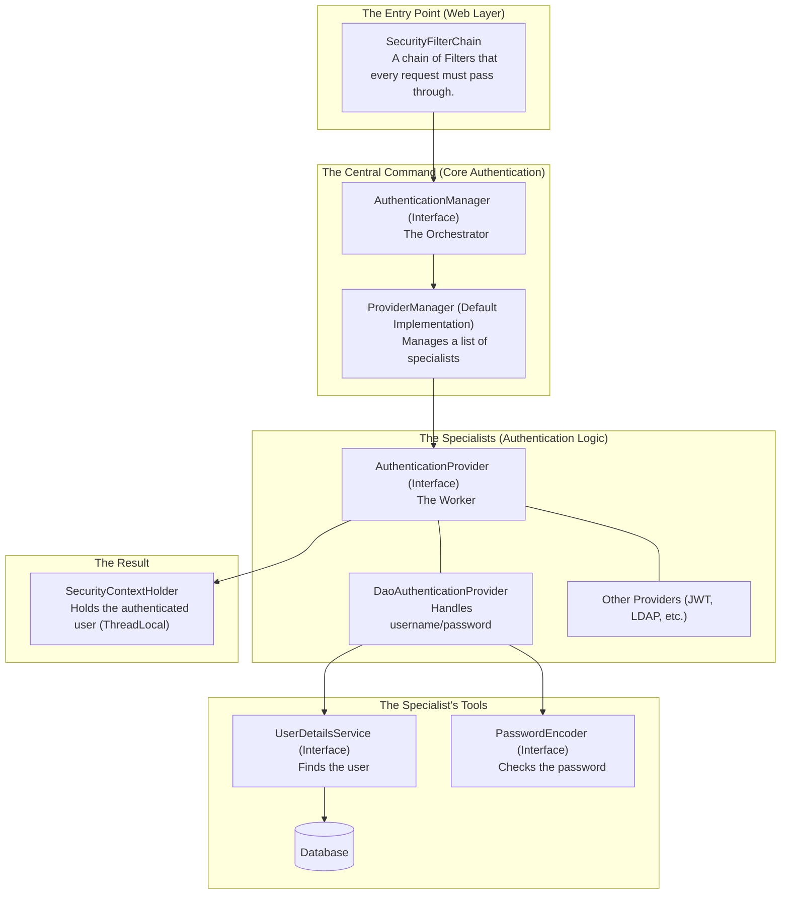

### **The Professional's Guide to Spring Security: Module 1 - Core Concepts & Architecture**

**Objective:** To achieve a deep, architectural understanding of Spring Security's foundational components, enabling you to articulate its internal workings with the clarity and precision of a senior engineer.

---

#### **1. What is Spring Security and Why is it Needed?**

Spring Security is a powerful and highly customizable framework that provides both **authentication** and **authorization** to Java applications.

Think of it as a set of sophisticated security guards and access control lists for your application. Its primary goal is to intercept incoming web requests and apply security rules before they ever reach your controller's business logic.

**Why it is essential (The "Business Case"):**
*   **Decouples Security Logic:** It allows you to manage security as a separate, cross-cutting concern. Your `OrderService` should only be concerned with order logic, not with verifying user identity.
*   **Provides Comprehensive Defense:** It protects against a wide range of common vulnerabilities, including session fixation, clickjacking, CSRF, and more, with battle-tested implementations.
*   **Declarative and Extensible:** It allows you to declare security rules rather than programmatically checking them everywhere. It is highly extensible, allowing you to integrate with any authentication mechanism, from JWT to LDAP to OAuth2.

---

#### **2. Authentication vs. Authorization: The Two Pillars of Security**

This is the most fundamental concept, and you must be able to explain it without hesitation.

*   **Authentication (AuthN): "Who are you?"**
    *   **Definition:** The process of verifying a user's identity. It's about proving you are who you say you are.
    *   **Analogy:** Presenting your driver's license to a security guard. The guard verifies that the ID is legitimate and that the picture matches your face.
    *   **In Practice:** The user provides credentials (like a username/password or a JWT). The system validates these credentials against a trusted source (like a database or an identity provider).

*   **Authorization (AuthZ): "What are you allowed to do?"**
    *   **Definition:** The process of determining if an *authenticated* user has the necessary permissions to access a specific resource or perform a certain action.
    *   **Analogy:** The security guard has verified your ID (authentication). Now, they check their access list to see if you are allowed to enter the "VIP Lounge" (authorization).
    *   **In Practice:** After successful authentication, the system checks the user's assigned roles or authorities (e.g., `ROLE_ADMIN`, `READ_PRIVILEGE`) against the permissions required for the requested endpoint.

**Interview Gold:** Always state clearly: "Authentication must always happen before authorization." You cannot determine what a user is allowed to do until you first know who they are.

---
<pre>

</pre>
---

### **Part : The Core Architecture - The Components of the Fortress**

Before we discuss the flow, we must understand the roles of the key players. This is the static blueprint of the authentication system.

**Explaining the Components in an Interview:**

*   **`SecurityFilterChain`:** "This is the primary defense line. It's a chain of simple `Filter` objects. A specific filter, like the `UsernamePasswordAuthenticationFilter`, is designed to watch for authentication attempts (e.g., a `POST` to `/login`). When it sees one, it initiates the authentication process."

*   **`AuthenticationManager`:** "This is the central interface for authentication. Think of it as a general contractor. It doesn't do the work itself; its sole purpose is to receive an authentication request and delegate it to the appropriate specialist. The default implementation is the `ProviderManager`."

*   **`ProviderManager`:** "The `ProviderManager` maintains a list of `AuthenticationProvider`s. When it receives a request from the `AuthenticationManager`, it iterates through its list and asks each provider if it supports the given authentication type. The first one that successfully authenticates wins."

*   **`AuthenticationProvider`:** "This is the specialist worker. Spring provides several implementations. The most common is the **`DaoAuthenticationProvider`**, which is designed specifically for username and password authentication using a data source."

*   **`UserDetailsService`:** "This is a tool used by the `DaoAuthenticationProvider`. Its *only* responsibility is to load a 'user' object from a persistent store, like a database, based on a username. It returns a `UserDetails` object, which is a container for the user's information, including the hashed password and their assigned roles."

*   **`PasswordEncoder`:** "This is the second tool used by the `DaoAuthenticationProvider`. Its job is to securely compare the raw password submitted by the user with the hashed password retrieved from the database. It uses a strong hashing algorithm like BCrypt."

*   **`SecurityContextHolder`:** "This is the final destination. After a successful authentication, the fully populated `Authentication` object, containing the user's principal and authorities, is stored here. It's a `ThreadLocal` object, which means the security information is accessible to the entire request processing thread, from the web layer all the way down to the data layer."

---

### **Part 2: The Authentication Flow - A Step-by-Step Trace**

This is the dynamic, step-by-step journey of a username/password authentication attempt. Articulate this sequence clearly.

**Scenario:** A user submits a form with `username="user"` and `password="password"` to `/login`.

1.  **Interception:** The request is intercepted by the **`UsernamePasswordAuthenticationFilter`** in the `SecurityFilterChain`. It extracts "user" and "password" from the HTTP request.

2.  **Creation of Token:** The filter creates a `UsernamePasswordAuthenticationToken` object. At this point, the token is **unauthenticated**. It simply holds the credentials the user submitted.
    *   `principal` = "user"
    *   `credentials` = "password"
    *   `authenticated` = `false`

3.  **Delegation to Manager:** The filter passes this unauthenticated token to the **`AuthenticationManager`** (specifically, the `ProviderManager`) by calling its `authenticate()` method.

4.  **Provider Selection:** The `ProviderManager` scans its list of `AuthenticationProvider`s. It finds the **`DaoAuthenticationProvider`** and determines that it supports the `UsernamePasswordAuthenticationToken`. It delegates the token to this provider.

5.  **User Retrieval:** The `DaoAuthenticationProvider` calls the configured **`UserDetailsService`'s** `loadUserByUsername("user")` method. The `UserDetailsService` connects to the **Database**, finds the user's record, and returns a `UserDetails` object containing:
    *   `username` = "user"
    *   `password` = "$2a$10$..." (the BCrypt hash from the DB)
    *   `authorities` = [`ROLE_USER`]

6.  **Password Verification:** The `DaoAuthenticationProvider` now has both the submitted raw password ("password") and the stored hash. It passes both to the **`PasswordEncoder`'s** `matches()` method. The `PasswordEncoder` performs the secure BCrypt comparison and returns `true`.

7.  **Creation of Authenticated Token:** With both the user found and the password verified, the `DaoAuthenticationProvider` considers the authentication successful. It now creates a **new, fully authenticated** `UsernamePasswordAuthenticationToken`.
    *   `principal` = The full `UserDetails` object.
    *   `credentials` = `null` (the raw password is wiped for security).
    *   `authorities` = The list of authorities (`ROLE_USER`).
    *   `authenticated` = `true`

8.  **Return Journey:** This authenticated token is returned up the call stack, from the `DaoAuthenticationProvider` to the `ProviderManager`.

9.  **Finalizing the Context:** The `ProviderManager` returns the authenticated token to the original `UsernamePasswordAuthenticationFilter`. The filter's final, critical action is to set this object in the **`SecurityContextHolder`**.
    *   `SecurityContextHolder.getContext().setAuthentication(authenticatedToken);`

10. **Chain Continuation:** The user is now officially authenticated for this request. The filter chain continues, but subsequent filters will now see an authenticated user in the `SecurityContext`. The `UsernamePasswordAuthenticationFilter` will typically then perform a redirect to the application's home page.