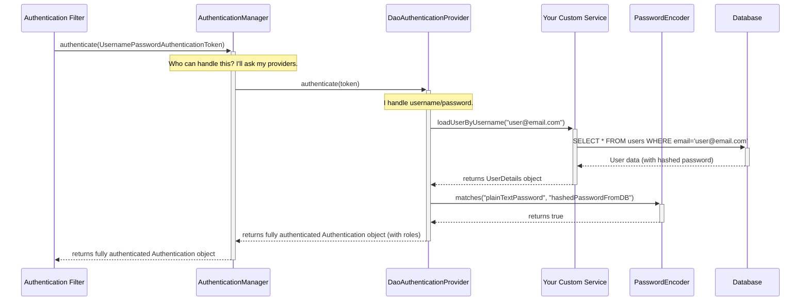

---

### **1. User Creation Methods: Where Do Users Come From?**

This topic covers how Spring Security finds and validates user credentials.

#### **a. In-Memory Authentication**

*   **What is it?** A method where user credentials (username, password, roles) are hardcoded directly in the Java security configuration.
*   **Why is it used?** **Exclusively for development, demonstrations, or very simple proof-of-concept applications.** It's the quickest way to get a security configuration up and running without needing a database.
*   **How does it work?** You define a `UserDetailsService` bean and use an `InMemoryUserDetailsManager` to create the users.

    ```java
    @Bean
    public UserDetailsService inMemoryUserDetailsService() {
        UserDetails user = User.withUsername("user")
                .password(passwordEncoder().encode("password"))
                .roles("USER")
                .build();
        UserDetails admin = User.withUsername("admin")
                .password(passwordEncoder().encode("adminpass"))
                .roles("ADMIN", "USER")
                .build();
        return new InMemoryUserDetailsManager(user, admin);
    }

    @Bean
    public PasswordEncoder passwordEncoder() {
        return new BCryptPasswordEncoder();
    }
    ```
*   **Interview Red Flag:** Never suggest using this for a production environment.

#### **b. JDBC Authentication**

*   **What is it?** A built-in mechanism where Spring Security directly queries a database to authenticate users, using a predefined schema.
*   **Why is it used?** It's a step up from in-memory, suitable for simple applications that follow Spring's default database schema for users and authorities. It requires minimal code.
*   **How does it work?** You provide a `DataSource` and Spring Security handles the rest, assuming your database has tables like `users(username, password, enabled)` and `authorities(username, authority)`.

    ```java
    // In your SecurityFilterChain configuration
    @Bean
    public UserDetailsService jdbcUserDetailsService(DataSource dataSource) {
        return new JdbcUserDetailsManager(dataSource);
    }
    ```
*   **Limitations:** It's not very flexible. If your user table has a different structure (e.g., `user_email` instead of `username`), you have to override the default queries, at which point a custom `UserDetailsService` becomes a better option.

#### **c. Custom `UserDetailsService` & `UserDetails` (The Professional Standard)**

*   **What is it?** This is the **most common and flexible** approach for production applications. You implement the `UserDetailsService` interface yourself, giving you complete control over how user information is retrieved.
*   **Why is it used?** It's used when your user schema is custom, or when user data comes from a source other than a simple JDBC database (e.g., an LDAP server, a different microservice, a NoSQL database).
*   **How does it work?**
    1.  You create a class that implements `UserDetailsService`.
    2.  This class has one method: `loadUserByUsername(String username)`.
    3.  Inside this method, you write your custom logic (e.g., `userRepository.findByEmail(username)`).
    4.  You must return an object that implements the `UserDetails` interface. This `UserDetails` object is a container for the user's essential security information (username, password hash, authorities, account status). You often create a custom `User` entity that implements this interface.

    ```java
    // Step 1: Your custom User entity implements UserDetails
    @Entity
    public class AppUser implements UserDetails {
        // ... fields like id, email, passwordHash ...

        @Override public String getUsername() { return this.email; }
        @Override public String getPassword() { return this.passwordHash; }
        @Override public Collection<? extends GrantedAuthority> getAuthorities() { /* ... return roles ... */ }
        // ... other UserDetails methods (isAccountNonExpired, etc.)
    }

    // Step 2: Your custom UserDetailsService implementation
    @Service
    public class CustomUserDetailsService implements UserDetailsService {
        private final UserRepository userRepository;

        public CustomUserDetailsService(UserRepository userRepository) {
            this.userRepository = userRepository;
        }

        @Override
        public UserDetails loadUserByUsername(String username) throws UsernameNotFoundException {
            return userRepository.findByEmail(username)
                    .orElseThrow(() -> new UsernameNotFoundException("User not found with email: " + username));
        }
    }
    ```
    This is the pattern used in virtually all production-grade Spring Boot applications.

---

### **2. Password Encoding: Protecting Credentials**

*   **Why is it needed?** **You must NEVER store passwords in plaintext.** If your database is compromised, all user passwords would be exposed. Password encoding is the process of applying a strong, one-way cryptographic hash function to a password. When a user tries to log in, you hash their submitted password and compare it to the stored hash.
*   **Analogy:** It's like turning a cow into a hamburger. You can easily go from cow to hamburger, but you can't go from a hamburger back to the original cow.

#### **Key `PasswordEncoder` Implementations:**

*   **`BCryptPasswordEncoder` (The Production Standard)**
    *   **What:** Implements the widely-trusted and battle-tested BCrypt hashing algorithm.
    *   **How it works:** BCrypt is an **adaptive hashing function**. It incorporates a "salt" (a random value) to protect against rainbow table attacks and has a configurable "work factor" that makes it deliberately slow, protecting against brute-force attacks.
    *   **Why it's recommended:** It is the industry standard for password hashing and is Spring Security's recommended choice.

*   **`NoOpPasswordEncoder` (For Testing & Migration ONLY)**
    *   **What:** A "no-operation" encoder. It does nothing; it simply compares passwords in plaintext.
    *   **Why it's used:** It is **DEPRECATED and highly insecure**. Its only valid use cases are for quickly testing non-security-related features or during a complex legacy system migration. **Never use it in production.**

*   **`DelegatingPasswordEncoder` (The Modern Default)**
    *   **What:** A smart encoder that prepends a cryptographic algorithm identifier to the password hash (e.g., `{bcrypt}$2a$10...`, `{noop}password`).
    *   **How it works:** It delegates the password check to the appropriate `PasswordEncoder` based on the identifier.
    *   **Why it's used:** It provides a seamless path for **password encoding upgrades**. Imagine your old system used a weaker algorithm. With `DelegatingPasswordEncoder`, you can support both the old and new hashes simultaneously. When a user logs in with an old hash, you can re-encode their password with the new algorithm and update their record. Spring Boot configures this by default.

---

### **3. The Authentication Flow: The Internal Mechanism**

This explains what happens when a user submits their credentials.



*   **Role of `AuthenticationManager`:** It is the **orchestrator** or **delegator**. Its job is not to authenticate but to manage a list of `AuthenticationProvider`s and ask each one if it can handle the submitted credentials.
*   **Role of `AuthenticationProvider`:** This is the **worker** that performs the actual authentication logic.
    *   `DaoAuthenticationProvider`: The most common one. It uses a `UserDetailsService` to fetch the user and a `PasswordEncoder` to validate the password.
    *   Other types exist for JWT, LDAP, OAuth2, etc. This makes the system highly extensible.

---

### **4. SecurityContext & SecurityContextHolder: Remembering the User**

*   **How it works:** After the `AuthenticationManager` successfully returns a fully authenticated `Authentication` object, the security filter's final job is to place this object inside the `SecurityContext`.
*   **The Role of `SecurityContextHolder`:**
    *   **Analogy:** Think of it as a special **filing cabinet** that is tied to a specific employee (the current request thread).
    *   **What it is:** The `SecurityContextHolder` is a **`ThreadLocal`** variable. This is a critical concept. It means that the `SecurityContext` (and thus the `Authentication` object) is available to any code running on the same thread that processed the initial authentication, without needing to pass it as a method parameter.
*   **How to Retrieve the Logged-in User:** This `ThreadLocal` strategy makes it incredibly easy to get the current user anywhere in your application.

    ```java
    // Method 1: The Static Way (good for any component)
    Authentication authentication = SecurityContextHolder.getContext().getAuthentication();
    String currentPrincipalName = authentication.getName();

    // Method 2: The Controller Way with @AuthenticationPrincipal (cleaner)
    @GetMapping("/api/me")
    public UserProfileDTO getMyProfile(@AuthenticationPrincipal AppUser currentUser) {
        // Spring automatically injects the authenticated user principal.
        // This is the cleanest and most recommended approach in controllers.
        return convertToDto(currentUser);
    }
    ```